# JAVV - Architecture (current, v2 2026-06-10)

> Verbose end-to-end view of the locked design: the drop-in dual-scanner module in each cluster, the
> private/token ingest hop, the central FastAPI backend, the OpenSearch single store (data + `system_*`
> indexes), and the frontend. Source of decisions: `PLAN.md` / `SPEC.md` (v2, audits folded in).
> Supersedes `deprecated/ARCHITECTURE.md`.

```mermaid
flowchart TB
    %% ================= Actors =================
    Triager["Triager<br/>security engineer"]
    Admin["Admin"]

    %% ================= Cluster (one per monitored cluster) =================
    subgraph CLUSTER["k8s cluster - any number; each runs the drop-in scanner"]
        direction TB
        K8SAPI["kube-apiserver"]
        REG["Private container registry"]
        TBIN["trivy binary"]
        GBIN["grype binary"]
        VDB["Vuln DBs - mirror/cache, scheduled refresh<br/>trivy-db / grype-db on PVC cache volume"]

        subgraph SCAN["Scanner module - Python package, CronJob (Forbid, deadline, PVC cache)"]
            direction TB
            CLI["cli.py / __main__<br/>entrypoint"]
            CFG["config.py<br/>env config (pydantic-settings)"]
            LOG["log_config.py<br/>stdlib logging<br/>LOG_FORMAT = json or multiline"]
            DISC["discovery.py<br/>list namespaces / workloads / images<br/>reads kube-system UID = cluster_id"]
            CRED["credentials.py<br/>imagePullSecret to dockerconfigjson"]
            DEDUP["dedup.py<br/>dedupe by image digest<br/>skip-unchanged (digest+scanner+db_version)"]
            BASE["scanners/base.py<br/>Scanner interface"]
            TRIVY["scanners/trivy.py<br/>Trivy adapter"]
            GRYPE["scanners/grype.py<br/>Grype adapter<br/>captures EPSS / KEV"]
            NORM["normalize.py + model.py<br/>NormalizedFinding<br/>stamps scanner = trivy or grype"]
            PUSH["push.py<br/>gzip · backoff+jitter · dead-letter<br/>bounded semaphore · scan_run_id"]
            HELP["helper_functions.py<br/>lean, cross-cutting only"]
        end
    end

    %% ================= JAVV (central) =================
    subgraph JAVV["JAVV - runs centrally, no cluster access"]
        direction TB

        subgraph API["Backend - FastAPI · AsyncOpenSearch · OpenAPI at /docs"]
            direction TB
            INGEST["Ingest endpoint<br/>per-cluster token auth<br/>validates versioned envelope (schema_version)<br/>size caps: gzip + decompressed + count"]
            UPSERT["Dedup / upsert (_bulk)<br/>_id = finding_key · content-hash detect_noop<br/>shared preserved-fields script:<br/>triage · tags · pre_stale_status"]
            STALE["Staleness sweep (daily job)<br/>last_seen < now − N (≈3× cadence)<br/>scanner-down guard · comeback revert"]
            TRIAGE["Triage API<br/>state transitions · bulk via _bulk + async<br/>optimistic concurrency · refresh=wait_for"]
            TAGS["Tagging API<br/>team / app / org · image-level<br/>async rate-limited retag jobs"]
            SEARCH["Search + aggregation<br/>faceted by scanner · PIT + search_after<br/>capped / composite aggs"]
            CSV["CSV export<br/>streaming · injection-sanitized<br/>async job for very large exports"]
            AUTH["Auth + RBAC<br/>get_current_principal() · IDOR checks<br/>tenant filter in query layer"]
            BOOT["Index bootstrap<br/>explicit mappings · dynamic:false<br/>ISM policies · snapshot repo"]
        end

        subgraph OS["OpenSearch - single store (refresh_interval 30s, snapshots to S3/MinIO)"]
            direction TB
            subgraph DATA["Data indexes"]
                direction TB
                F[("findings")]
                I[("images")]
                O[("occurrences - ISM rollover")]
            end
            subgraph SYS["System indexes - system_* (repository interface)"]
                direction TB
                SU[("system_users")]
                SR[("system_roles")]
                ST[("system_tokens<br/>+ last_ingest_at")]
                SC[("system_config")]
                SA[("system_audit_log - ISM rollover")]
                SG[("system_tags")]
            end
        end

        subgraph FE["Frontend - Vue 3 · PrimeVue · vue-echarts (all server-side data)"]
            direction TB
            FLOW["Barebones first-flow<br/>discover → scanner dropdown → scan → table"]
            DASH["Kibana-like dashboard<br/>KPI tiles · donut · trends · dense tables"]
            IMG["Per-image report<br/>Trivy or Grype dropdown"]
        end
    end

    %% ================= Scanner internal flow =================
    CLI --> CFG
    CLI --> LOG
    CFG --> DISC
    DISC --> K8SAPI
    CRED --> K8SAPI
    DISC --> DEDUP
    DEDUP --> BASE
    BASE --> TRIVY
    BASE --> GRYPE
    CRED --> TRIVY
    CRED --> GRYPE
    TRIVY --> TBIN
    GRYPE --> GBIN
    TBIN --> REG
    GBIN --> REG
    TBIN --> VDB
    GBIN --> VDB
    TRIVY --> NORM
    GRYPE --> NORM
    NORM --> PUSH

    %% ================= Ingest hop =================
    PUSH -->|"POST /api/v1/ingest/scan<br/>private network · per-cluster token<br/>gzipped · per-image · retried · scan_run_id"| INGEST

    %% ================= Backend to store =================
    INGEST --> UPSERT
    UPSERT --> F
    UPSERT --> I
    UPSERT --> O
    STALE --> F
    STALE --> ST
    TRIAGE --> F
    TRIAGE --> SA
    TAGS --> F
    TAGS --> SG
    SEARCH --> F
    SEARCH --> I
    CSV --> F
    AUTH --> SU
    AUTH --> SR
    AUTH --> ST
    AUTH --> SC
    BOOT -->|"bootstraps mappings + ISM + snapshots"| OS

    %% ================= Frontend to backend =================
    FLOW --> SEARCH
    FLOW -.->|"trigger scan (later)"| INGEST
    DASH --> SEARCH
    DASH --> CSV
    IMG --> SEARCH

    %% ================= Actors =================
    Triager --> FE
    Admin --> FE
    Admin --> AUTH

    %% ================= Styling =================
    style CLUSTER fill:#fff7ed,stroke:#F18F01
    style SCAN fill:#fef3c7,stroke:#F18F01
    style JAVV fill:#eef2ff,stroke:#6366f1
    style API fill:#e0e7ff,stroke:#6366f1
    style OS fill:#ecfeff,stroke:#2EC4B6
    style DATA fill:#e6f4f1,stroke:#2EC4B6
    style SYS fill:#f3f4f6,stroke:#9CA3AF
    style FE fill:#f0fdf4,stroke:#22c55e
```

## How to read it (data flow)
1. **Discovery** - the scanner's `discovery.py` calls the kube-apiserver to list namespaces/workloads/
   running images and reads the `kube-system` UID as the immutable `cluster_id`; `dedup.py` collapses to
   unique image **digests** and skips digests already scanned with the current scanner + vuln-DB version.
2. **Scan** - for the selected tool, the `trivy`/`grype` adapter invokes its binary (bounded
   parallelism), which pulls the image from the (private) registry using creds resolved by
   `credentials.py`, and the matching vuln DB from the **PVC cache** (mirror-refreshed on a schedule).
3. **Normalize** - each adapter maps its raw JSON into the shared `NormalizedFinding` (Grype adds
   EPSS/KEV), stamping `scanner = trivy|grype`.
4. **Push** - `push.py` POSTs per-image, gzipped, with backoff + jitter and a dead-letter file, over the
   **private network** with a **per-cluster token**, stamping **`scan_run_id`** (observability).
5. **Ingest** - the backend authenticates the token, validates the versioned envelope and size caps,
   then `_bulk`-upserts by `_id = finding_key` with **content-hash `detect_noop`** (unchanged rescans
   write nothing) via the shared preserved-fields script (triage state, tags, `pre_stale_status` survive).
6. **Staleness** - a daily sweep marks findings not seen within ~3× the cluster's cadence as `stale`
   (skipping silent-scanner clusters; re-pushed findings revert to their pre-stale status).
7. **Operate** - triage/tagging/search/CSV act over OpenSearch through PIT + `search_after` and
   capped/composite aggregations; auth/RBAC and audit use the **`system_*`** indexes (repository
   interface); the frontend (barebones first-flow → Kibana-like dashboard) reads through the backend APIs.

> Diagram per the working agreement: **Mermaid, not ASCII.** Keep this file updated as the architecture
> evolves.
