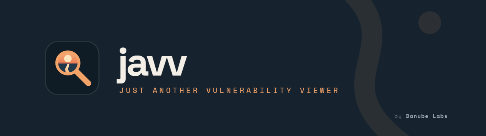
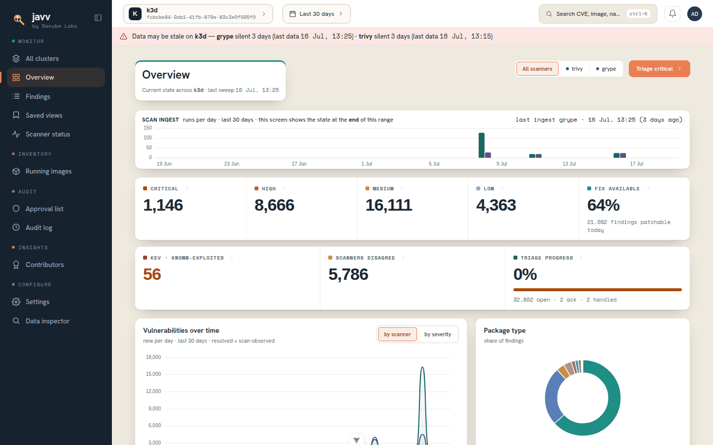
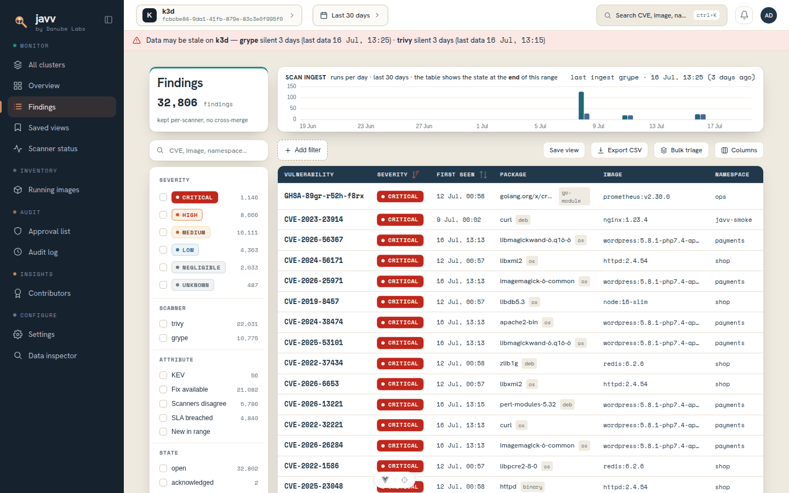
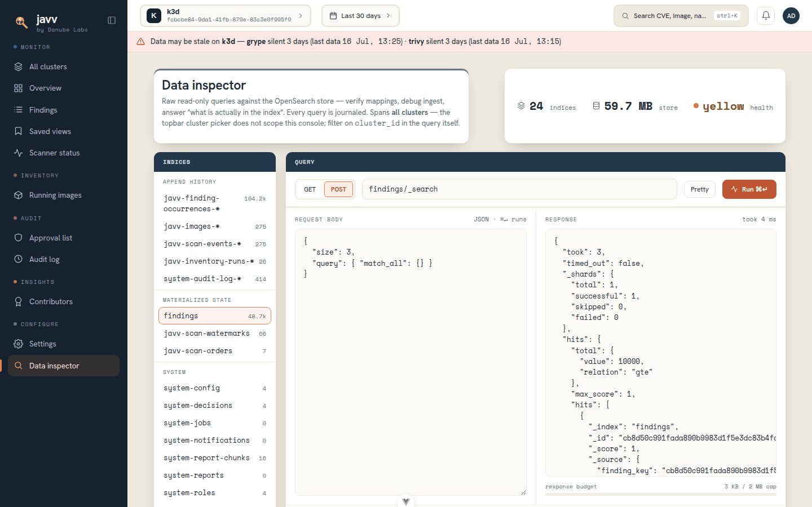
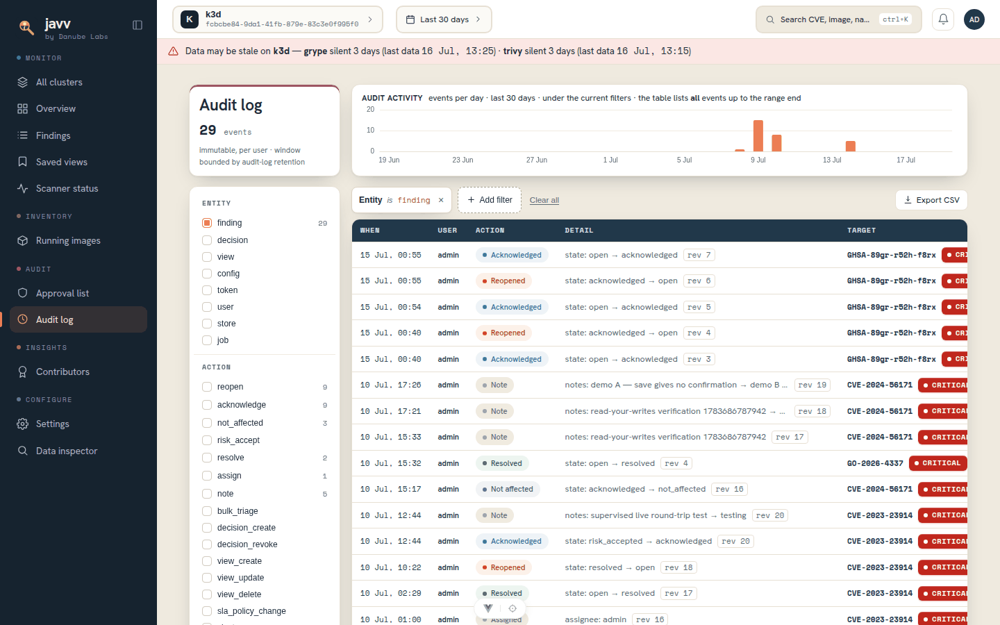

<p align="center">
  
</p>

<p align="center">
  <a href="https://github.com/Danube-Labs/javv-poc/releases"></a>
  <a href="https://github.com/Danube-Labs/javv-poc/actions/workflows/ci.yml"></a>
  <a href="LICENSE"></a>
  
  
</p>

<p align="center">
  <b>Kubernetes-runtime-native container-vulnerability triage.</b><br>
  Discovers what's <i>actually running</i> in your clusters, scans it with <b>Trivy and Grype</b>
  side by side, and gives you a real <b>triage lifecycle</b> — with rich dashboards, an append-only
  audit trail, whole-app time-travel, and one-click CSV. Without the weight of a full ASPM platform.
</p>

<p align="center">
  <a href="REPO-MAP.md">Repo map</a> ·
  <a href="development/RUNNING-THE-STACK.md">Run the stack</a> ·
  <a href="docs/API.md">API</a> ·
  <a href="docs/CONFIGURATION.md">Configuration</a> ·
  <a href="docs/engineering/ARCHITECTURE.md">Architecture</a>
</p>

> **Status:** actively developed, pre-1.0. The full stack is built and runnable from source — Python
> scanners → FastAPI backend → **Vue 3 frontend** (overview, triage, images, audit, scanner status,
> contributors, approvals, settings, data inspector). A **packaged deploy (container images + Helm
> chart) is not available yet** — that's the remaining milestone, **M10**
> ([#452](https://github.com/Danube-Labs/javv-poc/issues/452)). See
> [Releases](https://github.com/Danube-Labs/javv-poc/releases) for the current cut; canonical design
> lives in [`docs/engineering/`](docs/engineering/).

---

## Why

Vulnerability tooling splits into two worlds: **triage tools** (DefectDojo, Dependency-Track) with
rigid reporting, and **log-analytics dashboards** with no concept of auditing a finding. JAVV fills
the seam — a real triage lifecycle *and* exploratory dashboards, over what's live in your clusters.

Three things it does differently:

- **Scans what's running, not a registry.** JAVV discovers the images actually deployed in your
  clusters and scans those — the vulnerabilities you're exposed to right now, not a catalogue.
- **Two scanners, never merged.** Trivy and Grype run per-image and are kept side by side. JAVV
  never dedupes a CVE across scanners — instead it **flags where they disagree**, so you see the
  blind spots a single-scanner tool hides.
- **Every finding has a history.** A six-state triage lifecycle (+ VEX and risk-accept), an
  append-only audit journal, and **whole-app time-travel** that rewinds every screen to any point
  in the past.

## Screenshots

|  |  |
|:--:|:--:|
| <br>**Overview** — severity, KEV, scanner-disagreement, trends | <br>**Findings** — faceted, server-side triage grid |
| <br>**Data inspector** — read-only, journaled OpenSearch console | <br>**Audit log** — every action, with causal revisions |

## Features

- **Runtime discovery** — scan the images live in your clusters, per namespace/workload.
- **Per-scanner, side by side** — Trivy + Grype kept separate; disagreement is surfaced, never merged away.
- **Triage lifecycle** — six states, VEX import, risk-accept, decisions that apply across scanners — every action journaled (D17).
- **Whole-app time-travel** — a global picker rewinds *every* screen to any point ≤ now, reconstructed from the append logs.
- **Append-only audit log** — immutable, per-user, with causal-revision replay and CSV export.
- **Multi-tenant + RBAC** — isolated by immutable `cluster_id`; capability-based roles, local auth + bootstrap admin.
- **Server-side everything** — every count and page comes from an OpenSearch aggregation, never computed on the client.
- **Dashboards & exports** — overview, running-images inventory, scanner status, contributors, approvals, SLA tracking, one-click CSV.
- **Data inspector + repair actions** — a read-only OpenSearch console and a small set of sanctioned, journaled maintenance jobs.
- **No external broker** — coordination is OpenSearch; jobs are Kubernetes CronJobs. No Redis/Kafka/RabbitMQ.

## Architecture

```
Python scanner module (Trivy + Grype adapters, one JAVV-built image per scanner, run as CronJobs)
        │  push signed envelopes
        ▼
FastAPI async backend  ──►  OpenSearch  (single store — findings, append logs, audit, config)
        │  server-side aggregations
        ▼
Vue 3 frontend (PrimeVue · Pinia · ECharts)
```

Deploy target is **Helm → k3s** (in progress, M10). Full detail — layers, data flow, index model —
in [`docs/engineering/ARCHITECTURE.md`](docs/engineering/ARCHITECTURE.md) and
[`docs/engineering/INDEX-MAP.md`](docs/engineering/INDEX-MAP.md).

## Running it

> **A packaged deploy is not available yet.** Container images and a Helm chart land in **M10**
> ([#452](https://github.com/Danube-Labs/javv-poc/issues/452)). For now JAVV runs **from source**,
> for local development and evaluation.

Bring the stack up by hand — backend + UI against a local OpenSearch, or the full end-to-end path
with real Trivy/Grype scanning a live k3d cluster — by following
**[`development/RUNNING-THE-STACK.md`](development/RUNNING-THE-STACK.md)** (paths A / B / F). On a
fresh Ubuntu host, `bash development/setup/setup-dev.sh` installs every prerequisite first
(idempotent; verify readiness with `preflight.sh`).

## Documentation

**Canonical engineering set — [`docs/engineering/`](docs/engineering/):**

| Doc | What |
|---|---|
| [PLAN.md](docs/engineering/PLAN.md) | Decisions (D1–D45), data model, milestones (M0–M10) |
| [SPEC.md](docs/engineering/SPEC.md) | Functional + non-functional requirements (FR/NFR) |
| [ARCHITECTURE.md](docs/engineering/ARCHITECTURE.md) | Layers, data flow, diagrams (Mermaid) |
| [INDEX-MAP.md](docs/engineering/INDEX-MAP.md) | Source of truth for every OpenSearch index + mapping |
| [FLOW-EXAMPLE.md](docs/engineering/FLOW-EXAMPLE.md) | Worked ingest / query / time-travel examples |
| [AUDIT-RESPONSE.md](docs/engineering/AUDIT-RESPONSE.md) | External-audit findings → resolutions (rounds 1–4) |

**Supporting:**

| Path | What |
|---|---|
| [REPO-MAP.md](REPO-MAP.md) | **Repository map** — what every folder is + reading order |
| [docs/API.md](docs/API.md) | The shipped HTTP surface at a glance (auth regimes, capabilities) |
| [docs/CONFIGURATION.md](docs/CONFIGURATION.md) | Every configuration knob: default, tier, UI-controllability |
| [development/RUNNING-THE-STACK.md](development/RUNNING-THE-STACK.md) | Bring the stack up by hand (backend / full-stack / frontend) |
| [docs/research/](docs/research/) | Stack best-practices, tooling/MCP, audits backing v4 |
| [design/](design/) | Brand source of record (logos, tokens, guide) |

## Stack & toolchain

Python 3.12 · FastAPI (async) · AsyncOpenSearch · Pydantic v2 · Vue 3 (`<script setup>`) · PrimeVue ·
Pinia · vue-echarts. OpenSearch is the single store. Apache-2.0 components throughout.

Gate-tool versions (the ones that decide lint/type/test results, so local matches CI) are pinned in
**[`versions.yaml`](versions.yaml)** (D42) — bump them there; `development/setup/setup-dev.sh` reads
it directly and `development/scripts/check-versions.sh` drift-checks every consumer.

| Tool | Role | Version |
|---|---|---|
| Python | Backend runtime | 3.12 |
| [uv](https://docs.astral.sh/uv/) | Python package/venv manager | 0.11.25 *(pinned)* |
| [ruff](https://docs.astral.sh/ruff/) | Lint + format (backend) | 0.15.20 *(pinned)* |
| [pyright](https://microsoft.github.io/pyright/) | Type check (backend) | 1.1.411 *(pinned)* |
| Node.js | Frontend runtime / toolchain | 22 LTS *(pinned major)* |
| Vite · Vitest · ESLint/oxlint · stylelint · vue-tsc | Build, tests, lint/type gates (frontend) | from [`frontend/package.json`](frontend/package.json) |
| OpenSearch | Single datastore | pinned in [`versions.yaml`](versions.yaml) |
| [Trivy](https://trivy.dev/) · [Grype](https://github.com/anchore/grype) | Scanners (per-scanner, never merged) | pinned in [`versions.yaml`](versions.yaml) |
| kubectl · helm · [k3d](https://k3d.io/) | Local k8s (k3s-in-Docker) | latest |

### Supported versions

The externally-owned scanners + datastore JAVV pins and supports live in
[`versions.yaml`](versions.yaml) (D41/D42). Renovate watches it, the **compatibility gate**
(`scanner-images` CI) validates a new scanner version before it's published, and a drift check keeps
the Dockerfiles + dev compose in step. To change support, edit `versions.yaml`.

| Component | Current | Also supported |
|---|---|---|
| Trivy | 0.71.2 | 0.70.0 |
| Grype | 0.115.0 | 0.114.0 |
| OpenSearch | 3.7.0 | — |

Scanner images are published per supported version as
`ghcr.io/danube-labs/javv-scanner-{trivy,grype}:<ver>`; an operator pins/swaps a tag in their own
deploy (JAVV never changes versions in a running cluster).

## License

JAVV is **source-available** under the [Business Source License 1.1](LICENSE):

- **Free to use, modify, and self-host** — including in production, for any team or company.
- **What you may not do:** offer JAVV itself to third parties as a hosted/managed service (i.e. sell JAVV-as-a-service).
- **Time-delayed open source:** on the Change Date (**2030-06-10**) this version automatically converts to the **Apache License 2.0**.

Bundled/invoked tools (Trivy, Grype, OpenSearch) remain under their own Apache-2.0 licenses with
attribution. For other licensing arrangements, contact Danube Labs.
