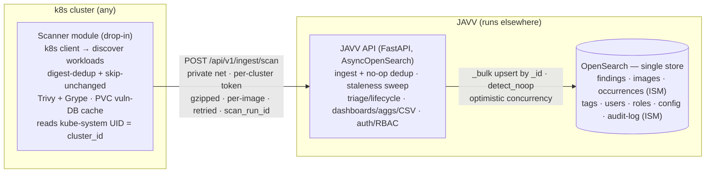

# JAVV — Just Another Vulnerability Viewer · MVP Plan (v2, audits folded in)

> **Status: revision 2 (2026-06-10).** Supersedes `deprecated/PLAN.md`; folds in both audits
> (`deprecated/AUDIT-FINDINGS.md`, `deprecated/extra_audit.md`) and the decisions of 2026-06-09/10 as
> verifiable milestone gates. Working root: `D:\Github\Claude\projects\javv`. Vendor: **Danube Labs**.
> Source notes: `original_notes_for_app.md` (read-only). Process: **specs.md FIRE flow, autonomy level 1
> (Confirm)** — run `npx specsmd@latest install` when we start building, then drive via
> `/fire-orchestrator → /fire-planner → /fire-builder`.

---

## 1. Identity / Brand (for logo generation)

- **Name:** JAVV — *Just Another Vulnerability Viewer*. The self-deprecating "just another…" tone is
  intentional: approachable, no-hype, engineer-first practical tooling.
- **Vendor:** **Danube Labs** — named for the Danube (the developer's birth city sits on the river);
  evokes steady, flowing, Central/Eastern-European engineering heritage.
- **Personality:** lightweight, pragmatic, transparent (shows raw per-scanner results, no black box).
- **Visual direction:** lens/reticle over a stylized container cube, subtle Danube wave; teal/cyan +
  dark slate; severity palette (reds/oranges/yellows) reserved for *data*, never brand chrome; geometric
  sans wordmark, favicon-scalable. **Full design brief: `LOGO-PROMPT.md`** (ready to hand to Claude Code
  with reference images).

## 2. Context & market fit

Vulnerability tooling splits into two non-overlapping worlds: **triage/audit tools** (DefectDojo,
Dependency-Track) have finding lifecycle management but rigid reporting; **search/BI tools** (Kibana /
OpenSearch Dashboards) have flexible dashboards + one-click CSV but no concept of *auditing* a
vulnerability. Existing OSS stacks (VulnWhisperer, Trivybeat) pipe scanner output into Kibana with
**zero** triage layer. JAVV targets the unfilled seam: **audit workflow + flexible reporting,
k8s-runtime-native, lightweight.**

**Differentiation pillars (must hold):** (1) k8s-runtime-native inventory of what's *actually running*;
(2) self-serve dashboards + one-click CSV materially better than DefectDojo OSS; (3) lightweight
(docker-compose → k8s, no Kafka/graph-DB sprawl). **Failure mode** to avoid: drifting into a generic
Trivy-dashboard or a DefectDojo clone. Honest risk: DefectDojo Pro is closing the dashboard gap.

## 3. Locked decisions

- **Scanner:** decoupled, self-contained **scanner module** (drop into any cluster). Runs **Trivy AND
  Grype from day one** (build the result handling around both real JSON shapes). Uses the official
  `kubernetes` Python client to discover namespaces/workloads/running images, reads the `kube-system`
  namespace UID as a stable **`cluster_id`**, digest-dedupes, scans, and pushes results to JAVV.
  **Direct image scans** (each tool scans the image filesystem); SBOM-first (Syft → both tools)
  rejected for now — accept double analysis for simplicity (2026-06-09).
- **Ingest:** scanner → **private network** endpoint, authenticated with a **per-cluster token**.
  Push **per-image (gzipped, retried with backoff + jitter, dead-letter on permanent failure)**; ingest
  is idempotent. Versioned API contract (`/v1` + `schema_version`) is the backbone. Every push carries a
  lightweight **`scan_run_id`** — observability only (coverage reporting, debugging), no completion
  protocol (2026-06-10).
- **Backend:** **FastAPI** (+ Pydantic, auto OpenAPI at `/docs`); no cluster access. **`AsyncOpenSearch`**
  client + **PIT + `search_after`** from the first commit (sync client / `from+size` rejected).
- **Storage:** **OpenSearch-only**, multiple indexes (Apache-2.0 → bundle/redistribute freely). No
  Postgres, no sync layer. `system_*` access isolated behind a **repository interface** as the escape
  hatch for a later SQLite/Postgres swap of just that slice (2026-06-09).
- **Staleness lifecycle replaces auto-resolve (2026-06-10):** findings not pushed again within a
  cadence-relative window go **`stale`** via a daily sweep (see §5); `resolved` is manual-only.
- **EPSS/KEV: capture now (2026-06-10)** — explicit mapped fields from Grype; free under static
  mappings, avoids a re-ingest later.
- **Findings are kept per-scanner** (no cross-scanner merge). An image view offers a **scanner dropdown**
  (e.g. "nginx — Trivy" vs "nginx — Grype"). Dashboards must **facet by scanner** to avoid double-counting.
- **State:** **current-state only** for the MVP (no historical scan series yet → trend charts & the
  "most vulns solved" hero are a later bolt).
- **Multi-cluster:** supported via `cluster_id` (immutable) + `cluster_name` (relabelable display).
- **Private registries:** supported from day one — scanner resolves `imagePullSecrets` →
  dockerconfigjson → passes creds to the scanner (held in memory only, never logged).
- **Vuln DB:** mirror/cache with scheduled refresh (not per-scan) to dodge GHCR rate limits;
  `--db-repository` override stays exposed. Scanner uses a **persistent cache volume**.
- **Frontend:** Vue 3 + PrimeVue (chrome) + vue-echarts. All pagination/sort/filter/facet/KPI
  **server-side** via OpenSearch aggregations — never ship raw findings to compute counts. **No embedded
  OpenSearch Dashboards** as the main UI. Table engine for dense grids: **deferred** (`UI-tools.md`),
  decide before M5.
- **Out of MVP (deferred):** Kibana-style dashboard *builder* (the scope trap), Jira, LDAP/OIDC,
  gamified landing page, dashboard color customization, historical trends.

## 4. Architecture

## 5. Core data model

**Finding identity:** `_id = finding_key = hash(cluster_id + image_digest + scanner + cve_id +
package_name + installed_version)` → idempotent upsert; re-ingest preserves triage state **and tags**.

**Normalized finding (both scanners map into one shape):**

| Field | Trivy (`Results[].Vulnerabilities[]`) | Grype (`matches[]`) |
|---|---|---|
| cve_id | `VulnerabilityID` | `vulnerability.id` |
| package_name | `PkgName` | `artifact.name` |
| installed_version | `InstalledVersion` | `artifact.version` |
| purl | `PkgIdentifier.PURL` | `artifact.purl` |
| fixed_version | `FixedVersion` | `fix.versions[]` |
| fix_state | `Status` | `fix.state` |
| severity | `Severity` | `vulnerability.severity` (has extra `Negligible`) |
| cvss | `CVSS` (**vendor-keyed map → reshape!**) | `vulnerability.cvss[]` |
| epss / kev | *absent* | `vulnerability.epss[]`, `kev` — **captured (2026-06-10)** |

> **DB/index design is a deliberate focus area.** Full field-level **explicit mappings**
> (`dynamic:false`, `keyword` IDs/enums, reshaped vendor-keyed CVSS, EPSS/KEV fields, `total_fields`
> safety net) are designed in M1 before any real ingest — see §7 and `SPEC.md` NFR-1.

**Index naming convention:**
- **System indexes** — prefix **`system_`**, named **`system_<entity>`** (concrete plural noun,
  snake_case): `system_users` (accounts), `system_roles` (RBAC), `system_tokens` (per-cluster ingest
  tokens), `system_config` (app settings), `system_audit_log` (append-only, **ISM rollover/retention**),
  `system_tags` (tag definitions). Avoid vague catch-alls like `system_user_data` — name by concrete
  entity (same rule as the lean-helpers principle). All `system_*` access goes through a **repository
  interface** (later SQLite/Postgres swap stays localized).
- **Data indexes** — scan output: `findings`, `images`, `occurrences` (**ISM rollover/retention** —
  grows unbounded otherwise; `findings`/`images` stay fixed). Applied tags are denormalized onto
  `findings`/`images`.

**Explicit `scanner` field:** every ingested scan/finding doc carries a top-level
**`scanner` ∈ {`trivy`, `grype`}** (in addition to `scanner` being part of `finding_key`) so the UI and
aggregations filter/facet by scanner cheaply.

**`findings` (the heart):** status ∈ {open, triaged, risk_accepted, false_positive, resolved, **stale**}
(`resolved` manual-only, `stale` sweep-only), **`pre_stale_status`** (for comeback), triage notes,
audited_by/at, first/last seen (**`last_seen` day-granularity** — critical: per-push timestamps would
defeat `detect_noop`), `scan_run_id`, `scanner`, `cluster_id`/`cluster_name`, plus denormalized image +
occurrence + tag fields for single-query filter/aggregation/CSV.

**Dedup/upsert rule:** upsert by `finding_key`; **content-hash each finding** and write via scripted
partial update with `detect_noop:true` so unchanged rescans are **no-ops** (Lucene update = delete +
re-insert; churn scales with scan frequency otherwise). One **shared preserved-fields script** enumerates
everything re-ingest must never overwrite (triage state, notes, tags, `pre_stale_status`).

**Staleness sweep (replaces auto-resolve):** daily job, `status != stale AND last_seen < now − N` →
`stale` via `_bulk`, where **N ≈ 3× the cluster's scan cadence** (per-cluster config). **Scanner-down
guard:** skip clusters whose `last_ingest_at` (tracked per token) is older than the window — alert
"scanner silent" instead of mass-staling. Comeback: re-pushed stale finding reverts to `pre_stale_status`.

**Concurrency/integrity (no relational DB):** `_id` enforces uniqueness; **optimistic concurrency**
(`if_seq_no`/`if_primary_term`) prevents lost triage updates; realtime GET-by-`_id` for read-after-write;
`refresh=wait_for` on **triage writes only** (data indexes run `refresh_interval: 30s`); referential
integrity in app code. Bulk/sweep jobs use `conflicts=proceed` + retry and report skipped docs.

## 6. First build — the scanner modules (build these first)

Per the milestone reorder (§8): **scanners → backend → rest.** Build the two Python scanners as one
well-structured package — per-tool **adapters that share one pipeline**, not two copy-pasted scripts.

**Structure (`scanner/`):**
- `scanners/base.py` — `Scanner` interface (ABC/Protocol): `scan(image) -> list[NormalizedFinding]`.
- `scanners/trivy.py`, `scanners/grype.py` — one adapter per tool: invoke the binary, parse its JSON,
  normalize into the shared model (incl. EPSS/KEV for Grype); each stamps `scanner = "trivy"|"grype"`.
- `model.py` — normalized finding (Pydantic/dataclass) from §5's mapping table.
- `discovery.py` — k8s workload/image discovery (shared).
- `credentials.py` — `imagePullSecret` → dockerconfigjson resolution (shared).
- `dedup.py` — digest dedup + **skip-unchanged** (`digest + scanner + vuln-DB version` already scanned →
  skip; rescans only matter when the DB updates).
- `push.py` — gzipped POST to the ingest API: **backoff + jitter** (`tenacity`), **dead-letter file** on
  permanent failure, bounded `asyncio.Semaphore`, stamps `scan_run_id`; until the backend exists, writes
  normalized JSON to a file/stub so scanners are testable standalone.
- `config.py` — env/config loading (`pydantic-settings`).
- `helper_functions.py` — small cross-cutting helpers only; keep lean. Real logic lives in the named
  modules above (discovery/credentials/dedup/normalize) so it never rots into a catch-all god module.
- `log_config.py` — thin layer on stdlib `logging` with two formatters (**JSON** vs **human-readable
  multiline**) chosen by the **`LOG_FORMAT`** env var. Named `log_config.py` **not** `logging.py` (the
  latter shadows the stdlib `import logging`).
- `cli.py` / `__main__.py` — entrypoint.
- `tests/fixtures/` — frozen golden Trivy/Grype JSON for deterministic unit tests (§7).

**Runtime (k8s):** Job/CronJob with `concurrencyPolicy: Forbid`, `activeDeadlineSeconds`, **PVC cache
volume** for trivy/grype DBs + layer cache (emptyDir re-downloads the DB every run and hammers GHCR),
bounded scan parallelism (the binaries can take 1 GB+ RAM each on large images — size memory
accordingly), fail-fast per image (one bad image must not kill the run).

**M0 deliverable:** run locally against an image, scan with either tool, emit normalized findings
(file/stdout), green unit tests vs golden fixtures. The end-to-end discover→scan→table flow
(`SPEC.md` sequence diagram) lands once the backend exists.

## 7. Research findings baked in

From inception research plus both audits (full detail + sources: `deprecated/AUDIT-FINDINGS.md`,
`deprecated/extra_audit.md`):
- **Licensing:** Trivy & Grype both Apache-2.0 (bundle with attribution). OpenSearch Apache-2.0.
- **Scan efficiency:** dedupe by **image digest** (`status.containerStatuses[].imageID`), scan each
  unique digest once (~300 pods ≈ ~40 images); skip-unchanged per vuln-DB version.
- **Upsert churn is the dominant scale cost:** same-`_id` rescans = Lucene delete+reinsert → tombstones,
  merge/GC load scaling with **scan frequency**. Fix: no-op upserts (content hash + `detect_noop`),
  `refresh_interval: 30s`, merge tuning.
- **OpenSearch mapping explosion** (top operational pitfall): **explicit mappings + `dynamic:false`**;
  reshape vendor-keyed objects (Trivy CVSS) into fixed `[{key,value}]` arrays;
  `index.mapping.total_fields.ignore_dynamic_beyond_limit:true` safety net.
- **Unbounded growth:** `occurrences` + `system_audit_log` grow forever → ISM rollover + retention on
  those two only. Shards 10–30 GB (search) to ~50 GB max; ≤20–25 shards/GB heap.
- **Bulk ingest:** 5–15 MiB per `_bulk`; backend batches per-image pushes into async `_bulk` writes.
- **Aggregation limits:** `search.max_buckets` defaults to 10k; terms aggs approximate beyond `size`;
  high-cardinality facets (image/CVE) → capped terms or **composite aggs**; never nest high-cardinality
  terms.
- **OpenSearch footprint:** ≥4 GB host for compose, ~50% RAM as heap, swap off; single-node prod only
  with snapshots + tested restore.
- **CSV formula injection** (must-fix in a security tool): sanitize cells starting with `= + - @`/tab/CR.
- **CSV at volume:** FastAPI `StreamingResponse` + async generator (~1000-row chunks); PIT +
  `search_after`; always close PITs in `finally`.
- **Least-priv scanner RBAC:** read-only `get/list/watch` on pods + apps workloads + namespaces;
  Secret read **namespace-scoped** (RoleBindings where private images run), not cluster-wide.
- **Domain scars (DefectDojo/Dependency-Track):** dedup must be batch; preserve triage across rescans;
  recompute metrics async, never on dashboard load; everything list/agg server-side or it walls at
  10k–100k findings.
- **Deterministic tests:** unit-test the normalizer/ingest against **frozen golden JSON fixtures**, never
  live scans (vuln DBs drift daily). One separate, count-tolerant live integration test.
- **Backend libs:** `pydantic-settings`, `structlog` → stdlib (JSON prod / console dev), pytest +
  pytest-asyncio + httpx + **testcontainers(OpenSearch)**; Pydantic API models decoupled from index docs
  (`to_os_doc()`/`from_os_hit()`); OpenTelemetry deferred until k8s.

## 8. Milestones (FIRE bolts) — hardening gates folded in

Each ends on a **verifiable check + Confirm gate** (CLAUDE.md #4). Order: **scanners → backend → rest.**
The audit checklists are no longer a side list — they are acceptance criteria below.

1. **M0 — Scanner modules (Trivy + Grype).** The `scanner/` package per §6.
   **Gates:** scan an image with either tool → normalized findings (incl. EPSS/KEV from Grype) → green
   unit tests vs golden fixtures; push envelope carries `scan_run_id` + `schema_version`;
   backoff + jitter + dead-letter exercised in tests; skip-unchanged works; `last_seen` day-granularity.
2. **M1 — Backend skeleton + indexes + ingest.** `backend/` (FastAPI) + `deploy/` compose (OpenSearch +
   API). **Gates:** explicit mappings/templates for **`system_` + data** indexes (`dynamic:false`,
   `keyword` IDs, reshaped CVSS, EPSS/KEV fields) + versioned bootstrap; ISM policies on `occurrences` +
   `system_audit_log`; `POST /api/v1/ingest/scan` with per-cluster token, **size caps (compressed +
   decompressed + findings count)**; **`AsyncOpenSearch`** via lifespan + `_bulk` writes;
   `refresh_interval: 30s`; snapshot repo configured; wire the scanner's real push.
3. **M2 — Ingest dedup/identity + staleness (highest risk).** **Gates:** upsert by `finding_key` with
   content-hash `detect_noop` (unchanged rescan = **zero doc writes**, asserted in tests); one shared
   preserved-fields script (triage + tags + `pre_stale_status` survive re-ingest); staleness sweep with
   cadence-relative window + scanner-down guard + comeback-to-`pre_stale_status`; optimistic concurrency.
   Test hardest.
4. **M3 — Triage API + RBAC + auth.** **Gates:** state transitions incl. `stale` rules
   (`resolved` manual-only); bulk actions via `_bulk` (202 + async job for large sets); audit log =
   **one entry per bulk action**; tag CRUD with image-level application + async rate-limited retag jobs;
   `get_current_principal()` dependency (ingest-token auth separate); per-request IDOR checks; tenant
   filter in the query layer; `refresh=wait_for` on triage writes.
5. **M4 — Read/reporting API.** **Gates:** filtered search (tag/app/team/org/severity/timestamp/
   **scanner**) via PIT + `search_after`; aggregation endpoints faceted by scanner, capped/composite
   (no nested high-cardinality terms); **streaming sanitized CSV** (constant memory, async job for very
   large exports); rate-limit search/export.
6. **M5 — Frontend.** Barebones first-flow (discover → scanner dropdown → scan → table) → then the
   Kibana-like dashboard per `UI-GUIDELINES.md` (KPI tiles, donut, trend charts, dense severity-colored
   tables, per-image report, scanner dropdown, one-click CSV). **Gates:** all grids server-side lazy
   (table engine decision from `UI-tools.md` lands here); ECharts canvas renderer; no client-side
   aggregation anywhere.
7. **M6 — Polish & deploy.** **Gates:** Helm chart (PVC cache volume, CronJob hygiene, scanner RBAC
   manifests, snapshot config); docs incl. **OpenSearch sizing minimums**; vuln-DB mirror how-to;
   snapshot **restore tested**; Trivy/Grype attribution.

## 9. Verification (end-to-end)

- **CI:** testcontainers OpenSearch. Assert: ingest upserts by `finding_key`; **re-ingest preserves
  triage state + tags, no duplicates**; **unchanged rescan = zero doc writes** (`detect_noop`);
  staleness sweep marks/skips/reverts correctly (window, scanner-down guard, comeback); concurrent
  triage protected by optimistic concurrency; bulk triage writes one audit entry; CSV stream matches the
  filtered query and is injection-sanitized; ingest rejects oversized/gzip-bomb payloads.
- **Scanner:** kind/minikube + a known-vulnerable image; confirm digest dedup (N pods → M<N scans),
  skip-unchanged on second run, namespace-scoped private-registry pulls, DB served from cache volume.
- **Manual E2E (compose):** discover → scan (pick scanner) → findings appear → filter → triage
  (risk-accept) → re-scan → state persists → export CSV → per-image report → stop pushing an image →
  staleness sweep marks it stale → re-push → status reverts.

## 10. Open items

- Logo: generate from `LOGO-PROMPT.md` + reference images; pick final assets.
- Table engine for dense grids — deferred; decide before M5 (`UI-tools.md`).
- GitHub repo setup (precedes M0).
- Which project-specific Claude Code skills to author (scan-fixture ingest helper, "run the JAVV stack").
