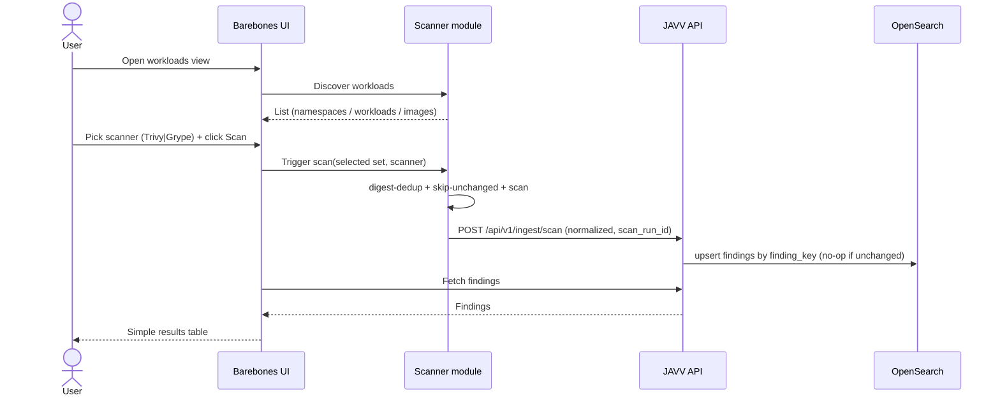

# JAVV — Spec (v2, audits folded in)

> **specs.md / FIRE-style draft, revision 2 (2026-06-10).** Supersedes `deprecated/SPEC.md`; folds in
> both audits (`deprecated/AUDIT-FINDINGS.md`, `deprecated/extra_audit.md`) and the decisions taken on
> 2026-06-09/10. To be formalized via `/fire-planner` after `npx specsmd@latest install`. Companion
> docs: `PLAN.md` (architecture + decisions), `UI-GUIDELINES.md` (polished UI target). Diagrams are Mermaid.

## Intent (what & why)
Teams that run container vulnerability scanners get either **flexible dashboards with no triage**
(Kibana/OpenSearch Dashboards) or **triage with rigid reporting** (DefectDojo). JAVV fills the seam:
a lightweight, k8s-runtime-native tool that ingests Trivy **and** Grype results, lets you **audit and
triage** findings, and gives **Kibana-grade dashboards + one-click CSV** over what's *actually running*.

## Goals
- Discover what's running in a cluster and scan it (Trivy + Grype) without external services.
- Ingest, deduplicate, and persist findings with a durable **triage lifecycle**.
- Dense, filterable dashboards + sanitized one-click CSV.
- Lightweight to run (docker-compose → k8s), OpenSearch-only.

## Non-goals (MVP)
Kibana-style dashboard *builder*; historical trends / "most vulns solved"; Jira; LDAP/OIDC;
cross-scanner finding merge; dashboard theming. (See `PLAN.md` §3.)

## Actors
- **Triager** (security engineer) — reviews, filters, triages findings, exports reports.
- **Admin** — manages users/roles, tags, per-cluster ingest tokens.
- **Scanner module** — automated client; discovers + scans + pushes results.

## Functional requirements
- **FR-1 Discovery:** scanner enumerates namespaces/workloads/running images via the k8s API;
  dedupes by image **digest**; reads `kube-system` UID as `cluster_id`.
- **FR-2 Scan:** scanner runs the **selected scanner (Trivy or Grype)** over unique digests; resolves
  `imagePullSecrets` (namespace-scoped) for private registries. Scans are skipped for a digest already
  scanned with the **same scanner + vuln-DB version** (skip-unchanged); scan concurrency is bounded.
- **FR-3 Ingest:** the **scanner normalizes** Trivy/Grype JSON into the shared shape (per-tool adapters)
  and pushes per-image, gzipped, retried (backoff + jitter, dead-letter on permanent failure) to
  `POST /api/v1/ingest/scan` over a private network with a **per-cluster token**. The endpoint
  **validates** the versioned envelope (`/v1` + `schema_version`) — it does not parse raw scanner JSON.
  Every push carries a **`scan_run_id`** (observability: coverage reporting, debugging).
- **FR-4 Dedup/identity:** upsert by `_id = finding_key = hash(cluster_id + image_digest + scanner +
  cve_id + package_name + installed_version)`; re-ingest **preserves triage state and tags** (one shared
  preserved-fields script) and is a **no-op for unchanged findings** (content hash + `detect_noop`);
  `last_seen` is **day-granularity** so intra-day rescans stay no-ops.
- **FR-5 Staleness lifecycle (replaces auto-resolve):** a finding not pushed again within a
  **cadence-relative window** (~3× the cluster's expected scan interval, per-cluster configurable) is
  marked **`stale`** by a daily background sweep. The sweep **skips clusters with no recent successful
  ingest** (scanner-down guard — alert "scanner silent" instead of mass-staling). A stale finding pushed
  again reverts to its **pre-stale status** (stored on the doc); triage state survives the round-trip.
- **FR-6 Triage:** finding status ∈ {open, triaged, risk_accepted, false_positive, resolved, **stale**}
  (`resolved` = manual only; `stale` = sweep only); notes; bulk actions (`_bulk`, async with progress for
  large sets); every change written to an append-only audit log — **one entry per bulk action**
  (criteria, actor, count, capped ID sample), not per finding; concurrent edits use optimistic concurrency.
- **FR-7 Tagging:** post-ingestion team/application/organization tags on findings/images. Tags apply at
  the **image level** where possible; retags run as **async jobs** (`update_by_query`, `slices=auto`,
  `conflicts=proceed` + retry), rate-limited.
- **FR-8 Search & dashboards:** filter by namespace/image/tag/severity/timestamp/**scanner**;
  aggregations faceted by scanner (never summed across scanners). Facets use capped terms or
  **composite aggregations**; no nested high-cardinality terms aggs.
- **FR-9 Reporting:** streaming, **CSV-injection-sanitized** export from any lens (PIT + `search_after`,
  constant memory; async job for very large exports).
- **FR-10 Per-image report:** drill into an image with a **Trivy/Grype scanner dropdown**.
- **FR-11 Auth/RBAC:** basic auth + role-gated mutations behind a single `get_current_principal()`
  dependency (OIDC-swappable later); ingest-token auth in a **separate** dependency. Per-request
  entitlement checks on every finding/image fetch **and export** (IDOR); tenant isolation enforced in the
  **query layer**, never UI-only.
- **FR-12 Risk metadata:** capture **EPSS/KEV** from Grype now (decision 2026-06-10) — explicit mapped
  fields; absent for Trivy. Forward-compat for later prioritization features without re-ingest.

## Non-functional requirements
- **NFR-1** OpenSearch-only; explicit mappings + `dynamic:false`; `keyword` for IDs/enums; vendor-keyed
  CVSS reshaped to fixed arrays; `total_fields.ignore_dynamic_beyond_limit` safety net.
- **NFR-2** Lightweight deploy: docker-compose and k8s/Helm, no Kafka/graph-DB. **Documented OpenSearch
  minimums** (compose: ≥4 GB host / 1–2 GB heap; small prod: ≥8 GB / ~4 GB heap).
- **NFR-3** Least-privilege scanner RBAC (read-only workloads; namespace-scoped Secret read).
- **NFR-4** Deterministic tests via frozen golden scanner JSON; one count-tolerant live scan test.
- **NFR-5** Credentials in memory only, never logged.
- **NFR-6 Backups/availability:** scheduled **snapshots to S3/MinIO with tested restore**; single-node
  production is acceptable **only with** snapshots in place. ISM rollover + retention on the unbounded
  indexes (`occurrences`, `system_audit_log`); `findings`/`images` stay fixed.
- **NFR-7 Ingest hardening:** backend uses **`AsyncOpenSearch`** + `_bulk` writes; `refresh_interval:
  30s` on data indexes with **`refresh=wait_for` on triage writes only**; ingest endpoint enforces max
  **compressed and decompressed** payload size (gzip-bomb guard) + max findings per push, clear 413s.
- **NFR-8** Vuln-DB mirror/cache with scheduled refresh; scanner uses a **persistent cache volume**
  (never re-downloads DBs per run).

## First working flow (barebones — acceptance target)

**Acceptance:** Given a cluster with running workloads, when the user picks a scanner and clicks Scan,
then discovered images are scanned (digest-deduped), findings are ingested without duplicates, and a
simple table renders the results. Re-running preserves any triage state and produces **no doc writes for
unchanged findings**.

## Work-item decomposition (→ `PLAN.md` milestones) — scanners → backend → rest
Each WI's hardening gates are spelled out in `PLAN.md` §8 (audit checklists folded into acceptance criteria).
- **WI-0** Scanner modules: Trivy + Grype adapters on a shared pipeline (discovery, credentials,
  digest-dedup + skip-unchanged, normalize incl. EPSS/KEV, `log_config` JSON|multiline, push-with-stub
  with `scan_run_id` + backoff/jitter + dead-letter) + golden-fixture tests — *M0*
- **WI-1** Backend skeleton + compose + OpenSearch **`system_` + data** index mappings (`dynamic:false`)
  + bootstrap + ingest API (per-cluster token, size caps, `AsyncOpenSearch` + `_bulk`) — *M1*
- **WI-2** Ingest dedup/identity + no-op upsert + triage/tag-state preservation + staleness sweep
  (highest risk) — *M2*
- **WI-3** Triage API + RBAC + auth + `system_audit_log` (bulk-action entries) — *M3*
- **WI-4** Search/aggregation API (scanner-faceted, composite aggs) + streaming sanitized CSV — *M4*
- **WI-5** Barebones first-flow UI → Kibana-like dashboard (`UI-GUIDELINES.md`) — *M5*
- **WI-6** Helm chart (PVC cache, snapshots) + docs (OpenSearch sizing) + scanner attribution — *M6*

## Open questions
- Brand/logo final assets — design prompt ready (`LOGO-PROMPT.md`); generate + pick.
- Table engine for dense grids (PrimeVue vs AG Grid/TanStack) — deferred, decide before M5 (`UI-tools.md`).
- Which project-specific Claude Code skills to author (scan-fixture ingest helper; "run the JAVV stack")?
