# JAVV - Architecture (v3)

> **Revision 3 (2026-06-20).** Supersedes `docs/ADR/ARCHITECTURE.md` (v2). The end-to-end design with the
> v3 **hybrid data model** (mutable current-state + append-only logs + human-decision layer), the
> projection mechanism, per-cluster retention, and first-class observability. Source of decisions:
> `PLAN_v3.md` / `SPEC_v3.md`. UI reference: `design_handoff_javv/`. Diagrams: Mermaid.

## 1. System diagram

```mermaid
flowchart TB
    Triager["Triager / Security Lead"]
    Admin["Admin"]

    subgraph CLUSTER["k8s cluster - one per cluster_id; runs the drop-in scanner"]
        direction TB
        K8SAPI["kube-apiserver"]
        REG["private registry"]
        VDB["vuln DBs (mirror/cache on PVC)<br/>trivy-db / grype-db"]
        subgraph SCAN["Scanner module (Job/CronJob · Forbid · PVC cache)"]
            direction TB
            DISC["discovery + dedup + skip-unchanged"]
            ADAPT["trivy / grype adapters → normalize<br/>EPSS/KEV (grype) · stamp scanner"]
            PUSH["push.py · gzip · backoff+jitter · dead-letter · scan_run_id"]
        end
    end

    subgraph JAVV["JAVV - central, no cluster access"]
        direction TB
        subgraph API["FastAPI · AsyncOpenSearch · OpenAPI /docs"]
            direction TB
            INGEST["Ingest (hardened)<br/>per-(cluster,scanner) token · validate envelope<br/>rate-limit·size+decompress caps·structured queries"]
            UPSERT["Dedup/upsert (_bulk)<br/>_id=finding_key · detect_noop<br/>preserved-fields script"]
            APPEND["Append scan-events + finding-occurrences (immutable)<br/>+ close-event diff (success-guarded)"]
            PROJECT["Exception projection → state<br/>precedence · scope × apply_both · expiry-refresh"]
            SWEEP["Staleness sweep + expiry re-project<br/>condition-based · scanner-down guard"]
            TRIAGE["Triage API · VEX two-field · bulk<br/>optimistic concurrency · refresh=wait_for"]
            SEARCH["Search/aggs · faceted by scanner · PIT+search_after<br/>trends ← scan-events · contributors ← audit_log<br/>point-in-time ← occurrences (collapse @ts≤T)"]
            CSV["Streaming CSV (sanitized)"]
            AUTH["Auth/RBAC · get_current_principal · IDOR · tenant filter"]
            RET["Retention mgr → ISM policies (per cluster_id)"]
            OBS["/healthz /readyz /metrics · structlog"]
            BOOT["Index bootstrap · mappings · ISM · snapshots"]
        end

        subgraph OS["OpenSearch - single store"]
            direction TB
            subgraph CUR["current-state (mutable, upsert)"]
                F[("findings<br/>per-scanner · triage · disagree flag")]
                I[("images<br/>counts · count-disagreement pair")]
            end
            subgraph LOG["logs (append-only, per-cluster, ISM)"]
                SE[("javv-scan-events-* (summaries → trends)")]
                OCC[("javv-finding-occurrences-* (per-finding → point-in-time)")]
                MET[("javv-metrics-* (optional rollup, post-MVP)")]
            end
            subgraph SYS["system_* (repository interface)"]
                direction TB
                SU[("users·roles·tokens·config·tags")]
                SX[("system_exceptions<br/>scoped decisions")]
                SA[("system_audit_log (immutable, ISM)")]
                SV[("saved_views · notifications (per-user)")]
            end
        end

        subgraph FE["Frontend - Vue 3 · PrimeVue · vue-echarts (server-side)"]
            FLOW["first-flow → Kibana-like dashboard"]
            RETUI["Settings → Data Retention (Admin)"]
        end
    end

    DISC --> K8SAPI
    ADAPT --> REG
    ADAPT --> VDB
    DISC --> ADAPT --> PUSH
    PUSH -->|"POST /api/v1/ingest/scan · private net · gzip · retried"| INGEST

    INGEST --> UPSERT --> F
    UPSERT --> I
    INGEST --> APPEND --> SE
    APPEND --> OCC
    UPSERT --> PROJECT
    PROJECT --> F
    SWEEP --> F
    SWEEP --> SE
    TRIAGE --> F
    TRIAGE --> SX
    TRIAGE --> SA
    PROJECT --> SX
    SEARCH --> F
    SEARCH --> I
    SEARCH --> SE
    SEARCH --> OCC
    SEARCH --> SA
    CSV --> F
    AUTH --> SU
    RET --> SE
    MET -. "ISM rollup" .- SE
    BOOT --> OS

    FLOW --> SEARCH
    FLOW --> TRIAGE
    FLOW --> CSV
    RETUI --> RET
    Triager --> FE
    Admin --> FE
    Admin --> AUTH

    style CLUSTER fill:#fff7ed,stroke:#F18F01
    style SCAN fill:#fef3c7,stroke:#F18F01
    style JAVV fill:#eef2ff,stroke:#6366f1
    style API fill:#e0e7ff,stroke:#6366f1
    style OS fill:#ecfeff,stroke:#2EC4B6
    style CUR fill:#e6f4f1,stroke:#2EC4B6
    style LOG fill:#fdf4ff,stroke:#a855f7
    style SYS fill:#f3f4f6,stroke:#9CA3AF
    style FE fill:#f0fdf4,stroke:#22c55e
```

## 2. The two layers + the human layer (the v3 crux)

JAVV separates three concerns that never write each other's fields:

| Layer | Index(es) | Mutability | Owner | Job |
|---|---|---|---|---|
| **Current-state** | `findings`, `images` | mutable (upsert) | ingest writes scanner fields; projection writes `state` | triage + grid |
| **Logs - trends** | `javv-scan-events-*` | append-only (immutable) | ingest only | severity-count trends |
| **Logs - history** | `javv-finding-occurrences-*` | append-only (immutable) | ingest only | **accurate point-in-time** (per-finding, `@timestamp`, close-events) |
| **Human decisions** | `system_exceptions`, `system_audit_log` | append/mutable | triage only | scoped decisions + audit |

This is Elastic CSPM's append-stream + materialized-current-state pattern, **plus** the triage layer the
view-only stacks omit. On OpenSearch (no `latest` transform), **ingest writes current-state and logs in one
pass** - no transform job.

## 3. Data flow (end to end)

1. **Discover** - scanner lists workloads/images via kube-apiserver; reads `kube-system` UID = `cluster_id`;
   digest-dedups; **skips** digests already scanned at the current scanner+DB version.
2. **Scan + normalize** - trivy/grype adapter invokes its binary (PVC-cached DB), pulls via namespace-scoped
   creds, normalizes to the shared shape (grype adds EPSS/KEV), stamps `scanner`.
3. **Push** - per-image, gzipped, backoff+jitter+dead-letter, `scan_run_id`, per-`(cluster,scanner)` token.
4. **Ingest (hardened)** - validate envelope + size/decompression caps + rate-limit; then in one pass:
   **upsert `findings`** (`detect_noop`, preserved-fields script) + **upsert `images`** (counts,
   count-disagreement) + **append `javv-scan-events`** (per-(image,scanner,scan) summary) + **append
   `javv-finding-occurrences`** (per-finding, write-on-change) + **close-event diff** for findings that
   dropped out of a **successfully scanned** image (guarded by `scan_run_id` - failed scans never false-close).
5. **Project** - recompute matching findings' `state` from `system_exceptions` (scope × `apply_both` ×
   precedence). Compute the per-finding severity `disagree` flag.
6. **Operate** - triage writes `findings` + `system_exceptions` + `system_audit_log`; search/aggs/CSV read
   current-state; trends read `javv-scan-events`; **point-in-time** reads `javv-finding-occurrences`
   (collapse on `finding_key`, latest `@timestamp ≤ T`, drop `closed` - same query both directions);
   Contributors read `system_audit_log`; all via PIT+`search_after`, faceted by scanner, tenant-filtered by
   `cluster_id`.
7. **Maintain (CronJobs, idempotent)** - daily **staleness sweep** (condition-based, scanner-down guard) +
   **exception-expiry re-projection**; optional **rollup** (deterministic-`_id`) downsampling old
   scan-events into `javv-metrics-*`.
8. **Retain** - ISM rollover (size/age/docs) on `javv-scan-events-<…cluster_id>-*` + per-cluster
   `retention_days` delete by **dropping whole indices** (Admin-managed via the Retention panel).

## 4. Projection & precedence (FR-8)

A finding's `state` is derived, not free-typed:
- **Scope** selects the image/namespace dimension of which findings an exception touches;
  **`apply_both_scanners`** selects the scanner dimension. Orthogonal.
- **Precedence** (on conflict only): explicit per-finding action > image-scoped > namespace-scoped >
  cluster-scoped > none; a direct human action always outranks an auto-rule.
- **Expiry-refresh:** when the winning decision expires, re-project to the *next* applicable rule (not
  `open`). Namespace/cluster scopes auto-apply to new matching findings at ingest; explicit-image scopes
  do not. *(Apply-to-both exact behavior: test gate, M3.)*

## 5. Observability & ops (M1)

`/healthz` + `/readyz` (k8s probes) and Prometheus `/metrics`: ingestion rate, 4xx/413/429/503, payload
sizes, **decompression ratio** (abuse signal), `_bulk` latency, queue depth, memory. structlog (JSON prod /
console dev) routed through stdlib. **No Redis/Kafka/broker** - backpressure is a bounded `asyncio.Semaphore`
(→503), rate-limit is `slowapi` in-proc (→429); both are observable via the metrics above.

## 6. Notes
- **Diagrams are Mermaid** (working agreement). Keep this file current as the architecture evolves.
- **Tenant isolation** is enforced in the query layer (`cluster_id` filter on every read/export), never
  UI-only. **RBAC** gates mutations client- and server-side.
- The frontend recreates `design_handoff_javv/` in Vue 3 - keep the `fields`-config pattern (one
  declaration driving FacetRail + FilterBar) verbatim; treat the JSX prototype as executable spec, not
  code to port line-by-line.
