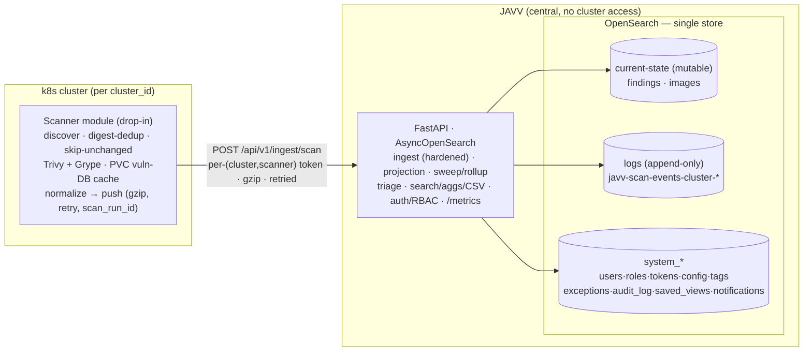

# JAVV — Just Another Vulnerability Viewer · MVP Plan (v3)

> **Status: revision 3 (2026-06-20).** Supersedes `docs/ADR/PLAN.md` (v2). Folds in the v3 design
> dialogue: the VEX two-field state model, the **hybrid data model** (mutable current-state + append-only
> logs), scoped exceptions/risk-acceptance with precedence, scanner-disagreement, SLA/overdue, per-cluster
> retention, first-class observability, and ingest hardening. Companion: `SPEC_v3.md` (requirements),
> `ARCHITECTURE_v3.md` (diagram + flows). The product **UI reference** is `design_handoff_javv/` —
> see §0. Working root: `D:\Github\Claude\projects\javv`. Vendor: **Danube Labs**. License: **BUSL 1.1**
> (→ Apache-2.0 on 2030-06-10). Process: **specs.md FIRE flow, autonomy level 1 (Confirm)**.

---

## 0. How to read this set (the three doc layers)

- **`design_handoff_javv/`** — the **UI/product reference**: 12 screens, design tokens, the React
  prototype. v3 targets it **as closely as the backend/data constraints allow**; the design is a
  *reference point, not a frozen 1:1 contract* — it is expected to evolve, so divergences are noted, not
  silently taken.
- **`docs/ADR/V3/` (this set)** — the canonical engineering plan/spec/architecture.
- **`docs/ADR/` (v2) + `docs/deprecated/` (v1)** — superseded; kept for history (incl. the two scale audits).

## 1. Identity / Brand

Name, vendor, personality unchanged from v2 §1. Brand assets are **built** (`design_handoff_javv/brand/`
+ `design & UI/`): lens-over-Danube-dusk mark, teal/slate, **severity-color firewall** (coral/amber are
brand; the red→blue severity ramp is *data*, never brand). Full guide: `design_handoff_javv/brand/BRAND.md`.

## 2. Context & market fit

Unchanged from v2 §2. The seam JAVV fills: **audit/triage workflow + flexible reporting, k8s-runtime-native,
lightweight.** The pure "scanner → Kibana" stacks (Trivybeat, VulnWhisperer) are **view-only — no triage**;
that is precisely the gap. Triage *requires a mutable per-finding entity* (confirmed against DefectDojo /
Dependency-Track / Elastic CSPM — see §7), which is why JAVV keeps a current-state findings store, not just
an append-only log.

## 3. Locked decisions (v3 — additions/changes in **bold**)

Carried from v2: decoupled drop-in **scanner module** (Trivy AND Grype, day one, direct image scans,
digest-dedup + skip-unchanged); **FastAPI + AsyncOpenSearch** (PIT + `search_after`, no sync client);
**OpenSearch-only** single store; **per-scanner, never merged** + scanner dropdown; **multi-cluster** via
immutable `cluster_id` + relabelable `cluster_name`; private registries via `imagePullSecrets`; vuln-DB
mirror/cache + PVC; **staleness lifecycle** (auto `stale`, manual `resolved`); EPSS/KEV captured (Grype);
Vue 3 + PrimeVue + vue-echarts, **all server-side**; no embedded OpenSearch Dashboards.

**New / changed in v3:**

- **D1 — VEX-aligned two-field state model.** Triage state and the *reason* are **separate fields**, the
  Dependency-Track / VEX pattern. `state ∈ {open, acknowledged, not_affected, risk_accepted, resolved,
  stale}`; `vex_justification` (nullable, required when `state=not_affected`) ∈ the CISA five. "False
  positive" is **not** a state — it is `not_affected` + a code/component-not-present justification, rendered
  as a "False positive" chip. Every state except `stale` is VEX-exportable. (§5; research §7.)
- **D2 — Hybrid data model.** A **mutable current-state** layer (`findings`, `images` — upsert, holds
  triage) **plus** an **append-only logs** layer with **two indices**: `javv-scan-events-*` (per-(image,
  scanner,scan) severity **summaries** → trends) and **`javv-finding-occurrences-*`** (per-finding records
  → **accurate point-in-time history**, D2b). Scanner-owned fields and human-owned fields **never write
  each other**. This is Elastic CSPM's own architecture (append stream + materialized current-state) with
  the triage layer they omit. (§5; §7.)
- **D2b — Accurate point-in-time history (per-finding occurrences).** `javv-finding-occurrences-*` stores
  one immutable record per finding with an **`@timestamp`** axis, so "what CVEs were on image X at T (with
  as-of-then severity)" and the symmetric "which images had CVE-Y at T" are the **same query, filter
  swapped** (collapse on `finding_key`, latest `@timestamp ≤ T`, drop `closed`). **Write-on-change**
  (rides skip-unchanged) **+ explicit `close` events** on disappearance (the key that keeps both
  directions accurate); close-events computed at ingest via a per-image diff, **only for successfully
  scanned images** (guarded by `scan_run_id`/scan-success so a failed scan never false-closes). Accurate
  detail horizon = this index's **raw retention** (downsampling is lossy — counts only). The ELK-proven
  Model-A-shape; verified against `elastic/kibana` (§7). (§5.5.)
- **D3 — Human decisions are their own layer.** Scoped risk-accepts and ignore-rules live in
  **`system_exceptions`** (scope + approver + expiry); every action is also appended to the immutable
  **`system_audit_log`**. A finding's `state` is a **projection** of the matching exceptions, recomputed at
  ingest / decision-apply / daily-sweep(expiry). (§5.)
- **D4 — Scoped risk-acceptance.** Accept a CVE for **selected images and/or namespaces** (not globally),
  with **precedence** (explicit-finding > image-scoped > namespace-scoped > cluster-scoped; direct action
  beats auto-rule) and **expiry-refresh** (on expiry, fall back to the next applicable rule, not to `open`).
  Toggleable **"apply to both scanners."** (§5.)
- **D5 — Scanner disagreement (two kinds, precomputed flags — never query-time cross-scanner math).**
  (a) **Severity** disagreement per finding; (b) **count** disagreement per image (`trivy_count` vs
  `grype_count`). Both stored at write/rollup time; the "never sum across scanners" rule holds. (§5.)
- **D6 — SLA / overdue.** Per-severity SLA days (CRIT 2 / HIGH 7 / MED 30 / LOW 90, editable) + KEV
  override (24h); `overdue` computed from `first_seen`/published + the policy. (`SPEC_v3` FR-13.)
- **D7 — Trends from logs, not from current-state.** `javv-scan-events-*` powers vulns-over-time and
  per-image-count-over-time; **Contributors** rides `system_audit_log` (actor+timestamp); "new in 30d"
  rides `findings.first_seen`. Optional **`javv-metrics-*`** downsample rollup for cheap long-term history.
  Contributors + trend dashboards are **MVP**. (§5; `SPEC_v3` FR-15.)
- **D8 — Per-cluster retention.** `javv-scan-events-*` is **partitioned per `cluster_id`** with ISM
  **rollover** (default ~40 GB primary-shard / 30 d / 50 M docs, whichever first — all configurable) and
  per-cluster `retention_days` via ISM **delete (drop whole indices**, never delete-by-query). Admin-only
  **Settings → Data Retention** panel. (§5; `SPEC_v3` FR-19.)
- **D9 — Observability is first-class from M1.** structlog (JSON/console) + Prometheus `/metrics`
  (ingestion rate, failures, queue depth, latency, payload sizes, decompression ratio, memory) +
  `/healthz` `/readyz`. Pulled forward from M6 → **M1**. (`SPEC_v3` FR-20, NFR-8.)
- **D10 — Ingest hardening.** Per-token rate-limit (`slowapi`, in-proc) → 429; bounded `asyncio.Semaphore`
  → 503; compressed (~5 MB) + **streamed decompressed (~50 MB) caps** → 413; Pydantic v2 `extra="forbid"`
  + per-field `max_length` + bounded arrays; **structured** OpenSearch query bodies (no string-concat);
  SHA-256-hashed bearer tokens, `hmac.compare_digest`. (`SPEC_v3` NFR-7; research §7.)
- **D11 — No extra infrastructure.** **No Redis, Kafka, RabbitMQ, or external broker** — hard constraint.
  Coordination is via OpenSearch; jobs are k8s CronJobs. Trade accepted: multi-replica rate-limiting is
  per-replica (approximate). (`SPEC_v3` NFR-9.)
- **D12 — Tokens per `(cluster, scanner)`.** ≥2 tokens/cluster, scope `push:findings`, hashed at rest;
  `last_ingest_at` tracked per `(cluster, scanner)` for the scanner-down guard.
- **D13 — Idempotent, resumable jobs — no durable-execution engine.** Crash-safety via **data design**:
  condition-based writes (sweep) + deterministic-`_id` recompute (rollup) over immutable sources. (§6.)
- **D14 — Notifications + saved views are per-user, MVP.** `system_notifications` (SLA breaches +
  assignments) and `system_saved_views` (named filter sets). Polling, no push broker. (D11.)
- **D15 — Scanner casing lowercase** (`trivy`/`grype`); the design's `Trivy`/`Grype` is display-only.
- **Promoted to MVP this revision:** per-finding occurrence history (D2b); VEX **export** (M4) + **import**
  via the exceptions engine (M4–M5, not a separate VEX subsystem).
- **v1.1 fast-follow (high-prio post-MVP):** Jira ticket push; dashboard **builder** — *power-user add-on
  only; saved views stay the default, the builder must not become the product (the scope trap)*.
- **Deferred:** `javv-metrics-*` downsample tier; CEL/expression policies; LDAP/OIDC.
- **HA — not JAVV-built:** the app tier is stateless (scale `replicas`); OpenSearch HA is native
  (multi-node + replica shards); background jobs are singleton CronJobs. The lightweight single-node
  default is a SPOF by design — HA = deploy OpenSearch multi-node + app `replicas>1`, no code change.
- **Explicit non-goals:** supply-chain hash-integrity checking (SBOM-integrity/registry-signing territory,
  not JAVV's thesis); **cross-scanner merge** (inverts the per-scanner pillar — disagreement flags only).

## 4. Architecture

See `ARCHITECTURE_v3.md` for the full diagram + data-flow. Summary:



## 5. Core data model (the heart of v3)

### 5.1 Two layers, strict field ownership

- **Scanner-owned** (severity, cvss, fixed_version, package, purl, fix_state, first/last_seen, scan_run_id):
  written **only by ingest**, overwritten each scan. Never human-edited.
- **Human-owned** (state, vex_justification, assignee, notes, exception linkage): written **only by
  triage/projection**. Never touched by ingest (enforced by one shared *preserved-fields* script).

The **append-only logs layer** has two indices: `javv-scan-events-*` (severity *summaries* → trends, §5.4)
and `javv-finding-occurrences-*` (per-finding records → *accurate point-in-time history*, §5.5). Both use
`@timestamp` as their time axis; current-state (`findings`/`images`) instead carries `first_seen`/`last_seen`
as *fields* (it is "now," not a timeline). Time-series docs → `@timestamp`; current-state docs → seen-times.

### 5.2 `findings` — mutable current-state (UPSERT) · the triage entity

`_id = finding_key = hash(cluster_id + image_digest + scanner + cve_id + package_name + installed_version)`
→ per-scanner rows (never merged). Single index, `cluster_id` as a field (query-layer tenant filter).

Holds: scanner-owned fields (above) + EPSS/KEV (Grype) + denormalized image/namespace/tag fields for
single-query filter/agg/CSV + **`last_seen` at day-granularity** (so unchanged rescans stay `detect_noop`
no-ops) + the human-owned triage fields + the precomputed **`disagree`** severity flag (D5a) +
`schema_version`.

**State machine (D1):**

| state | meaning | VEX | set by |
|---|---|---|---|
| `open` | new/unreviewed | `under_investigation` | ingest (new) |
| `acknowledged` | reviewed, real, no decision yet | `under_investigation` | user |
| `not_affected` | true positive, not exploitable here (+ `vex_justification`) | `not_affected` | user |
| `risk_accepted` | exploitable but accepted (via an exception: approver+expiry) | `affected` + `will_not_fix` | exception projection |
| `resolved` | manually fixed | `fixed` | user (manual only) |
| `stale` | not re-pushed within window (ingestion freshness) | **never exported** | daily sweep |

`vex_justification` (required iff `not_affected`) ∈ `{component_not_present, vulnerable_code_not_present,
vulnerable_code_not_in_execute_path, vulnerable_code_cannot_be_controlled_by_adversary,
inline_mitigations_already_exist}`. UI labels: first two → "False positive"; other three → "Not exploitable".

**Transitions:** `open→acknowledged→{not_affected|risk_accepted|resolved}`; fast-path `open→{not_affected|
resolved}`. System: `any→stale` (sweep), `stale→prior` (re-push), `resolved→open` (re-push of same key),
`risk_accepted→open` (exception expiry, then re-project). User transitions write `system_audit_log`.

### 5.3 `images` — mutable current-state image inventory (UPSERT)

k8s-runtime inventory (digest-deduped). Per-severity counts; `replicas` = **observed at last sweep** (no
live pod watch); `scanners[]`; **count-disagreement pair** `{trivy_count, grype_count, delta}` (D5b);
`fixable`; last-seen.

### 5.4 `javv-scan-events-*` — append-only logs (the history/trends source)

One **immutable** doc per **(image, scanner, scan)** — severity *summaries* (per-finding detail lives in
§5.5 `javv-finding-occurrences-*`). These are **logs/events**, not metrics (high-cardinality `image_digest`,
discrete scan events).

- Fields: `@timestamp` (scan time), `scan_id`, `scanner`, `cluster_id`, `namespace`, `image_repo`,
  `image_digest`, `tag`, `app`, `crit`, `high`, `med`, `low`, `total`, `fixable`. (Illustrative — pinned at M2.5.)
- **Naming:** `javv-scan-events-<scanner>-<cluster_id>-NNNNNN` (purpose→scanner→cluster→rollover), so
  retention wildcards nest: `javv-scan-events-*` (global) ⊃ `…-trivy-*` (per-scanner) ⊃
  `…-trivy-<cluster_id>-*` (per-cluster-per-scanner). Write to a **rollover alias**; ISM makes the
  numbered backing indices.
- **Lifecycle (D8):** ISM rollover (default ~40 GB primary-shard / 30 d / 50 M docs, configurable) → ISM
  delete by **dropping whole indices** at per-cluster `retention_days`. Never delete-by-query at this volume.
- **Optional `javv-metrics-*` (post-MVP):** ISM rollup downsampling old scan-events into daily
  per-(cluster,scanner,severity) aggregates for cheap multi-year trends.

Trend queries: vulns-over-time = `date_histogram` over scan-events; per-image counts-over-time = filter by
image + `date_histogram`. No image dimension is needed for the cluster trend → cheap.

### 5.5 `javv-finding-occurrences-*` — append-only per-finding history (point-in-time) · D2b

One **immutable** record per finding occurrence, **`@timestamp`**-axed, so any past state is reconstructable.
Verified against Elastic CSPM's Model-A `logs-…vulnerabilities-*` stream + collapse-latest reconstruction.

- **Fields:** `@timestamp` (scan time), `scan_run_id`, `cluster_id`, `scanner`, `image_digest`, `namespace`,
  `vuln_id`, `package_name`, `package_version`, **`finding_key`** (single `keyword` — collapse/identity key),
  `severity` (**as-of-then**), `cvss`, `fixable`, `fixed_version`, **`status` ∈ {open, closed}**. (Pinned at M2.6.)
- **Write-on-change + close-events:** append on actual (re)scan (skip-unchanged throttles to ~daily); when a
  finding **disappears** from a successfully scanned image, append a `status: closed` event. Close-events are
  computed at ingest via a **per-image diff** (the finding set being upserted vs the prior set), **only for
  images that scanned successfully this run** (guarded by `scan_run_id`/scan-success — a failed scan never
  false-closes). Close-events are what keep *both* pivot directions accurate.
- **Point-in-time query (symmetric):** `collapse` on `finding_key`, filter `@timestamp ≤ T` (+ `image_digest`
  *or* `vuln_id`), `inner_hits` size 1 sort `@timestamp desc`, drop results whose latest is `closed`. "Image
  X at T" and "which images had CVE-Y at T" are the **same query, filter swapped**.
- **Naming/lifecycle:** `javv-finding-occurrences-<cluster_id>-NNNNNN`, partition per immutable `cluster_id`,
  monthly rollover, per-cluster `retention_days` (ISM drop-whole-index). **Kept NON-downsampled** — accurate
  detail horizon = this index's raw retention (downsampling is lossy, counts-only).

### 5.5b Retention horizons (one knob per purpose)

| Index | Type | Retention = how far back you can see… | Size | Default |
|---|---|---|---|---|
| `findings` / `images` | current-state (mutable) | "now" (not time-based) | bounded | no time-retention |
| `javv-finding-occurrences-*` | append (per-finding) | **exact CVE-level point-in-time history** | **big — cost lever** | per-cluster `retention_days` |
| `javv-scan-events-*` | append (summaries) | trend charts (counts) | medium | per-cluster `retention_days` |
| `javv-metrics-*` (post-MVP) | downsample rollup | cheap multi-year trends (lossy counts) | tiny | keep long |
| `system_audit_log` | append (immutable) | **audit / Contributors** (who did what) | small | keep long, compliance-aware |

### 5.6 `system_*` — system + human-decision indexes

`system_users`, `system_roles`, `system_tokens` (per `(cluster,scanner)`, hashed, scope `push:findings`,
`last_ingest_at`), `system_config`, `system_tags`, **`system_exceptions`** (scoped decisions — see 5.7),
**`system_audit_log`** (immutable, ISM retention), **`system_saved_views`** (per-user filter sets),
**`system_notifications`** (per-user SLA breaches + assignments). All `system_*` access behind a
**repository interface** (later SQLite/Postgres swap stays localized).

### 5.7 `system_exceptions` — scoped decisions + projection (D3/D4)

```
{ type: "risk_accepted" | "ignore_rule",
  cve_id, scope: { namespaces?: [...], images?: [...] },   // image and/or namespace; empty = cluster-wide
  apply_both_scanners: bool,
  justification, approver, expiry, created_by, created_at }
```

**Projection:** a finding's `state` is derived by selecting the matching exceptions and applying
**precedence** — explicit per-finding action > image-scoped > namespace-scoped > cluster-scoped > none;
a direct human action always outranks an auto-rule. Precedence only matters on *conflict*. Selection uses
two orthogonal filters: **scope** picks the image/namespace dimension; **`apply_both_scanners`** picks the
scanner dimension. Re-projection runs at **(1) ingest** (new findings inherit namespace/cluster rules),
**(2) decision-apply**, **(3) daily sweep** (expiry → fall back to the next applicable rule, not `open`).
Explicit-image scopes do **not** auto-apply to new images; namespace/cluster scopes do.

> *Apply-to-both projection: exact behavior to be confirmed under test (M3 gate).*

## 6. Background jobs — idempotent, resumable, no engine (D13)

- **Staleness sweep** (daily CronJob, `concurrencyPolicy: Forbid`): condition-based update —
  `state≠stale AND last_seen < now−N → stale` (save `pre_stale_status`); `N ≈ 3× cluster cadence`,
  per-cluster. **Scanner-down guard:** skip clusters whose `last_ingest_at` is older than the window →
  alert "scanner silent" instead of mass-staling. Re-running is a no-op; `conflicts=proceed`. Also runs
  **exception-expiry re-projection** (5.7).
- **Rollup** (optional, post-MVP): deterministic `_id = hash(date+cluster+scanner)` → re-running
  overwrites, never duplicates; recompute from immutable scan-events. Rollup window < raw retention.

Crash-safety = immutable sources + deterministic ids + condition-based writes. No Temporal/durable engine.

## 7. Research baked in (v3 additions)

Carried from v2 §7 (Apache-2.0 licensing, digest-dedup, upsert-churn → `detect_noop`, mapping-explosion →
explicit `dynamic:false` mappings + reshaped CVSS, ISM on unbounded indices, `_bulk` 5–15 MiB,
aggregation `max_buckets`/composite, OpenSearch footprint, CSV-injection sanitize, PIT+`search_after`,
least-priv RBAC, golden-fixture tests, backend libs). **New (full reports in conversation history):**

- **VEX → state machine:** two-field model (state + justification) is the only VEX-clean way to express
  false-positive vs not-exploitable vs risk-accepted distinctly. `risk_accepted` = `affected`+`will_not_fix`,
  **never** `not_affected`. `stale` has no VEX equivalent. (OpenVEX, CISA justifications, Dependency-Track.)
- **ELK hybrid (decisive):** Elastic's own CSPM/CNVM appends a `logs-…vulnerabilities-*` data stream +
  materializes a `…_latest` current-state index via a transform; the UI reads `_latest`. Append is Lucene's
  happy path (no tombstones); **upsert churn scales with deleted-ratio vs merge throughput, not index
  size** — negligible for `findings` at JAVV scale. OpenSearch has no `latest` transform → **ingest owns
  both writes in one pass** (simpler, no transform job). Retention = drop whole time-based indices.
- **Point-in-time history (verified, `elastic/kibana`):** Elastic's `latest`-transform keys on finding
  identity + `@timestamp` — proof of full-finding-per-cycle; reconstruction = `collapse` on the identity +
  latest `@timestamp ≤ T`. JAVV mirrors the raw stream as `javv-finding-occurrences-*` and uses
  **write-on-change + close-events** (riding skip-unchanged) for exact history at delta-level storage.
  **Downsampling is lossy** (deletes originals, keeps min/max/sum/count) → accurate per-finding history is
  **bounded by raw occurrence retention**; the `javv-metrics-*` rollup is counts-only, never CVE-level. (D2b.)
- **DT 5.0 lessons adopted:** bounded retention on time-series (D8); idempotent/resumable jobs (D13);
  observability-first (D9); standards-as-anchor → VEX (D1). **Rejected as over-engineering:** durable
  execution engine, CEL policy engine, **JAVV-built** active/active coordination (HA comes from OpenSearch
  multi-node + stateless replicas instead), supply-chain hash integrity.
- **Ingest hardening:** per-token rate-limit + semaphore backpressure + streamed decompression cap +
  Pydantic strictness + structured queries + hashed tokens; **don't sanitize values** (UTF-8/emoji
  round-trips fine — risk is field-names/`query_string`/`script`, not values); no Redis/WAF/broker. (D10/D11.)

## 8. Milestones (FIRE bolts) — v3 gates

Order: **scanners → backend → rest.** Each ends on a verifiable check + Confirm gate.

1. **M0 — Scanner modules** (Trivy+Grype, shared pipeline). Gates as v2 + EPSS/KEV, `scan_run_id`,
   skip-unchanged, day-granularity `last_seen`, backoff/jitter/dead-letter tested.
2. **M1 — Backend skeleton + indexes + ingest + observability.** Explicit mappings (`dynamic:false`,
   `keyword` ids, reshaped CVSS, EPSS/KEV) for current-state + `system_*`; versioned bootstrap;
   **hardened** `POST /ingest/scan` (rate-limit, size+decompression caps, hashed `(cluster,scanner)`
   tokens, structured queries); `AsyncOpenSearch` + `_bulk`; **structlog + `/metrics` + `/healthz`/`/readyz`
   (D9).**
3. **M2 — Dedup/identity + staleness + projection (highest risk).** `detect_noop` (unchanged rescan = 0
   writes, asserted); shared preserved-fields script (triage survives re-ingest); staleness sweep
   (window, scanner-down guard, comeback); optimistic concurrency.
4. **M2.5 — Logs layer + retention.** `javv-scan-events-*` append on ingest; per-`cluster_id` partition +
   ISM rollover (size/age/docs) + per-cluster `retention_days` delete. Scanner-disagreement flags (D5a/b).
5. **M2.6 — Per-finding occurrence history + point-in-time (D2b).** `javv-finding-occurrences-<cluster_id>-*`
   append (write-on-change) + **close-event diff** at ingest (per-image, success-guarded by `scan_run_id`);
   `finding_key` keyword; **collapse-latest-`@timestamp ≤ T`** point-in-time query (both directions);
   per-cluster ISM retention, **NON-downsampled**. Gates: reconstruct exact CVE-list-at-T for an image and
   the symmetric image-set-for-CVE-at-T; a fixed CVE is correctly absent after its close-event; a failed
   scan does **not** false-close.
6. **M3 — Triage + RBAC + exceptions + SLA + VEX model.** Two-field state machine + `vex_justification`;
   **`system_exceptions`** scoped risk-accept with precedence + expiry-refresh + apply-to-both
   (**projection behavior test-gated**); SLA/overdue (FR-13); approval list; bulk via `_bulk` (202+async,
   one audit entry per bulk action); `get_current_principal()` (ingest-token auth separate); IDOR checks;
   tenant filter in query layer; `refresh=wait_for` on triage writes.
7. **M4 — Read/reporting + history queries + VEX export.** PIT+`search_after` search (faceted by scanner,
   composite aggs); **point-in-time reconstruction** endpoints over `javv-finding-occurrences-*` (both
   directions); trend endpoints over scan-events + Contributors over audit-log; streaming sanitized CSV;
   **VEX export** (state/justification → OpenVEX/CycloneDX); rate-limited. **VEX import** via the exceptions
   engine lands here or M5 (a VEX `not_affected` statement → a `system_exceptions` record).
8. **M5 — Frontend** per `design_handoff_javv/` (reference, not 1:1): shell+tokens → filter module →
   findings grid + detail/triage → overview/all-clusters/images (incl. **point-in-time image view** via the
   time picker) → audit/approvals/contributors/scanner-status → settings (incl. **Data Retention panel**,
   FR-19) → cross-cutting (search, notifications, saved views, RBAC gating, empty states). All grids
   server-side lazy.
9. **M6 — Polish & deploy.** Helm (PVC cache, CronJob hygiene, scanner RBAC, snapshots); docs (OpenSearch
   sizing); finalize VEX import/export; attribution.

## 9. Verification (v3 deltas)

As v2 §9 plus: state machine + `vex_justification` transitions; **exception projection** (scope ×
apply_both × precedence × expiry-refresh) — *the apply-to-both case is an explicit test gate*; scanner
disagreement (severity + count); scan-events append + per-cluster ISM retention (rollover + drop-index);
**point-in-time:** reconstruct exact CVE-list-at-T for an image and the symmetric image-set-for-CVE-at-T
from `javv-finding-occurrences-*`; a fixed CVE is absent after its close-event; a failed scan does **not**
false-close; ingest rejects oversized/gzip-bomb/over-rate payloads (413/429/503) and survives emoji/4-byte
UTF-8; `/metrics` exposes ingestion-rate/failures/decompression-ratio; Contributors/trends render from
scan-events + audit-log.

## 10. Open items

- Confirm exact `javv-scan-events-*` (M2.5) and `javv-finding-occurrences-*` (M2.6) field lists;
  rollover/retention defaults per index.
- Table engine for dense grids — deferred, decide before M5 (`UI-tools.md`).
- GitHub repo finalize (initial commit + private remote) — pending on the Ubuntu VM migration.
- Project-specific Claude Code skills (scan-fixture ingest helper, "run the JAVV stack").
