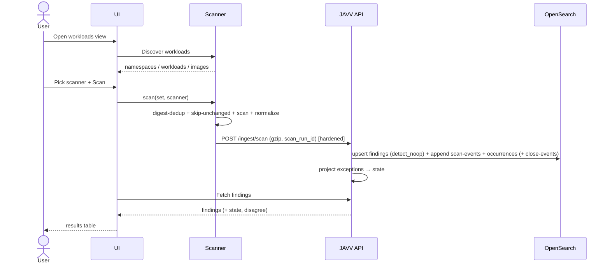

# JAVV - Spec (v3)

> **Revision 3 (2026-06-20).** Supersedes `docs/ADR/SPEC.md` (v2). Requirements reflecting the v3 design
> dialogue. Companions: `PLAN_v3.md` (decisions/data-model/milestones), `ARCHITECTURE_v3.md` (flows),
> `design_handoff_javv/` (UI reference - *reference point, not a frozen 1:1 contract*). Diagrams: Mermaid.

## Intent
A lightweight, k8s-runtime-native tool that ingests **Trivy AND Grype** results, lets teams **audit and
triage** findings with a durable, **VEX-aligned** lifecycle, and gives **Kibana-grade dashboards + trends +
one-click CSV** over what's *actually running* - the seam between view-only scanner-dashboards (no triage)
and rigid triage tools (no flexible reporting).

## Actors
- **Triager** (Operator+) - reviews, filters, triages, exports.
- **Security Lead** - approves exceptions, edits SLA.
- **Admin** - users/roles, tags, per-(cluster,scanner) tokens, **retention policy**, scanner config.
- **Scanner module** - automated client: discover → scan → push.

(RBAC matrix: Viewer < Auditor < Operator < Security Lead < Admin - see `design_handoff_javv/DATA_MODEL.md`.)

## Functional requirements

- **FR-1 Discovery.** Scanner enumerates namespaces/workloads/running images via the k8s API; dedupes by
  image **digest**; reads `kube-system` UID as immutable `cluster_id`.
- **FR-2 Scan.** Selected scanner (Trivy|Grype) over unique digests; resolves namespace-scoped
  `imagePullSecrets`; **skip-unchanged** (`digest+scanner+vuln-DB version` already scanned); bounded concurrency.
- **FR-3 Ingest.** Scanner **normalizes** Trivy/Grype JSON into the shared shape and pushes per-image,
  gzipped, retried (backoff+jitter, dead-letter), to `POST /api/v1/ingest/scan` over a private network with
  a per-`(cluster,scanner)` token. The endpoint **validates** the versioned envelope (`/v1` +
  `schema_version`) and is **hardened** (NFR-7) - it never parses raw scanner JSON. Each push carries
  `scan_run_id` (observability).
- **FR-4 Dedup/identity.** Upsert `findings` by `_id = finding_key = hash(cluster_id + image_digest +
  scanner + cve_id + package_name + installed_version)`. **No-op for unchanged findings** (content-hash +
  `detect_noop`); `last_seen` day-granularity; re-ingest **preserves all human-owned fields** (one shared
  preserved-fields script). Per-scanner rows, **never merged**.
- **FR-5 Logs / trends.** On every ingest, append an **immutable** event to `javv-scan-events-*` - one doc
  per **(image, scanner, scan)** carrying severity *counts* + image/namespace dimensions + `@timestamp`.
  The trends source. Partitioned per `cluster_id`; lifecycle per FR-19.
- **FR-5b Per-finding history (point-in-time).** On every ingest, also append immutable **per-finding**
  records to `javv-finding-occurrences-<cluster_id>-*` (`@timestamp`, `finding_key` keyword, `scan_run_id`,
  `vuln_id`, `package`, `image_digest`, `severity` as-of-then, `status ∈ {open,closed}`). **Write-on-change**
  (rides skip-unchanged) **+ close-events**: when a finding disappears from a **successfully scanned** image
  (per-image diff at ingest, guarded by `scan_run_id`/scan-success so failed scans never false-close),
  append a `status: closed` event. Enables exact reconstruction of *"image X's CVE list (+ as-of-then
  severities) at time T"* and the symmetric *"which images had CVE-Y at T"* - the **same query, filter
  swapped** (collapse on `finding_key`, latest `@timestamp ≤ T`, drop `closed`). **NON-downsampled** -
  accurate-history horizon = its raw `retention_days`.
- **FR-6 Staleness lifecycle.** A finding not re-pushed within a **cadence-relative window** (~3× cluster
  cadence, per-cluster) → `stale` (daily sweep). Sweep **skips clusters with no recent successful ingest**
  (scanner-down guard → "scanner silent" alert). Re-push reverts to `pre_stale_status`. `resolved` is
  manual-only; `stale` is sweep-only.
- **FR-7 Triage (VEX two-field model).** `state ∈ {open, acknowledged, not_affected, risk_accepted,
  resolved, stale}` + nullable `vex_justification` (the CISA five; required iff `not_affected`). "False
  positive" = `not_affected` + code/component-not-present justification (UI chip). Notes; transitions per
  `PLAN_v3 §5.2`; optimistic concurrency; bulk via `_bulk` (202 + async for large sets); **one audit entry
  per bulk action**.
- **FR-8 Exceptions / scoped risk-acceptance.** Risk-accepts and ignore-rules are `system_exceptions`
  documents with **scope** (selected images and/or namespaces; empty = cluster-wide), `apply_both_scanners`,
  justification, approver, expiry. A finding's `state` is a **projection** with **precedence**
  (explicit-finding > image > namespace > cluster; direct action > auto-rule) and **expiry-refresh** (on
  expiry, fall back to the next applicable rule). Re-projected at ingest / decision-apply / daily-sweep.
  *(Apply-to-both projection behavior is a test gate.)*
- **FR-9 Tagging.** Team/application/organization tags on findings/images; image-level where possible;
  retags as async `update_by_query` (`slices=auto`, `conflicts=proceed`), rate-limited; tag fields
  preserved on re-ingest.
- **FR-10 SLA / overdue.** Per-severity SLA days (CRIT 2 / HIGH 7 / MED 30 / LOW 90, editable) + KEV
  override (24h). `overdue` derived from age vs policy; surfaced on findings + notifications.
- **FR-11 Scanner disagreement.** **(a)** Per-finding **severity** disagreement flag (`disagree` = other
  scanner's severity) when both report the same `cve_id`(+package) on an image. **(b)** Per-image **count**
  disagreement (`trivy_count` vs `grype_count` + delta). Both precomputed at write/rollup time; shown
  side-by-side, never summed.
- **FR-12 Search & dashboards.** Filter by namespace/image/tag/severity/timestamp/**scanner**/state/
  assignee/KEV/fix-available/disagree; aggregations **faceted by scanner** (never summed across); capped
  terms or **composite** aggs; PIT + `search_after`. Trends from scan-events; Contributors from
  `system_audit_log`; "new in 30d" from `first_seen`.
- **FR-13 Reporting.** Streaming, **CSV-injection-sanitized** export from any lens (constant memory; async
  job for very large exports).
- **FR-14 Per-image report.** Image drill-down with Trivy/Grype **scanner dropdown**; severity-summary +
  per-scanner finding table. With the global time picker set to a past T, shows the image's **point-in-time**
  state (exact CVE list + as-of-then severities) reconstructed from `javv-finding-occurrences-*` (FR-5b),
  within the raw retention horizon; "didn't exist then" when there is no occurrence ≤ T.
- **FR-15 Contributors / trends (MVP).** Resolved-over-time, median TTR (`resolved_at − first_seen`),
  SLA-hit %, leaderboard - all from `system_audit_log` + `findings`; scoped by the global time-range picker.
- **FR-16 Notifications (MVP, per-user).** `system_notifications` populated with the user's SLA breaches +
  new assignments; bell badge; polling (no broker).
- **FR-17 Saved views (MVP, per-user).** `system_saved_views` named filter sets; cards deep-link into
  pre-filtered Findings.
- **FR-18 Auth/RBAC.** Single `get_current_principal()` dependency (OIDC-swappable later); **ingest-token
  auth in a separate dependency**. Per-request entitlement on every finding/image fetch **and export**
  (IDOR); tenant isolation enforced in the **query layer** (`cluster_id` filter), never UI-only. RBAC gates
  every mutating affordance, **client and server side**.
- **FR-19 Retention (admin).** `Settings → Data Retention` (Admin only): per-orchestrator (`cluster_id`)
  `retention_days`; JAVV applies/updates the ISM policy on `javv-scan-events-<…cluster_id>-*`. Rollover
  knobs (size/age/docs) configurable; defaults ~40 GB / 30 d / 50 M docs. (Full index-management UI is v1.x.)
- **FR-20 Observability.** `/healthz`, `/readyz`, Prometheus `/metrics` (ingestion rate, 4xx/413/429/503,
  payload sizes, **decompression ratio**, queue depth, latency, memory); structured logs (structlog,
  JSON/console). First-class from M1.
- **FR-21 Risk metadata.** Capture **EPSS/KEV** from Grype (explicit mapped fields; absent for Trivy).
- **FR-22 VEX import/export (MVP).** **Export** (M4): serialize `state`/`vex_justification` → OpenVEX/
  CycloneDX (consumable by Trivy/Grype `--vex`). **Import** (M4–M5): a VEX `not_affected` statement becomes
  a `system_exceptions` record routed through the existing projection engine (FR-8) - **not** a separate
  VEX subsystem. The two-field model (FR-7) is what makes both additive rather than a rewrite.

## Non-functional requirements

- **NFR-1 Storage.** OpenSearch-only; explicit mappings + `dynamic:false`; `keyword` ids/enums; vendor-keyed
  CVSS reshaped to fixed arrays; `total_fields` safety net. Current-state (`findings`/`images`) single
  indices with `cluster_id` field; logs (`javv-scan-events-*`, `javv-finding-occurrences-*`) partitioned per
  `cluster_id`. `finding_key` is a single-valued `keyword` (collapse/point-in-time requires it).
- **NFR-2 Lightweight deploy.** docker-compose + k8s/Helm. Documented OpenSearch minimums (compose ≥4 GB /
  1–2 GB heap; small prod ≥8 GB / ~4 GB heap).
- **NFR-3 Least-priv scanner RBAC** (read-only workloads; namespace-scoped Secret read).
- **NFR-4 Deterministic tests** via frozen golden scanner JSON; one count-tolerant live scan test.
- **NFR-5 Credentials in memory only, never logged.**
- **NFR-6 Backups/availability + retention horizons.** Scheduled snapshots to S3/MinIO with **tested
  restore**; single-node prod only with snapshots. **Independent retention per purpose:**
  `javv-finding-occurrences-*` (per-cluster - sets the accurate-history horizon, the main cost lever, kept
  NON-downsampled); `javv-scan-events-*` (per-cluster - trends); `system_audit_log` (small → keep long,
  compliance-aware → bounds Contributors/audit history); current-state has no time-retention. HA is **not
  JAVV-built** - OpenSearch multi-node + replica shards + stateless app `replicas`; single-node is a SPOF
  by design.
- **NFR-7 Ingest hardening.** `AsyncOpenSearch` + `_bulk`; `refresh_interval: 30s` on data indexes with
  `refresh=wait_for` on **triage writes only**; per-token rate-limit (`slowapi`, in-proc) → 429+Retry-After;
  bounded `asyncio.Semaphore` (ingest + bulk) → 503; **max compressed (~5 MB) + streamed decompressed
  (~50 MB) caps** → 413 (gzip-bomb guard, never one-shot decompress); Pydantic v2 `extra="forbid"` +
  per-field `max_length` + bounded arrays; **structured OpenSearch query bodies, never string-concat**
  (query-DSL-injection guard); **do not sanitize field values** (UTF-8/emoji safe - risk is field-names/
  `query_string`/`script`); bearer tokens SHA-256-hashed at rest, `hmac.compare_digest`, rotatable.
- **NFR-8 Observability first** (FR-20) - M1, not M6.
- **NFR-9 No extra infrastructure.** **No Redis, Kafka, RabbitMQ, or broker** (hard constraint). Jobs are
  k8s CronJobs (`concurrencyPolicy: Forbid`); coordination via OpenSearch. Multi-replica rate-limiting is
  per-replica (accepted approximation).
- **NFR-10 Idempotent/resumable jobs** (no durable-execution engine) - condition-based sweep +
  deterministic-`_id` rollup over immutable sources.
- **NFR-11 Vuln-DB** mirror/cache, scheduled refresh, PVC cache volume (never re-download per run).

## First working flow (acceptance target)

**Acceptance:** pick scanner → Scan → discovered images scanned (digest-deduped) → findings ingested with
no duplicates and **zero writes for unchanged findings** → scan-events appended → table renders. Re-running
preserves triage; staleness/exception projection behave per FR-6/FR-8.

## Scope notes
- **Promoted to MVP (this revision):** per-finding occurrence history + point-in-time (FR-5b/FR-14); VEX
  export + import-via-exceptions (FR-22).
- **v1.1 fast-follow (high-prio post-MVP):** Jira ticket push; dashboard **builder** (power-user add-on
  only - saved views stay the default).
- **Deferred:** `javv-metrics-*` downsample tier; CEL/expression policies; LDAP/OIDC.
- **HA:** OpenSearch-native (multi-node + replicas) + stateless app replicas - not JAVV-built.
- **Explicit non-goals:** supply-chain hash-integrity checking; **cross-scanner merge** (disagreement flags
  only - never an averaged row).
