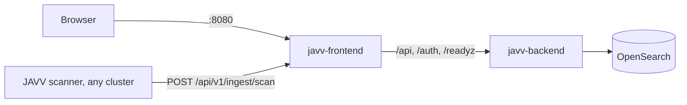

# Deploying JAVV

JAVV is three containers and, somewhere else, its scanners:



- **javv-frontend** serves the web app and forwards `/api`, `/auth` and `/readyz` to the backend,
  so browsers and scanners use one address. Nothing has to sit in front of it.
- **javv-backend** is the API, ingest and the background jobs (staleness, lifecycle, exports,
  cleanup), which it runs itself on cron schedules. One backend per store.
- **OpenSearch** is the only store.
- **Scanners** run in the clusters they scan and push results to JAVV over HTTP. They can be
  anywhere that reaches the JAVV address; JAVV never connects to a monitored cluster.

Today there is one way to deploy: **docker compose on one machine**. A Helm chart for Kubernetes
follows it (issue 41).

## A machine with docker compose

You need Docker Engine with the compose plugin and two files from the release you deploy:
`deploy/compose/compose.yaml` and `deploy/compose/.env.example`. Each release publishes the backend
and frontend images under its version (`ghcr.io/danube-labs/javv-backend:<version>` and
`javv-frontend:<version>`), and its compose file names them.

1. **Give OpenSearch its memory map limit** (once per host; add it to `/etc/sysctl.conf` to keep
   it after a reboot):
   ```bash
   sudo sysctl -w vm.max_map_count=262144
   ```
2. **Fill in `.env`**, in the folder that holds the two files:
   ```bash
   cp .env.example .env
   ```
   Set three secrets. The compose file refuses to start without them.
   - `JAVV_TOKEN_PEPPER`: a long random string (`openssl rand -hex 32`), kept for good.
   - `JAVV_BOOTSTRAP_ADMIN_PASSWORD`: the first JAVV admin's password, used once.
   - `JAVV_OPENSEARCH_PASSWORD`: OpenSearch's admin password, which JAVV signs in with. OpenSearch
     takes it once, when it first starts, and refuses to start on a weak one. Its rules: 8
     characters or more, with an upper-case letter, a lower-case letter, a digit and a special
     character, and not a common password such as `Password123!`. A refused password stops the
     `opensearch` container, and OpenSearch writes the refused value into its own log
     (`docker compose logs opensearch`). Changing this password later is in
     [`UPGRADING.md` § With docker compose](UPGRADING.md#with-docker-compose).

   Decide the session cookie (next section).
3. **Start it:**
   ```bash
   docker compose up -d   # pulls the release's images the first time
   docker compose ps      # opensearch, backend and frontend all "healthy"
   ```
   The backend creates its indices on the first start.
4. **Sign in** at `http://<this machine>:8080` as `admin` with the password from `.env`. JAVV asks
   for a new password (12 characters or more) before anything else.

To upgrade later, see [`UPGRADING.md` § With docker compose](UPGRADING.md#with-docker-compose).

**A checkout that is not a release** (`main`, or a commit between releases): build the images first
with `development/scripts/build-app-images.sh`. It tags them with the names the compose file uses,
and `docker compose up -d` then runs them instead of pulling.

### http or https

The session cookie is marked `Secure` by default, and a browser keeps a `Secure` cookie only from
`https` or `localhost`.

- **Behind TLS** (a proxy, load balancer or gateway in front that terminates `https`): keep the
  default. Remove `JAVV_SESSION_COOKIE_SECURE=false` from `.env`.
- **Plain http** (for example `http://<machine>:8080` on a LAN): set
  `JAVV_SESSION_COOKIE_SECURE=false` in `.env`, as `.env.example` does. Without it, sign-in
  succeeds and the next request fails.

JAVV cannot see a TLS terminator in front of it, so it never turns the flag on by itself.

### What is exposed

One port, **8080**, on the frontend. Browsers and scanners both use it; scanner pushes reach the
backend through the frontend's forward. To serve on another host port, change the left side of
`8080:8080` in `compose.yaml`.

- The backend's own port (8000) is not published. It also serves `/docs`, `/openapi.json` and a
  `/metrics` that needs no sign-in, so publish it only for something that must reach it directly,
  such as a Prometheus scrape (the commented `ports` block under `backend`).
- OpenSearch is not published. Its security plugin is on (issue 715): every request needs the
  admin password from `.env`. Its TLS uses OpenSearch's demo certificates, whose private key ships
  in the image, so the traffic is not private from anyone on the compose network; the backend
  does not check the certificate and logs one warning at start saying so. The network holds only
  the three JAVV containers. Do not publish OpenSearch's port.
- Scanner pushes stream through the frontend container. Restarting it cuts a push in flight. The
  scanner retries it with backoff; if the retries run out, it writes the envelope to its
  dead-letter file, and its next cycle scans and pushes that image again.

### Settings

Every setting is in [`deploy/compose/compose.yaml`](../deploy/compose/compose.yaml) with its default
and what it does; [`CONFIGURATION.md`](CONFIGURATION.md) has the long form. To change one, add
`NAME=value` to `.env` and run `docker compose up -d`. The ones most often changed:

- `TZ`: the zone the job schedules are read in (default `UTC`).
- `OPENSEARCH_JAVA_OPTS`: the OpenSearch heap (default `-Xms1g -Xmx1g`).
- `JAVV_JOB_<KIND>_CRON` and `JAVV_SCHEDULER_ENABLED`: when the background jobs run.

### The first night

The backend runs its background jobs on its own schedules (02:00 staleness, 03:00 lifecycle, 04:00
findings cleanup, by default). On an install that already holds data, read
[`UPGRADING.md` § The first run of the background jobs](UPGRADING.md#the-first-run-of-the-background-jobs)
before the first night.

### Data

OpenSearch keeps everything in the `opensearch-data` volume: `docker compose down` keeps it,
`docker compose down -v` deletes it. Snapshots taken from **Settings › Data & OpenSearch** land
inside the same volume (`path.repo`); copying them off the machine is up to you (issue 664).

## Point scanners at it

Scanners run in the cluster they scan, which can be a different cluster or a different network.
Each pair of cluster and scanner has its own token.

1. Find the cluster's id: the `kube-system` namespace UID.
   ```bash
   kubectl get namespace kube-system -o jsonpath='{.metadata.uid}'
   ```
2. In JAVV, **Settings › Access & tokens › Mint token**: that cluster id and the scanner (`trivy`
   or `grype`). The token is shown once.
3. Run the scanner with `JAVV_BACKEND_URL=http://<JAVV machine>:8080`, `JAVV_TOKEN=<the token>`
   and `JAVV_CLUSTER_ID=<the id>`. The scanner's settings are in
   [`CONFIGURATION.md` §2](CONFIGURATION.md); its images are published per scanner version.
   Manifests to run them as Kubernetes CronJobs are issue 714.

The first push appears in **Scanner status**; its findings appear once a scan is complete.

## Known limits

- **amd64 only.** The images, like the scanner images, are built for amd64.
- **The first release with published images is the one after 0.5.0.** 0.5.0 predates the images, so
  its tag has none.
- **An OpenSearch of your own, with its security plugin on,** works from the release after 0.5.1:
  point `JAVV_OPENSEARCH_URL` at it and set `JAVV_OPENSEARCH_USERNAME`, `JAVV_OPENSEARCH_PASSWORD`
  and, for a private CA, `JAVV_OPENSEARCH_CA_BUNDLE` ([`CONFIGURATION.md` §1](CONFIGURATION.md)).
  The user needs full access to the `findings`, `javv-*` and `system-*` indices and their aliases,
  point-in-time searches, cluster health and the snapshot repository; a narrower role is issue 729.
- **The compose file's OpenSearch uses demo certificates** (see What is exposed). For certificates
  of your own, run your own OpenSearch and point JAVV at it as above.
- **No maintenance page without a proxy.** `frontend/public/maintenance.html` is shown by pointing
  a proxy in front of JAVV at it (`development/RUNNING-THE-STACK.md` §R1). With nothing in front,
  there is no switch yet. Issue 719.
- **`VITE_*` settings are fixed when the frontend image is built** ([`CONFIGURATION.md`
  §2b](CONFIGURATION.md)): an image carries their defaults.
- **TLS is yours.** JAVV serves plain http; put `https` in front of it with whatever you already
  run, and keep the session cookie `Secure`.
- **Scanner manifests** for Kubernetes are issue 714, and the Helm chart for JAVV itself follows
  this compose file.
