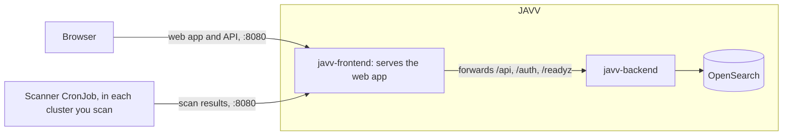

# Deploying JAVV

This page tells you how to install JAVV, with docker compose on one machine or with Helm on
Kubernetes. It also tells you how to connect the scanners, how to verify the published images, and
how to use an OpenSearch that you operate.

JAVV runs as three containers. The scanners run in the clusters that you scan, and send their
results to JAVV:



- **javv-frontend** serves the web app. It sends the requests to `/api`, `/auth` and `/readyz` on
  to the backend. Thus browsers and scanners use one address. You do not need a proxy in front of
  it.
- **javv-backend** holds the API, the ingest endpoint and the background jobs (staleness,
  lifecycle, exports and cleanup). It runs the jobs itself, on cron schedules. Use one backend for
  each OpenSearch.
- **OpenSearch** holds all the data.
- **Scanners** run in the clusters that they scan. They push their results to JAVV over HTTP. A
  scanner can be at any place that can connect to the JAVV address. JAVV never connects to a
  cluster that you scan.

There are two installation methods: **docker compose on one machine**, and **Helm charts on
Kubernetes**. Both use the same images, with the same settings and defaults.

## Install with docker compose

You need Docker Engine with the compose plugin, version 2.23.1 or later. The compose file holds the
OpenSearch role for JAVV in `configs`, and older versions cannot read it. You also need two files
from the release that you install: `deploy/compose/compose.yaml` and `deploy/compose/.env.example`.

Each release publishes the backend image and the frontend image with its version
(`ghcr.io/danube-labs/javv-backend:<version>` and `javv-frontend:<version>`). The compose file of
the release names these images.

1. **Set the memory map limit for OpenSearch.** Do this one time on each host. To keep the limit
    after a reboot, also add it to `/etc/sysctl.conf`.
    ```bash
    sudo sysctl -w vm.max_map_count=262144
    ```
2. **Make the `.env` file** in the folder that holds the two files:
    ```bash
    cp .env.example .env
    ```
    Set the four secrets. The compose file does not start without them.

    - `JAVV_SECRET_KEY`: the secret key of the backend. Use a long random string
        (`openssl rand -hex 32`). Keep it for the life of the installation (see the warning below).
    - `JAVV_BOOTSTRAP_ADMIN_PASSWORD`: the password of the first JAVV admin. JAVV uses it one time.
    - `JAVV_OPENSEARCH_ADMIN_PASSWORD`: the password of the OpenSearch admin. Only OpenSearch and its
        `healthcheck` use it. JAVV never gets it. OpenSearch reads it one time, at its first start.
        OpenSearch does not start with a weak password. The rules are:
        - 8 characters or more.
        - At least one uppercase letter, one lowercase letter, one digit and one special character.
        - Not a common password, such as `Password123!`.

        When OpenSearch refuses the password, the `opensearch` container stops. OpenSearch then writes
        the refused value into its log (`docker compose logs opensearch`).

    - `JAVV_OPENSEARCH_PASSWORD`: the password of `javv`, the OpenSearch user that the backend
        signs in as. This user has only the `javv` role. See
        [An OpenSearch of your own](#an-opensearch-of-your-own) for what the role permits. OpenSearch
        also reads this password one time, at its first start. Use a long random string
        (`openssl rand -hex 24`).

    > **Warning: keep the secret key.** Set `JAVV_SECRET_KEY` once and do not change it. The
    > backend uses it to hash every scanner token and session, and to sign download links. If you
    > change it, every scanner gets 401, every user must sign in again, and every open download link stops
    > working. The stored data cannot restore them: each scanner needs a new token.

    To change an OpenSearch password later, see
    [`UPGRADING.md` § With docker compose](UPGRADING.md#with-docker-compose).

    **In `.env`, write each `$` as `$$`, or put the full value in single quotes** (`'pa$ss…'`).
    Compose reads an unquoted `$name` as a variable and replaces it. It gives only a warning. For
    example, `pa$ss-Word1!` gets to OpenSearch and to the backend as `pa-Word1!`. All containers
    become healthy, with a password that you did not write. Compose also changes an unquoted value
    in these three ways:

    - A space before `#` ends the value: `pa #ss` becomes `pa`.
    - Compose deletes the spaces at the end.
    - Compose reads a value that starts with `"` or `'` as a quoted value.

    `"` and `\` in other positions need no change.

    **If `opensearch` never becomes healthy** and its log shows that it runs, the admin password in
    `.env` is different from the password that OpenSearch took at its first start. If the backend
    stops with "refused the credentials in JAVV_OPENSEARCH_USERNAME", the `javv` passwords are
    different. [`UPGRADING.md`](UPGRADING.md#change-an-opensearch-password) tells you how to correct
    both conditions.

    Then set the session cookie (see [http or https](#http-or-https)).

3. **Start JAVV:**
    ```bash
    docker compose up -d   # pulls the release's images the first time
    docker compose ps      # opensearch, backend and frontend all "healthy"
    ```
    The backend makes its indices at its first start.

4. **Sign in** at `http://<this machine>:8080` as `admin`, with the password from `.env`. JAVV
    then asks for a new password (12 characters or more). You must set it before you can do other
    work.

To upgrade later, see [`UPGRADING.md` § With docker compose](UPGRADING.md#with-docker-compose).

**To install from a checkout that is not a release** (`main`, or a commit between two releases),
make the images first with `development/scripts/build-app-images.sh`. The script gives the images
the names that the compose file uses. Then `docker compose up -d` runs these images, and it pulls
nothing.

### http or https

By default, the session cookie has the `Secure` flag. A browser keeps a `Secure` cookie only from
`https` or from `localhost`.

- **With TLS in front of JAVV** (a proxy, a load balancer or a gateway that ends `https`): keep the
  default. Delete `JAVV_SESSION_COOKIE_SECURE=false` from `.env`.
- **With plain http** (for example `http://<machine>:8080` on a LAN): set
  `JAVV_SESSION_COOKIE_SECURE=false` in `.env`. `.env.example` sets this value. Without it, the
  sign-in succeeds, and the next request fails.

JAVV cannot see a TLS proxy in front of it. Thus it never sets the flag itself.

### Ports and access

The frontend publishes one port, **8080**. Browsers and scanners both use it. The frontend sends
the scanner pushes on to the backend. To use a different host port, change the left side of
`8080:8080` in `compose.yaml`.

- **The backend port (8000) is not published.** This port also serves `/docs`, `/openapi.json` and
  `/metrics`, and `/metrics` needs no sign-in. Publish the port only for a system that must connect
  to the backend directly, for example a Prometheus scrape. For this, use the `ports` block in
  comments under `backend`.
- **OpenSearch is not published.** Its security plugin is on. Two users can sign in with a
  password: `admin`, the superuser of OpenSearch, and `javv`. The backend uses `javv`, which has
  only the `javv` role.
- **The demo security setup of OpenSearch adds six more users.** The password of each of these
  users is its own name. The compose file deletes them before the first start of OpenSearch.
- **The demo admin certificate also has full access, with no password.** This is `kirk.pem`, and
  [`UPGRADING.md`](UPGRADING.md#change-an-opensearch-password) uses it to change a password. Its
  key is in the public image, as are the keys of the demo certificates. Thus each system that can
  connect to OpenSearch on the compose network can use it.
- **The traffic to OpenSearch is not private** from systems on that network. The backend does not
  verify the certificate, and it logs one warning about this at start. The network holds only the
  three JAVV containers. Do not publish the OpenSearch port.
- **Scanner pushes go through the frontend container.** When the frontend container restarts, the
  push that is in progress stops. The scanner tries the push again, with a longer wait each time.
  When all tries fail, the scanner writes the envelope to its dead-letter file. In its next cycle,
  it scans and pushes that image again.

### Settings

[`deploy/compose/compose.yaml`](../deploy/compose/compose.yaml) lists each setting, with its
default and what it does. [`CONFIGURATION.md`](CONFIGURATION.md) gives more detail. To change a
setting, add `NAME=value` to `.env`, and run `docker compose up -d`. These settings change most
frequently:

- `TZ`: the time zone of the job schedules (default `UTC`).
- `OPENSEARCH_JAVA_OPTS`: the OpenSearch heap (default `-Xms1g -Xmx1g`).
- `JAVV_JOB_<KIND>_CRON` and `JAVV_SCHEDULER_ENABLED`: when the background jobs run.

### Scheduled jobs

The backend runs its background jobs on its own schedules. The defaults are 02:00 for staleness,
03:00 for lifecycle and 04:00 for the findings cleanup. If the installation already holds data,
read [`UPGRADING.md` § The first run of the background jobs](UPGRADING.md#the-first-run-of-the-background-jobs)
before the jobs run for the first time.

### Data

OpenSearch keeps all data in the `opensearch-data` volume. `docker compose down` keeps the volume.
`docker compose down -v` deletes it.

The snapshots that you make in **Settings › Data & OpenSearch** are on the same volume
(`path.repo`). You must copy them to a different machine yourself. JAVV does not make scheduled
snapshots yet ([issue 664](https://github.com/Danube-Labs/javv-poc/issues/664)).

## Install on Kubernetes with Helm

You use three charts:

- `javv-opensearch`: OpenSearch.
- `javv`: the backend and the frontend.
- `javv-scanner`: the scanners, in each cluster that you scan (see
  [Connect the scanners](#connect-the-scanners)).

Install `javv-opensearch` and `javv` in the same namespace, in that sequence. Each release
publishes the three charts at `oci://ghcr.io/danube-labs/charts/<chart>`, with the version of the
release, and signs them (see [Verify the images and charts](#verify-the-images-and-charts)). From a
checkout that is not a release, use `deploy/helm/<chart>` in place of
`oci://ghcr.io/danube-labs/charts/<chart> --version <version>`. The README of each chart lists all
of its values. These are the steps:

1. **Install OpenSearch, with its two passwords in Secrets.** One password is for `admin`, and
    only OpenSearch uses it. The other password is for `javv`, the user that the JAVV backend signs
    in as. This user has only the `javv` role (see
    [An OpenSearch of your own](#an-opensearch-of-your-own)). OpenSearch refuses a weak admin
    password. The rules are the same as for compose (above). The commands read each secret at a
    prompt, or make it in place. Thus no secret goes into your shell history or into the arguments of
    a process. The commands need bash.
    ```bash
    read -rs -p 'OpenSearch admin password: ' pw && echo
    printf '%s' "$pw" | kubectl create secret generic javv-opensearch-admin --from-file=password=/dev/stdin
    unset pw
    kubectl create secret generic javv-opensearch-backend \
      --from-file=password=<(openssl rand -hex 24 | tr -d '\n')
    helm install store oci://ghcr.io/danube-labs/charts/javv-opensearch --version <version> \
      --set opensearch.javv.auth.existingSecret=javv-opensearch-admin \
      --set opensearch.javv.backend.existingSecret=javv-opensearch-backend
    ```
    This uses the demo certificates of OpenSearch, as compose does. To use your own certificates,
    set one of these values. The [chart README](../deploy/helm/javv-opensearch/README.md) describes
    both.

    - `opensearch.javv.tls.existingSecret`: a Secret with `tls.crt`, a PKCS#8 `tls.key` and
        `ca.crt`.
    - `opensearch.javv.tls.certManager`: the chart asks your cert-manager Issuer for a certificate.
2. **Make the two JAVV secrets.** For compose, `.env` holds the same two secrets.
    ```bash
    read -rs -p 'First JAVV admin password (12 characters or more): ' pw && echo
    kubectl create secret generic javv-secrets \
      --from-file=secret-key=<(openssl rand -hex 32 | tr -d '\n') \
      --from-file=bootstrap-admin-password=<(printf '%s' "$pw")
    unset pw
    ```
    `secret-key` is the secret key of the backend, `JAVV_SECRET_KEY`.

    > **Warning: keep the secret key.** Set `JAVV_SECRET_KEY` once and do not change it. The
    > backend uses it to hash every scanner token and session, and to sign download links. If you
    > change it, every scanner gets 401, every user must sign in again, and every open download link stops
    > working. The stored data cannot restore them: each scanner needs a new token.

3. **Install JAVV.** The backend signs in to OpenSearch as `javv`, with the Secret of `javv`:
    ```bash
    helm install javv oci://ghcr.io/danube-labs/charts/javv --version <version> \
      --set secrets.existingSecret=javv-secrets \
      --set opensearch.passwordSecret.name=javv-opensearch-backend
    helm test javv
    ```
    If OpenSearch uses its own certificate, also add `--set opensearch.caSecret.name=<the Secret with
    its ca.crt>`. With cert-manager, this Secret is `store-javv-opensearch-tls`. The backend then
    verifies the certificate.

4. **Sign in** through the `javv` Service on port 8080, as `admin`, with the bootstrap password.
    Nothing is in front of the Service. For `https`, put your own Ingress, gateway or load balancer
    in front of it, and keep the session cookie `Secure` ([http or https](#http-or-https) applies in
    the same way). To look at JAVV before you do this, run `kubectl port-forward svc/javv 8080`, and
    set `backend.config.JAVV_SESSION_COOKIE_SECURE=false`.

**What the `javv` chart runs:**

- One backend, with `strategy: Recreate`. The backend runs the background jobs itself. A rolling
  update can run two backends for a short time, so the chart does not use one.
- The ClusterIP Service of the backend, on port 8000.
- The Service of the frontend, on port 8080. Browsers and scanners use this Service.

The backend and the frontend run as the user of their images, with a read-only root file system.
Each backend setting is under `backend.config` in `deploy/helm/javv/values.yaml`. Each setting has
the same default and the same comment as in the compose file. To change a setting, use
`--set backend.config.TZ=Europe/Bucharest`, or your own values file.

**Access:** only what you put in front of the `javv` Service. The backend Service and the
OpenSearch Service are ClusterIP. The sign-in and the certificates of OpenSearch are as in step 1.
With the demo certificates, each system in the cluster that can connect to the OpenSearch Service
can read its traffic, and it can use the demo admin certificate of the image. This is the same as
on the compose network.

To upgrade, or to go back to a previous release, see
[`UPGRADING.md` § On Kubernetes (Helm)](UPGRADING.md#on-kubernetes-helm).

## Connect the scanners

The scanners run in the cluster that they scan. This can be a different cluster, or a different
network. Each pair of a cluster and a scanner has its own token.

1. Find the ID of the cluster. The ID is the UID of the `kube-system` namespace:
    ```bash
    kubectl get namespace kube-system -o jsonpath='{.metadata.uid}'
    ```
2. In JAVV, go to **Settings › Access & tokens › Mint token**. Enter the cluster ID and the scanner
    (`trivy` or `grype`). JAVV shows the token only one time.

3. Install the `javv-scanner` chart in that cluster. Put each token in its own Secret. Set the JAVV
    address that this cluster can connect to:
    ```bash
    kubectl create namespace javv-scanner
    for s in trivy grype; do  # each token at a prompt: out of shell history and process arguments
      read -rs -p "$s token: " token && echo
      printf '%s' "$token" | kubectl -n javv-scanner create secret generic "javv-$s-token" \
        --from-file=token=/dev/stdin
    done; unset token
    helm install scanner oci://ghcr.io/danube-labs/charts/javv-scanner --version <version> \
      -n javv-scanner \
      --set backendUrl=http://<JAVV's address>:8080 \
      --set trivy.token.existingSecret=javv-trivy-token \
      --set grype.token.existingSecret=javv-grype-token
    helm test scanner -n javv-scanner
    ```
    `helm test` verifies that JAVV replies at that address, and that it accepts each token. Without
    Kubernetes, run the scanner image with `JAVV_BACKEND_URL`, `JAVV_TOKEN` and `JAVV_CLUSTER_ID`
    ([Scanner settings](CONFIGURATION.md#scanner-settings)).

The first push shows in **Scanner status**. Its findings show when the scan is complete.

### What the scanner chart runs

The [chart README](../deploy/helm/javv-scanner/README.md) lists all of its values.

- **One CronJob for each scanner.** By default, each CronJob runs every 6 hours. Grype starts half
  an hour after Trivy. Kubernetes stops a cycle after 5 hours and 30 minutes. Each scanner has its
  own token, settings, image and cache.
- **One cycle at a time.** A CronJob never starts a cycle while one of its own cycles runs. The
  CronJob does not see a cycle that you start manually. Thus pause the CronJob first, and start your
  cycle when no cycle runs. The `NOTES` of the chart give the commands.
- **A vuln-DB cache for each scanner,** on a 10Gi `ReadWriteOnce` volume. Each cycle first updates
  the DB on this volume. Then it scans all images against that DB, with updates off. The installation
  runs one update immediately. Thus the first cycle finds a DB, and the volume is bound for
  `helm install --wait`. When an update fails, the scanner uses the DB in the cache. Grype refuses a
  DB that is older than 5 days.
- **The DB sources:** by default, the sources of the scanner vendors. The scanners connect to them
  over the internet. To use a mirror, set `trivy.vulnDb.repository` and `trivy.vulnDb.javaRepository`
  (OCI repositories), or `grype.vulnDb.updateUrl` (a DB listing).
- **What the scanners can read in the cluster:** the pods in all namespaces, to find the images that
  run, and the `kube-system` namespace, because its UID is the cluster ID. They can read nothing
  more, and no Secrets.
- **The images** are the scanner versions in [`versions.yaml`](../versions.yaml). The published
  chart names each image by its digest at the time of the release. Thus a cluster runs the scanner
  build of that release. From a checkout, the chart has only the tag, and Kubernetes pulls it at
  each run. JAVV publishes the tag of a version again when it changes the scanner image. To run one
  exact build from a checkout, set `<scanner>.image.digest`.

## Verify the images and charts

Each release signs the backend and frontend images that it publishes, with **cosign keyless**:

- The certificate comes from the GitHub identity of the release workflow.
- The public Rekor transparency log records the signature.
- Each image also has a **signed SPDX SBOM attestation**: the list of the contents of the image.
- The signature and the attestation are for the digest of the image, not for its tag.

To verify an image with cosign 3.x (the release uses the version in `versions.yaml`
`supply_chain.cosign`):

```bash
IMAGE=ghcr.io/danube-labs/javv-backend:<version>   # or javv-frontend
IDENTITY='^https://github\.com/Danube-Labs/javv-poc/\.github/workflows/release-please\.yml@refs/heads/main$'
ISSUER=https://token.actions.githubusercontent.com

cosign verify "$IMAGE" --certificate-identity-regexp "$IDENTITY" --certificate-oidc-issuer "$ISSUER"
cosign verify-attestation "$IMAGE" --type spdxjson \
  --certificate-identity-regexp "$IDENTITY" --certificate-oidc-issuer "$ISSUER" > /dev/null && echo "SBOM attestation OK"
```

The identity accepts only the release workflow when it runs on `main` of this repository. Thus an
image that a different system made fails the verification. Before the release ends, it runs these two
commands without a sign-in. The images of 0.5.1 and earlier releases have no signature.

The same workflow signs the three charts, with the same identity. A chart holds no software
packages. Thus a chart has a signature, but no SBOM:

```bash
cosign verify ghcr.io/danube-labs/charts/javv:<version> \
  --certificate-identity-regexp "$IDENTITY" --certificate-oidc-issuer "$ISSUER"
```

A different workflow signs the scanner images in the same way.
[`scanner/README.md`](https://github.com/Danube-Labs/javv-poc/blob/main/scanner/README.md#verify-a-published-image)
gives its identity. Before the release puts the digest of a scanner image into the published
`javv-scanner` chart, it verifies the signature of that image.

## An OpenSearch of your own

JAVV signs in to OpenSearch as one user, and that user needs one role. The compose file and the
`javv-opensearch` chart make both, with the name `javv`. The role permits only the calls that the
backend makes:

- Its own indices: `findings`, `javv-*` and `system-*`.
- The `restored-*` copies that a restore from **Settings › Data & OpenSearch** writes. The Data
  inspector lists these copies, but it never reads them, because a copy of `system-users` holds
  password hashes.
- The snapshots of its indices, and the health of the cluster.

The role cannot read the documents of other indices. It cannot change the cluster settings,
register a snapshot repository or use the security API.

OpenSearch verifies some permissions at the cluster level. Thus these permissions apply to more than
the JAVV indices:

- `cluster:monitor/state`: the index list of the Data inspector needs it. It also lets the user read
  the metadata of the cluster: the name, the settings and the mappings of each index, including the
  indices of OpenSearch. It never gives their documents.
- `cluster:admin/snapshot/create`: OpenSearch does not limit it to the JAVV indices. The user can
  copy any index into a repository that you registered. JAVV makes snapshots only of its own indices.
- `cluster:monitor/nodes/stats` and `cluster:monitor/shards`: the runtime card and the shard list
  of the Data inspector use them. They show the statistics and the shards of each index.
- `indices:admin/index_template/put`: it can write a template for any index pattern. The index setup
  writes only the JAVV templates.
- The bulk, multi-get and scroll calls. OpenSearch still verifies their documents against the index
  permissions.

We showed that JAVV needs each permission: the role test fails without it.

To make the user and the role on an OpenSearch that you operate, use a user that can change the
security configuration (the `admin` of OpenSearch):

```bash
OS=https://<your opensearch>:9200
curl -u admin -X PUT "$OS/_plugins/_security/api/roles/javv" \
  -H 'content-type: application/json' --data-binary @javv-role.json
curl -u admin -X PUT "$OS/_plugins/_security/api/internalusers/javv" \
  -H 'content-type: application/json' -d '{"password": "<a long random password>"}'
curl -u admin -X PUT "$OS/_plugins/_security/api/rolesmapping/javv" \
  -H 'content-type: application/json' -d '{"users": ["javv"]}'
```

with `javv-role.json`:

```json
{
  "description": "JAVV backend: its own indices, their snapshots, and cluster health",
  "cluster_permissions": [
    "cluster:monitor/main",
    "cluster:monitor/health",
    "cluster:monitor/nodes/info",
    "cluster:monitor/nodes/stats",
    "cluster:monitor/state",
    "cluster:monitor/shards",
    "indices:admin/index_template/get",
    "indices:admin/index_template/put",
    "cluster:admin/snapshot/get",
    "cluster:admin/snapshot/create",
    "cluster:admin/snapshot/restore",
    "indices:data/write/bulk",
    "indices:data/read/mget",
    "indices:data/read/scroll*"
  ],
  "index_permissions": [
    {
      "index_patterns": [
        "findings",
        "javv-*",
        "system-*"
      ],
      "allowed_actions": [
        "indices:data/read/*",
        "indices:data/write/*",
        "indices:admin/create",
        "indices:admin/get",
        "indices:admin/mapping/put",
        "indices:admin/mappings/get",
        "indices:admin/aliases",
        "indices:admin/aliases/get",
        "indices:admin/refresh*",
        "indices:monitor/*"
      ]
    },
    {
      "index_patterns": [
        "javv-*",
        "system-audit-log*"
      ],
      "allowed_actions": [
        "indices:admin/rollover"
      ]
    },
    {
      "index_patterns": [
        "javv-*"
      ],
      "allowed_actions": [
        "indices:admin/delete"
      ]
    },
    {
      "index_patterns": [
        "restored-*"
      ],
      "allowed_actions": [
        "indices:admin/create",
        "indices:data/write/*",
        "indices:monitor/*"
      ]
    }
  ]
}
```

Then set `JAVV_OPENSEARCH_USERNAME=javv` and `JAVV_OPENSEARCH_PASSWORD`
([Connection to OpenSearch](CONFIGURATION.md#connection-to-opensearch)). For snapshots, you must register a repository
(`PUT _snapshot/<name>`, with its credentials in the keystore of OpenSearch). The JAVV role cannot
do this.

## A forgotten password

A user who forgets the password asks an admin. The admin gives the user a temporary password with
**Reset password** in **Settings › Users & roles**. The user sets a new password at the next
sign-in.

When no admin can sign in, reset the password of an admin from a shell in the backend container:

```bash
docker compose exec backend python -m backend.auth.reset_password admin          # compose
kubectl exec deploy/javv-backend -- python -m backend.auth.reset_password admin  # Helm, release javv
```

The command shows a temporary password one time, and nothing more. Sign in with it. JAVV then asks
for a new password before you can do other work. The command also ends all sessions of that user.
It writes a `pwd_reset` row to the audit log, with `system` as the actor.

- The command refuses a user whose password belongs to an identity provider.
- A user that too many failed sign-ins locked out stays locked out for `JAVV_LOGIN_LOCKOUT_MINUTES`
  (15 by default). The lockout is in the memory of the running backend. Wait until it ends, or
  restart the backend.

A change to `JAVV_BOOTSTRAP_ADMIN_PASSWORD` does not reset a password. JAVV reads it only when the
admin does not exist.

## Known limits

- **amd64 only.** The images and the scanner images are for amd64.
- **Releases with published images:** 0.5.1, and the releases after 0.6.0. 0.5.0 has no images.
  The release run of 0.6.0 stopped before it published (its compose test had no value for a
  required setting). Thus 0.6.0 has no images and no charts. Use the release after it.
- **An OpenSearch of your own with its security plugin on** works from the 0.6 releases. Set
  `JAVV_OPENSEARCH_URL` to its address. Set `JAVV_OPENSEARCH_USERNAME`, `JAVV_OPENSEARCH_PASSWORD`
  and, for a private CA, `JAVV_OPENSEARCH_CA_BUNDLE` ([Connection to OpenSearch](CONFIGURATION.md#connection-to-opensearch)).
  The user needs the `javv` role ([An OpenSearch of your own](#an-opensearch-of-your-own)).
- **The OpenSearch of the compose file uses demo certificates** (see
  [Ports and access](#ports-and-access)). For your own certificates, operate your own OpenSearch,
  and connect JAVV to it as above.
- **No maintenance page without a proxy.** To show `frontend/public/maintenance.html`, a proxy in
  front of JAVV must send requests to it (`development/RUNNING-THE-STACK.md` §R1). With nothing in
  front of JAVV, there is no switch yet
  ([issue 719](https://github.com/Danube-Labs/javv-poc/issues/719)).
- **The build of the frontend image sets the `VITE_*` settings**
  ([Frontend build settings](CONFIGURATION.md#frontend-build-settings)). You cannot change them later. A published image has
  their default values.
- **TLS is your work.** JAVV serves plain http. Put `https` in front of it with the tools that you
  already operate, and keep the session cookie `Secure`.
- **The scanners do not scan images from private registries yet.** They pull each image with no
  sign-in. When a pull fails, the scanner skips the image, and it writes a warning in its log
  ([issue 739](https://github.com/Danube-Labs/javv-poc/issues/739)).
- **The scanners see each pod spec.** To find the images, they list the pods. This also shows each
  value that is in the `env` of a pod. Keep secrets in Secrets.
- **The first release with published charts is the release after 0.6.0.** For earlier releases,
  install from `deploy/helm/` in a checkout.
