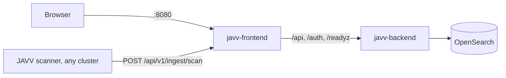

# Deploying JAVV

JAVV is three containers and, somewhere else, its scanners:



- **javv-frontend** serves the web app and forwards `/api`, `/auth` and `/readyz` to the backend,
  so browsers and scanners use one address. Nothing has to sit in front of it.
- **javv-backend** is the API, ingest and the background jobs (staleness, lifecycle, exports,
  cleanup), which it runs itself on cron schedules. One backend per store.
- **OpenSearch** is the only store.
- **Scanners** run in the clusters they scan and push results to JAVV over HTTP. They can be
  anywhere that reaches the JAVV address; JAVV never connects to a monitored cluster.

There are two ways to deploy: **docker compose on one machine**, and **Helm charts on
Kubernetes** (issue 725). Both run the same images with the same settings and defaults.

## A machine with docker compose

You need Docker Engine with the compose plugin and two files from the release you deploy:
`deploy/compose/compose.yaml` and `deploy/compose/.env.example`. Each release publishes the backend
and frontend images under its version (`ghcr.io/danube-labs/javv-backend:<version>` and
`javv-frontend:<version>`), and its compose file names them.

1. **Give OpenSearch its memory map limit** (once per host; add it to `/etc/sysctl.conf` to keep
   it after a reboot):
   ```bash
   sudo sysctl -w vm.max_map_count=262144
   ```
2. **Fill in `.env`**, in the folder that holds the two files:
   ```bash
   cp .env.example .env
   ```
   Set three secrets. The compose file refuses to start without them.
   - `JAVV_TOKEN_PEPPER`: a long random string (`openssl rand -hex 32`), kept for good.
   - `JAVV_BOOTSTRAP_ADMIN_PASSWORD`: the first JAVV admin's password, used once.
   - `JAVV_OPENSEARCH_PASSWORD`: OpenSearch's admin password, which JAVV signs in with. OpenSearch
     takes it once, when it first starts, and refuses to start on a weak one. Its rules: 8
     characters or more, with an upper-case letter, a lower-case letter, a digit and a special
     character, and not a common password such as `Password123!`. A refused password stops the
     `opensearch` container, and OpenSearch writes the refused value into its own log
     (`docker compose logs opensearch`). Changing this password later is in
     [`UPGRADING.md` § With docker compose](UPGRADING.md#with-docker-compose).

   **In `.env`, write a `$` as `$$`, or put the whole value in single quotes** (`'pa$ss…'`).
   Compose reads an unquoted `$name` as a variable and substitutes it, with only a warning, so
   `pa$ss-Word1!` reaches OpenSearch and the backend as `pa-Word1!`: the stack comes up healthy
   on a password you did not write. Three more things compose does to an unquoted value: a space
   before `#` ends it (`pa #ss` is `pa`), trailing spaces are dropped, and a value that starts
   with `"` or `'` is read as quoted. `"` and `\` anywhere else need nothing.

   **If `opensearch` never reports healthy** while its log shows it running, the password in
   `.env` and the one the store took on its first start disagree. UPGRADING has the way out.

   Decide the session cookie (next section).
3. **Start it:**
   ```bash
   docker compose up -d   # pulls the release's images the first time
   docker compose ps      # opensearch, backend and frontend all "healthy"
   ```
   The backend creates its indices on the first start.
4. **Sign in** at `http://<this machine>:8080` as `admin` with the password from `.env`. JAVV asks
   for a new password (12 characters or more) before anything else.

To upgrade later, see [`UPGRADING.md` § With docker compose](UPGRADING.md#with-docker-compose).

**A checkout that is not a release** (`main`, or a commit between releases): build the images first
with `development/scripts/build-app-images.sh`. It tags them with the names the compose file uses,
and `docker compose up -d` then runs them instead of pulling.

### http or https

The session cookie is marked `Secure` by default, and a browser keeps a `Secure` cookie only from
`https` or `localhost`.

- **Behind TLS** (a proxy, load balancer or gateway in front that terminates `https`): keep the
  default. Remove `JAVV_SESSION_COOKIE_SECURE=false` from `.env`.
- **Plain http** (for example `http://<machine>:8080` on a LAN): set
  `JAVV_SESSION_COOKIE_SECURE=false` in `.env`, as `.env.example` does. Without it, sign-in
  succeeds and the next request fails.

JAVV cannot see a TLS terminator in front of it, so it never turns the flag on by itself.

### What is exposed

One port, **8080**, on the frontend. Browsers and scanners both use it; scanner pushes reach the
backend through the frontend's forward. To serve on another host port, change the left side of
`8080:8080` in `compose.yaml`.

- The backend's own port (8000) is not published. It also serves `/docs`, `/openapi.json` and a
  `/metrics` that needs no sign-in, so publish it only for something that must reach it directly,
  such as a Prometheus scrape (the commented `ports` block under `backend`).
- OpenSearch is not published. Its security plugin is on (issue 715), and `admin`, with the
  password from `.env`, is the only user that can sign in with a password. OpenSearch's demo
  security setup would also add six users whose passwords are their own names; the compose file
  removes them before OpenSearch first starts (issue 736). The setup's demo admin certificate
  (`kirk.pem`, which [`UPGRADING.md`](UPGRADING.md#with-docker-compose) uses to change the
  password) also has full access, with no password. Its key ships in the public image, like the
  demo certificates' own, so anything that can reach OpenSearch on the compose network can use
  it. The traffic is not private from anyone on that network either; the backend does not
  check the certificate and logs one warning at start saying so. The network holds only the three
  JAVV containers. Do not publish OpenSearch's port.
- Scanner pushes stream through the frontend container. Restarting it cuts a push in flight. The
  scanner retries it with backoff; if the retries run out, it writes the envelope to its
  dead-letter file, and its next cycle scans and pushes that image again.

### Settings

Every setting is in [`deploy/compose/compose.yaml`](../deploy/compose/compose.yaml) with its default
and what it does; [`CONFIGURATION.md`](CONFIGURATION.md) has the long form. To change one, add
`NAME=value` to `.env` and run `docker compose up -d`. The ones most often changed:

- `TZ`: the zone the job schedules are read in (default `UTC`).
- `OPENSEARCH_JAVA_OPTS`: the OpenSearch heap (default `-Xms1g -Xmx1g`).
- `JAVV_JOB_<KIND>_CRON` and `JAVV_SCHEDULER_ENABLED`: when the background jobs run.

### The first night

The backend runs its background jobs on its own schedules (02:00 staleness, 03:00 lifecycle, 04:00
findings cleanup, by default). On an install that already holds data, read
[`UPGRADING.md` § The first run of the background jobs](UPGRADING.md#the-first-run-of-the-background-jobs)
before the first night.

### Data

OpenSearch keeps everything in the `opensearch-data` volume: `docker compose down` keeps it,
`docker compose down -v` deletes it. Snapshots taken from **Settings › Data & OpenSearch** land
inside the same volume (`path.repo`); copying them off the machine is up to you (issue 664).

## On Kubernetes, with Helm

Two charts in `deploy/helm/`, installed one after the other in the same namespace (issue 725), and
a third, `javv-scanner`, in each cluster you scan ([below](#point-scanners-at-it)):
`javv-opensearch`, the store, and `javv`, the backend and frontend. Each chart's README lists every
value; this is the order and what each step needs.

1. **The store, with its admin password in a Secret.** OpenSearch refuses a weak one (the rules
   are the compose ones above). Each secret here is read at a prompt or made on the spot, so it
   stays out of your shell history and every process's arguments (the commands need bash).
   ```bash
   read -rs -p 'OpenSearch admin password: ' pw && echo
   printf '%s' "$pw" | kubectl create secret generic javv-opensearch-admin --from-file=password=/dev/stdin
   helm install store deploy/helm/javv-opensearch \
     --set opensearch.javv.auth.existingSecret=javv-opensearch-admin
   ```
   That runs OpenSearch's demo certificates, as compose does. For your own, set
   `opensearch.javv.tls.existingSecret` (a Secret with `tls.crt`, a PKCS#8 `tls.key` and
   `ca.crt`) or `opensearch.javv.tls.certManager` (the chart asks your cert-manager Issuer); the
   [chart's README](../deploy/helm/javv-opensearch/README.md) has both.
2. **JAVV's own two secrets**, the same ones `.env` holds for compose:
   ```bash
   read -rs -p 'First JAVV admin password (12 characters or more): ' pw && echo
   kubectl create secret generic javv-secrets \
     --from-file=token-pepper=<(openssl rand -hex 32 | tr -d '\n') \
     --from-file=bootstrap-admin-password=<(printf '%s' "$pw")
   unset pw
   ```
3. **JAVV**, signing in to the store with the store's own Secret:
   ```bash
   helm install javv deploy/helm/javv \
     --set secrets.existingSecret=javv-secrets \
     --set opensearch.passwordSecret.name=javv-opensearch-admin
   helm test javv
   ```
   With the store's own certificate, add `--set opensearch.caSecret.name=<the Secret with its
   ca.crt>` (for cert-manager: `store-javv-opensearch-tls`): the backend then checks it.
4. **Sign in** through the `javv` Service on port 8080, as `admin` with the bootstrap password.
   Nothing sits in front of it: put your own Ingress, gateway or load balancer there for `https`,
   and keep the session cookie `Secure` (http or https, above, applies the same way). To look
   before that, `kubectl port-forward svc/javv 8080` and set
   `backend.config.JAVV_SESSION_COOKIE_SECURE=false`.

**What it runs.** One backend (`strategy: Recreate`: it runs the background jobs itself, so a
rolling update would briefly run two, issue 691), its ClusterIP Service on 8000, and the frontend
Service on 8080 that browsers and scanners use. Both run as the images' user with a read-only
root. Every backend setting is under `backend.config` in `deploy/helm/javv/values.yaml`, at the
same default and with the same comment as in the compose file; change one with
`--set backend.config.TZ=Europe/Bucharest` or in a values file of your own.

**What is exposed.** Only what you put in front of the `javv` Service. The backend's Service and
OpenSearch's are ClusterIP; OpenSearch's login and certificates are as in step 1. With the demo
certificates, anything in the cluster that can reach the store's Service can read its traffic or
use the image's demo admin certificate, as on the compose network.

Upgrading and rolling back:
[`UPGRADING.md` § On Kubernetes (Helm)](UPGRADING.md#on-kubernetes-helm).

## Point scanners at it

Scanners run in the cluster they scan, which can be a different cluster or a different network.
Each pair of cluster and scanner has its own token.

1. Find the cluster's id: the `kube-system` namespace UID.
   ```bash
   kubectl get namespace kube-system -o jsonpath='{.metadata.uid}'
   ```
2. In JAVV, **Settings › Access & tokens › Mint token**: that cluster id and the scanner (`trivy`
   or `grype`). The token is shown once.
3. Install the `javv-scanner` chart in that cluster, each token in its own Secret, with JAVV's
   address as that cluster reaches it:
   ```bash
   kubectl create namespace javv-scanner
   kubectl -n javv-scanner create secret generic javv-trivy-token --from-literal=token='<trivy token>'
   kubectl -n javv-scanner create secret generic javv-grype-token --from-literal=token='<grype token>'
   helm install scanner deploy/helm/javv-scanner -n javv-scanner \
     --set backendUrl=http://<JAVV's address>:8080 \
     --set trivy.token.existingSecret=javv-trivy-token \
     --set grype.token.existingSecret=javv-grype-token
   helm test scanner -n javv-scanner
   ```
   `helm test` checks that JAVV answers at that address and accepts each token. Without
   Kubernetes, run the scanner image with `JAVV_BACKEND_URL`, `JAVV_TOKEN` and `JAVV_CLUSTER_ID`
   ([`CONFIGURATION.md` §2](CONFIGURATION.md)).

The first push appears in **Scanner status**; its findings appear once a scan is complete.

### What the scanner chart runs

The [chart's README](../deploy/helm/javv-scanner/README.md) lists every value.

- **One CronJob per scanner,** every 6 hours by default (Grype half an hour after Trivy), one cycle
  at a time, stopped after 5 h 30 min. Each scanner has its own token, settings, image and cache.
- **A vuln-DB cache per scanner,** a 10Gi `ReadWriteOnce` volume. Each cycle first refreshes the
  DB there, then scans every image against that one DB with updates off. The install runs one
  refresh straight away, so the first cycle finds a DB in place and the volume is bound for
  `helm install --wait`. A failed refresh falls back to the cached DB; Grype refuses one older
  than 5 days.
- **Where the DBs come from:** the vendors' own sources by default, which the scanners reach over
  the internet. For a mirror, set `trivy.vulnDb.repository` and `trivy.vulnDb.javaRepository` (OCI
  repositories) or `grype.vulnDb.updateUrl` (a DB listing).
- **What it may read in the cluster:** pods, in every namespace (to find the running images), and
  the `kube-system` namespace (its UID is the cluster id). Nothing else, and no Secrets.
- **The images** are the scanner versions in [`versions.yaml`](../versions.yaml), pulled on every
  run because JAVV republishes a version's tag when it changes the scanner. Set
  `<scanner>.image.digest` to run one exact build.

## Known limits

- **amd64 only.** The images, like the scanner images, are built for amd64.
- **The first release with published images is the one after 0.5.0.** 0.5.0 predates the images, so
  its tag has none.
- **An OpenSearch of your own, with its security plugin on,** works from the release after 0.5.1:
  point `JAVV_OPENSEARCH_URL` at it and set `JAVV_OPENSEARCH_USERNAME`, `JAVV_OPENSEARCH_PASSWORD`
  and, for a private CA, `JAVV_OPENSEARCH_CA_BUNDLE` ([`CONFIGURATION.md` §1](CONFIGURATION.md)).
  The user needs full access to the `findings`, `javv-*` and `system-*` indices and their aliases,
  point-in-time searches, cluster health and the snapshot repository; a narrower role is issue 729.
- **The compose file's OpenSearch uses demo certificates** (see What is exposed). For certificates
  of your own, run your own OpenSearch and point JAVV at it as above.
- **No maintenance page without a proxy.** `frontend/public/maintenance.html` is shown by pointing
  a proxy in front of JAVV at it (`development/RUNNING-THE-STACK.md` §R1). With nothing in front,
  there is no switch yet. Issue 719.
- **`VITE_*` settings are fixed when the frontend image is built** ([`CONFIGURATION.md`
  §2b](CONFIGURATION.md)): an image carries their defaults.
- **TLS is yours.** JAVV serves plain http; put `https` in front of it with whatever you already
  run, and keep the session cookie `Secure`.
- **Images from private registries are not scanned yet.** The scanners pull each image without a
  login; one that fails to pull is skipped with a warning in the scanner's log. Issue 739.
- **The scanners see every pod spec.** Listing pods, which finding the images needs, also shows
  any value written straight into a pod's `env`. Keep secrets in Secrets.
- **The charts are installed from a checkout** (`deploy/helm/`) until a release publishes them
  (issue 725, slice 4).
