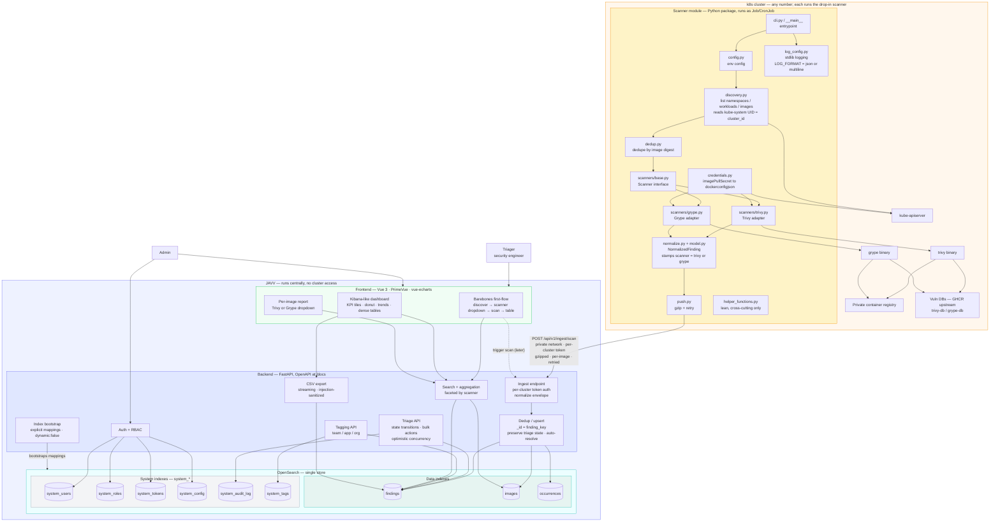

# JAVV — Architecture (current)

> Verbose end-to-end view of the locked design: the drop-in dual-scanner module in each cluster, the
> private/token ingest hop, the central FastAPI backend, the OpenSearch single store (data + `system_*`
> indexes), and the frontend. Source of decisions: `PLAN.md` / `SPEC.md`.

## How to read it (data flow)
1. **Discovery** — the scanner's `discovery.py` calls the kube-apiserver to list namespaces/workloads/
   running images and reads the `kube-system` UID as the immutable `cluster_id`; `dedup.py` collapses to
   unique image **digests**.
2. **Scan** — for the selected tool, the `trivy`/`grype` adapter invokes its binary, which pulls the image
   from the (private) registry using creds resolved by `credentials.py`, and the matching vuln DB.
3. **Normalize** — each adapter maps its raw JSON into the shared `NormalizedFinding`, stamping
   `scanner = trivy|grype`.
4. **Push** — `push.py` POSTs per-image, gzipped and retried, over the **private network** with a
   **per-cluster token** to the ingest endpoint.
5. **Ingest** — the backend authenticates the token, upserts by `_id = finding_key` (preserving triage
   state, auto-resolving absent CVEs) into the **data indexes** (`findings`/`images`/`occurrences`).
6. **Operate** — triage/tagging/search/CSV act over OpenSearch; auth/RBAC and audit use the **`system_*`
   indexes**; the frontend (barebones first-flow → Kibana-like dashboard) reads through the backend APIs.

> Diagram per the working agreement: **Mermaid, not ASCII.** Keep this file updated as the architecture
> evolves.
