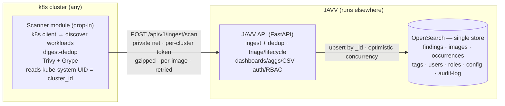

# JAVV — Just Another Vulnerability Viewer · MVP Plan

> **Status: draft for your review.** Consolidates every decision locked during inception. Working
> root: `D:\Github\Claude\javv`. Vendor: **Danube Labs**. Source notes: `../original_notes_for_app.md`
> (read-only). Process: **specs.md FIRE flow, autonomy level 1 (Confirm)** — run `npx specsmd@latest
> install` when we start building, then drive via `/fire-orchestrator → /fire-planner → /fire-builder`.

---

## 1. Identity / Brand (for logo generation)

- **Name:** JAVV — *Just Another Vulnerability Viewer*. The self-deprecating "just another…" tone is
  intentional: approachable, no-hype, engineer-first practical tooling.
- **Vendor:** **Danube Labs** — named for the Danube (the developer's birth city sits on the river);
  evokes steady, flowing, Central/Eastern-European engineering heritage.
- **Personality:** lightweight, pragmatic, transparent (shows raw per-scanner results, no black box).
- **Visual direction** (`Suggestion:` — for Claude design / logo):
  - Motif: a **viewer/lens** (magnifying glass, focus reticle, or eye) over a stylized **container/cube**,
    with a subtle **wave** hinting at the Danube.
  - Palette: anchor on **teal/cyan** (matches the dashboard inspiration's accent bars) + **dark slate**
    for text. Reserve the severity palette (reds/oranges/yellows) for *data*, never brand chrome.
  - Wordmark: clean geometric sans, works lowercase, scales to a favicon.
  - **Seed prompt:** *"A minimal flat logo for 'JAVV', a Kubernetes container-vulnerability dashboard by
    Danube Labs. A magnifying lens over a stylized container cube, with a subtle wave hinting at a river.
    Teal and slate palette, geometric sans wordmark, scalable to a favicon."*

## 2. Context & market fit

Vulnerability tooling splits into two non-overlapping worlds: **triage/audit tools** (DefectDojo,
Dependency-Track) have finding lifecycle management but rigid reporting; **search/BI tools** (Kibana /
OpenSearch Dashboards) have flexible dashboards + one-click CSV but no concept of *auditing* a
vulnerability. Existing OSS stacks (VulnWhisperer, Trivybeat) pipe scanner output into Kibana with
**zero** triage layer. JAVV targets the unfilled seam: **audit workflow + flexible reporting,
k8s-runtime-native, lightweight.**

**Differentiation pillars (must hold):** (1) k8s-runtime-native inventory of what's *actually running*;
(2) self-serve dashboards + one-click CSV materially better than DefectDojo OSS; (3) lightweight
(docker-compose → k8s, no Kafka/graph-DB sprawl). **Failure mode** to avoid: drifting into a generic
Trivy-dashboard or a DefectDojo clone. Honest risk: DefectDojo Pro is closing the dashboard gap.

## 3. Locked decisions

- **Scanner:** decoupled, self-contained **scanner module** (drop into any cluster). Runs **Trivy AND
  Grype from day one** (build the result handling around both real JSON shapes). Uses the official
  `kubernetes` Python client to discover namespaces/workloads/running images, reads the `kube-system`
  namespace UID as a stable **`cluster_id`**, digest-dedupes, scans, and pushes results to JAVV.
- **Ingest:** scanner → **private network** endpoint, authenticated with a **per-cluster token**.
  Push **per-image (gzipped, retried)**; ingest is idempotent. Versioned API contract is the backbone.
- **Backend:** **FastAPI** (+ Pydantic, auto OpenAPI at `/docs`); no cluster access.
- **Storage:** **OpenSearch-only**, multiple indexes (Apache-2.0 → bundle/redistribute freely; chosen
  over Elasticsearch on licensing — perf is a wash for this workload). No Postgres, no sync layer.
- **Findings are kept per-scanner** (no cross-scanner merge). An image view offers a **scanner dropdown**
  (e.g. "nginx — Trivy" vs "nginx — Grype"). Dashboards must **facet by scanner** to avoid double-counting.
- **State:** **current-state only** for the MVP (no historical scan series yet → trend charts & the
  "most vulns solved" hero are a later bolt).
- **Multi-cluster:** supported via `cluster_id` (immutable) + `cluster_name` (relabelable display).
- **Private registries:** supported from day one — scanner resolves `imagePullSecrets` →
  dockerconfigjson → passes creds to the scanner (held in memory only, never logged).
- **Vuln DB:** upstream default for MVP (accept GHCR rate-limit risk); `--db-repository` override left
  exposed (native flag) so a mirror is a later config change, not code.
- **Out of MVP (deferred):** Kibana-style dashboard *builder* (the scope trap), Jira, LDAP/OIDC,
  gamified landing page, dashboard color customization, historical trends.

## 4. Architecture

## 5. Core data model

**Finding identity:** `_id = finding_key = hash(cluster_id + image_digest + scanner + cve_id +
package_name + installed_version)` → idempotent upsert; re-ingest preserves triage state.

**Normalized finding (both scanners map into one shape):**

| Field | Trivy (`Results[].Vulnerabilities[]`) | Grype (`matches[]`) |
|---|---|---|
| cve_id | `VulnerabilityID` | `vulnerability.id` |
| package_name | `PkgName` | `artifact.name` |
| installed_version | `InstalledVersion` | `artifact.version` |
| purl | `PkgIdentifier.PURL` | `artifact.purl` |
| fixed_version | `FixedVersion` | `fix.versions[]` |
| fix_state | `Status` | `fix.state` |
| severity | `Severity` | `vulnerability.severity` (has extra `Negligible`) |
| cvss | `CVSS` (**vendor-keyed map → reshape!**) | `vulnerability.cvss[]` |
| epss / kev | *absent* | `vulnerability.epss[]`, `kev` |

> **DB/index design is a deliberate focus area.** Full field-level **explicit mappings**
> (`dynamic:false`, reshaped vendor-keyed CVSS, `total_fields` safety net) are designed in M1 before
> any real ingest — see §7 and `SPEC.md` NFR-1.

**Index naming convention:**
- **System indexes** — prefix **`system_`**, named **`system_<entity>`** (concrete plural noun,
  snake_case): `system_users` (accounts), `system_roles` (RBAC), `system_tokens` (per-cluster ingest
  tokens), `system_config` (app settings), `system_audit_log` (append-only), `system_tags` (tag
  definitions). Avoid vague catch-alls like `system_user_data` — name by concrete entity (same rule as
  the lean-helpers principle).
- **Data indexes** — scan output: `findings`, `images`, `occurrences`. Applied tags are denormalized
  onto `findings`/`images`.

**Explicit `scanner` field:** every ingested scan/finding doc carries a top-level
**`scanner` ∈ {`trivy`, `grype`}** (in addition to `scanner` being part of `finding_key`) so the UI and
aggregations filter/facet by scanner cheaply.

**`findings` (the heart):** status ∈ {open, triaged, risk_accepted, false_positive, resolved},
triage notes, audited_by/at, first/last seen, `scanner`, `cluster_id`/`cluster_name`, plus denormalized
image + occurrence + tag fields for single-query filter/aggregation/CSV.

**Concurrency/integrity (no relational DB):** `_id` enforces uniqueness; **optimistic concurrency**
(`if_seq_no`/`if_primary_term`) prevents lost triage updates; realtime GET-by-`_id` for read-after-write;
referential integrity in app code. **Dedup rule:** upsert by `finding_key`; existing → update scan
fields + `last_seen` via scripted partial update that **never** overwrites triage state; absent CVEs on a
fresh full scan → auto-`resolved`.

## 6. First build — the scanner modules (build these first)

Per the milestone reorder (§8): **scanners → backend → rest.** Build the two Python scanners as one
well-structured package — per-tool **adapters that share one pipeline**, not two copy-pasted scripts.

**Structure (`scanner/`):**
- `scanners/base.py` — `Scanner` interface (ABC/Protocol): `scan(image) -> list[NormalizedFinding]`.
- `scanners/trivy.py`, `scanners/grype.py` — one adapter per tool: invoke the binary, parse its JSON,
  normalize into the shared model; each stamps `scanner = "trivy"|"grype"`.
- `model.py` — normalized finding (Pydantic/dataclass) from §5's mapping table.
- `discovery.py` — k8s workload/image discovery (shared).
- `credentials.py` — `imagePullSecret` → dockerconfigjson resolution (shared).
- `dedup.py` — digest dedup (shared).
- `push.py` — gzipped, retried POST to the ingest API (shared; until the backend exists, can write
  normalized JSON to a file/stub so scanners are testable standalone).
- `config.py` — env/config loading.
- `helper_functions.py` — small cross-cutting helpers only; keep lean. Real logic lives in the named
  modules above (discovery/credentials/dedup/normalize) so it never rots into a catch-all god module.
- `log_config.py` — thin layer on stdlib `logging` with two formatters (**JSON** vs **human-readable
  multiline**) chosen by the **`LOG_FORMAT`** env var. Named `log_config.py` **not** `logging.py` (the
  latter shadows the stdlib `import logging`).
- `cli.py` / `__main__.py` — entrypoint.
- `tests/fixtures/` — frozen golden Trivy/Grype JSON for deterministic unit tests (§7).

**M0 deliverable:** run locally against an image, scan with either tool, emit normalized findings
(file/stdout), green unit tests vs golden fixtures. The end-to-end discover→scan→table flow
(`SPEC.md` sequence diagram) lands once the backend exists.

## 7. Research findings baked in

- **Licensing:** Trivy & Grype both Apache-2.0 (bundle with attribution). OpenSearch Apache-2.0.
- **Scan efficiency:** dedupe by **image digest** (`status.containerStatuses[].imageID`), scan each
  unique digest once (~300 pods ≈ ~40 images).
- **OpenSearch mapping explosion** (top operational pitfall): use **explicit mappings + `dynamic:false`**;
  reshape vendor-keyed objects (Trivy CVSS) into fixed `[{key,value}]` arrays; set
  `index.mapping.total_fields.ignore_dynamic_beyond_limit:true` as a safety net.
- **CSV formula injection** (must-fix in a security tool): sanitize cells starting with `= + - @`/tab/CR
  on export.
- **CSV at volume:** FastAPI `StreamingResponse` + async generator (~1000-row chunks); OpenSearch
  PIT + `search_after` for deep pagination.
- **Least-priv scanner RBAC:** read-only `get/list/watch` on pods + apps workloads + namespaces;
  Secret read **namespace-scoped** (RoleBindings where private images run), not cluster-wide.
- **Deterministic tests:** unit-test the normalizer/ingest against **frozen golden JSON fixtures**, never
  live scans (vuln DBs drift daily). One separate, count-tolerant live integration test.

## 8. Milestones (FIRE bolts)

Each ends on a **verifiable check + Confirm gate** (CLAUDE.md #4). Order: **scanners → backend → rest.**

1. **M0 — Scanner modules (Trivy + Grype).** The `scanner/` package per §6: per-tool adapters on a
   shared pipeline (discovery, credentials, digest-dedup, normalize, `log_config` JSON|multiline,
   push-with-stub). Deliverable: scan an image with either tool → normalized findings → green unit
   tests vs golden fixtures.
2. **M1 — Backend skeleton + indexes + ingest.** `backend/` (FastAPI) + `deploy/` compose (OpenSearch +
   API). Explicit OpenSearch mappings/templates for **`system_` + data** indexes (`dynamic:false`) +
   versioned bootstrap. `POST /api/v1/ingest/scan` with per-cluster token; wire the scanner's real push.
3. **M2 — Ingest dedup/identity (highest risk).** Upsert by `finding_key` preserving triage state;
   auto-resolve absent CVEs; optimistic concurrency. Test hardest.
4. **M3 — Triage API + RBAC + auth.** State transitions, bulk actions, tag CRUD, `system_audit_log`,
   role gating.
5. **M4 — Read/reporting API.** Filtered search (tag/app/team/org/severity/timestamp/**scanner**),
   aggregation endpoints (faceted by scanner), **streaming sanitized CSV**.
6. **M5 — Frontend.** Barebones first-flow (discover → scanner dropdown → scan → table) → then the
   Kibana-like dashboard per `UI-GUIDELINES.md` (KPI tiles, donut, trend charts, dense severity-colored
   tables, per-image report, scanner dropdown, one-click CSV).
7. **M6 — Polish & deploy.** Helm chart, docs, Trivy/Grype attribution.

## 9. Verification (end-to-end)

- **CI:** testcontainers OpenSearch. Assert: ingest upserts by `finding_key`; **re-ingest preserves
  triage state, no duplicates**; auto-resolve works; concurrent triage protected by optimistic
  concurrency; CSV stream matches the filtered query and is injection-sanitized.
- **Scanner:** kind/minikube + a known-vulnerable image; confirm digest dedup (N pods → M<N scans) and
  namespace-scoped private-registry pulls.
- **Manual E2E (compose):** discover → scan (pick scanner) → findings appear → filter → triage
  (risk-accept) → re-scan → state persists → export CSV → per-image report.

## 10. Open items to confirm at review

- Brand/logo specifics (colors, motif) — see §1 `Suggestion:` notes.
- Whether to capture EPSS/KEV now (Grype) for forward-compat even though current-state-only MVP.
- Which project-specific Claude Code skills to author (scan-fixture ingest helper, "run the JAVV stack").
