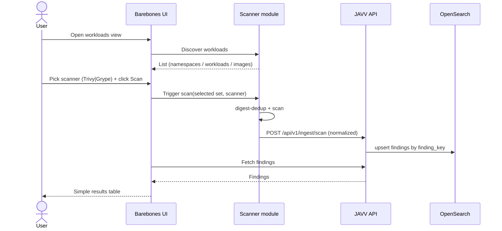

# JAVV — Spec (initial draft)

> **Initial specs.md / FIRE-style draft.** Hand-authored starting point; to be formalized via
> `/fire-planner` after `npx specsmd@latest install`. Companion docs: `PLAN.md` (architecture +
> decisions), `UI-GUIDELINES.md` (polished UI target). Diagrams are Mermaid.

## Intent (what & why)
Teams that run container vulnerability scanners get either **flexible dashboards with no triage**
(Kibana/OpenSearch Dashboards) or **triage with rigid reporting** (DefectDojo). JAVV fills the seam:
a lightweight, k8s-runtime-native tool that ingests Trivy **and** Grype results, lets you **audit and
triage** findings, and gives **Kibana-grade dashboards + one-click CSV** over what's *actually running*.

## Goals
- Discover what's running in a cluster and scan it (Trivy + Grype) without external services.
- Ingest, deduplicate, and persist findings with a durable **triage lifecycle**.
- Dense, filterable dashboards + sanitized one-click CSV.
- Lightweight to run (docker-compose → k8s), OpenSearch-only.

## Non-goals (MVP)
Kibana-style dashboard *builder*; historical trends / "most vulns solved"; Jira; LDAP/OIDC;
cross-scanner finding merge; dashboard theming. (See `PLAN.md` §3.)

## Actors
- **Triager** (security engineer) — reviews, filters, triages findings, exports reports.
- **Admin** — manages users/roles, tags, per-cluster ingest tokens.
- **Scanner module** — automated client; discovers + scans + pushes results.

## Functional requirements
- **FR-1 Discovery:** scanner enumerates namespaces/workloads/running images via the k8s API;
  dedupes by image **digest**; reads `kube-system` UID as `cluster_id`.
- **FR-2 Scan:** scanner runs the **selected scanner (Trivy or Grype)** over unique digests; resolves
  `imagePullSecrets` (namespace-scoped) for private registries.
- **FR-3 Ingest:** scanner pushes per-image, gzipped, retried, to `POST /api/v1/ingest/scan` over a
  private network with a **per-cluster token**; the endpoint normalizes Trivy/Grype JSON into one shape.
- **FR-4 Dedup/identity:** upsert by `_id = finding_key = hash(cluster_id + image_digest + scanner +
  cve_id + package_name + installed_version)`; re-ingest **preserves triage state**; absent CVEs on a
  fresh full scan → auto-`resolved`.
- **FR-5 Triage:** finding status ∈ {open, triaged, risk_accepted, false_positive, resolved}; notes;
  bulk actions; every change written to an append-only audit log; concurrent edits use optimistic concurrency.
- **FR-6 Tagging:** post-ingestion team/application/organization tags on findings/images.
- **FR-7 Search & dashboards:** filter by namespace/image/tag/severity/timestamp/**scanner**;
  aggregations faceted by scanner (never summed across scanners).
- **FR-8 Reporting:** streaming, **CSV-injection-sanitized** export from any lens.
- **FR-9 Per-image report:** drill into an image with a **Trivy/Grype scanner dropdown**.
- **FR-10 Auth/RBAC:** basic auth + role-gated mutations.

## Non-functional requirements
- **NFR-1** OpenSearch-only; explicit mappings + `dynamic:false` to prevent mapping explosion.
- **NFR-2** Lightweight deploy: docker-compose and k8s/Helm, no Kafka/graph-DB.
- **NFR-3** Least-privilege scanner RBAC (read-only workloads; namespace-scoped Secret read).
- **NFR-4** Deterministic tests via frozen golden scanner JSON; one count-tolerant live scan test.
- **NFR-5** Credentials in memory only, never logged.

## First working flow (barebones — acceptance target)

**Acceptance:** Given a cluster with running workloads, when the user picks a scanner and clicks Scan,
then discovered images are scanned (digest-deduped), findings are ingested without duplicates, and a
simple table renders the results. Re-running preserves any triage state.

## Work-item decomposition (→ `PLAN.md` milestones) — scanners → backend → rest
- **WI-0** Scanner modules: Trivy + Grype adapters on a shared pipeline (discovery, credentials,
  digest-dedup, normalize, `log_config` JSON|multiline, push-with-stub) + golden-fixture tests — *M0*
- **WI-1** Backend skeleton + compose + OpenSearch **`system_` + data** index mappings (`dynamic:false`)
  + bootstrap + ingest API (per-cluster token) — *M1*
- **WI-2** Ingest dedup/identity + triage-state preservation (highest risk) — *M2*
- **WI-3** Triage API + RBAC + auth + `system_audit_log` — *M3*
- **WI-4** Search/aggregation API (scanner-faceted) + streaming sanitized CSV — *M4*
- **WI-5** Barebones first-flow UI → Kibana-like dashboard (`UI-GUIDELINES.md`) — *M5*
- **WI-6** Helm chart + docs + scanner attribution — *M6*

## Open questions
- Capture EPSS/KEV (Grype) now for forward-compat, despite current-state-only MVP?
- Which project-specific Claude Code skills to author (scan-fixture ingest helper; "run the JAVV stack")?
- Confirm brand/logo specifics (`PLAN.md` §1).
