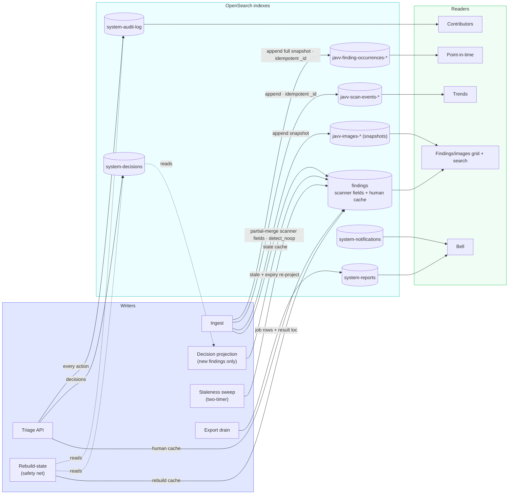

# JAVV - Architecture (v4)

> **Living doc** (formerly `ARCHITECTURE_v4.md` in `docs/engineering/V4/` — suffixes dropped 2026-07-16, #410).
> The v1–v3 evolution trail is frozen in `.deprecated/`; version markers are reserved for frozen generations.

> **Revision 4 (2026-06-21).** Supersedes `.deprecated/docs/engineering/deprecated/V3/ARCHITECTURE_v3.md` (frozen). End-to-end design with
> the hybrid data model + the v4 refinements: `system-exceptions`→`system-decisions`, raw-fidelity keyword
> normalizer, rebuildable triage state (partial-merge + rebuild job), idempotent appends, full-snapshot
> point-in-time (no close events), scheduled/throttled export, and an explicit HA/multi-pod section. Source of
> decisions: `PLAN.md` / `SPEC.md`. UI reference: `handoff/v4/`. Diagrams: Mermaid.

## 1. System diagram

```mermaid
flowchart TB
    Triager["Triager / Security Lead"]
    Admin["Admin"]

    subgraph CLUSTER["k8s cluster - one per cluster_id; runs the drop-in scanner"]
        direction TB
        K8SAPI["kube-apiserver"]
        REG["private registry"]
        VDB["vuln DBs (mirror/cache on PVC)<br/>trivy-db / grype-db"]
        subgraph SCAN["Scanner module (Job/CronJob · Forbid · PVC cache)"]
            direction TB
            DISC["discovery + local digest-dedup (scan ALL)"]
            ADAPT["trivy / grype adapters → normalize<br/>severity vocab → canonical (verbatim kept)<br/>EPSS/KEV (grype) · stamp scanner"]
            PUSH["push.py · gzip · backoff+jitter · dead-letter · scan_run_id · envelope vN"]
        end
    end

    subgraph JAVV["JAVV - central, no cluster access"]
        direction TB
        subgraph API["FastAPI · AsyncOpenSearch · OpenAPI /docs"]
            direction TB
            INGEST["Ingest (hardened)<br/>per-(cluster,scanner) token (256-bit, peppered SHA-256) · validate envelope (current only)<br/>rate-limit·size+decompress caps·structured queries"]
            UPSERT["findings partial-merge (_bulk)<br/>_id=finding_key · detect_noop · reconcile-on-commit (present=false)<br/>scanner fields only - human cache untouched"]
            APPEND["Append scan-events + finding-occurrences full snapshot (immutable)<br/>deterministic _id (idempotent) · scan-events = commit catalog (commit_key 4-tuple)"]
            PROJECT["Decision projection → state<br/>new findings only · precedence · scope × apply_both"]
            SWEEP["Two-timer staleness sweep + expiry re-project<br/>per-finding (N) + scanner-down escalation (M)"]
            REBUILD["Rebuild-state job (safety net)<br/>re-project cache from decisions + audit_log"]
            EXPORT["Export drain (CronJob)<br/>system-reports · off-peak · throttled"]
            TRIAGE["Triage API · VEX two-field · bulk<br/>every action → audit_log · refresh=wait_for"]
            SEARCH["Search/aggs · faceted by scanner · PIT+search_after (closed in finally)<br/>trends ← scan-events · contributors ← audit_log<br/>point-in-time ← R-CATALOG (latest committed run from scan-events, then occurrences)<br/>vuln-age computed at read time"]
            CSV["Streaming CSV (sanitized) → now | scheduled"]
            AUTH["Auth/RBAC · local users (argon2id) · bootstrap admin<br/>get_current_principal · IDOR · tenant filter"]
            RET["Retention/rollover/snapshot mgr → ISM (per cluster_id)"]
            OBS["/healthz /readyz /metrics · structlog"]
            BOOT["Index bootstrap · mappings (normalizer) · ISM · snapshots"]
        end

        subgraph OS["OpenSearch - single store"]
            direction TB
            subgraph CUR["current-state (mutable) - the 'now' cache"]
                F[("findings<br/>per-scanner · triage cache · disagree flag")]
                WM[("javv-scan-watermarks<br/>per-digest committed-scan order (CAS guard)")]
            end
            subgraph LOG["logs (append-only, per-cluster, ISM rollover + drop-retention)"]
                SE[("javv-scan-events-* (receipts + trends + commit catalog)")]
                OCC[("javv-finding-occurrences-* (full snapshots → point-in-time)")]
                I[("javv-images-* (inventory snapshots)")]
                IRUN[("javv-inventory-runs-* (inventory commit manifest)")]
                MET[("javv-metrics-* (rollup, v1.1)")]
            end
            subgraph SYS["system-* (repository interface)"]
                direction TB
                SU[("users·roles·tokens·config·tags")]
                SD[("system-decisions<br/>scoped decisions (was system-exceptions)")]
                SA[("system-audit-log (append-only role · structured · keep long)")]
                SV[("saved_views · notifications · reports")]
            end
        end

        subgraph FE["Frontend - Vue 3 · PrimeVue · vue-echarts (server-side)"]
            FLOW["first-flow → Kibana-like dashboard"]
            RETUI["Settings → Data & OpenSearch (Admin)<br/>retention · rollover · snapshots · staleness timers"]
        end
    end

    DISC --> K8SAPI
    ADAPT --> REG
    ADAPT --> VDB
    DISC --> ADAPT --> PUSH
    PUSH -->|"POST /api/v1/ingest/scan · private net · gzip · retried"| INGEST

    INGEST --> UPSERT --> F
    INGEST --> APPEND --> SE
    APPEND --> OCC
    APPEND --> I
    APPEND --> IRUN
    APPEND -->|"CAS watermark"| WM
    WM -.->|"newer-scan-wins guard"| UPSERT
    UPSERT --> PROJECT
    PROJECT --> F
    SWEEP --> F
    SWEEP --> SE
    REBUILD --> F
    REBUILD --> SD
    REBUILD --> SA
    EXPORT --> SV
    TRIAGE --> F
    TRIAGE --> SD
    TRIAGE --> SA
    PROJECT --> SD
    SEARCH --> F
    SEARCH --> I
    SEARCH --> IRUN
    SEARCH --> SE
    SEARCH --> OCC
    SEARCH --> SA
    CSV --> F
    CSV --> SV
    AUTH --> SU
    RET --> SE
    MET -. "ISM rollup (v1.1)" .- SE
    BOOT --> OS

    FLOW --> SEARCH
    FLOW --> TRIAGE
    FLOW --> CSV
    RETUI --> RET
    Triager --> FE
    Admin --> FE
    Admin --> AUTH

    style CLUSTER fill:#fff7ed,stroke:#F18F01
    style SCAN fill:#fef3c7,stroke:#F18F01
    style JAVV fill:#eef2ff,stroke:#6366f1
    style API fill:#e0e7ff,stroke:#6366f1
    style OS fill:#ecfeff,stroke:#2EC4B6
    style CUR fill:#e6f4f1,stroke:#2EC4B6
    style LOG fill:#fdf4ff,stroke:#a855f7
    style SYS fill:#f3f4f6,stroke:#9CA3AF
    style FE fill:#f0fdf4,stroke:#22c55e
```

## 1b. Index data-lineage (who writes / reads each index)

Read it as three columns: **writers** (the only paths that mutate state) → **indexes** → **readers** (each
screen reads from exactly one or two indexes, never computing across scanners). Note the source-of-truth
loop: triage writes `system-decisions` + `system-audit-log`; projection/rebuild read them back to (re)compute
the `findings` cache - the heart of D17.

## 2. The layers (the v3 crux, v4-refined)

| Layer | Index(es) | Mutability | Owner | Job |
|---|---|---|---|---|
| **Current-state** | `findings` | mutable (partial-merge + reconcile-on-commit) | ingest merges scanner fields & flips `present`; projection writes `state` **cache** | triage + grid |
| **Scan watermark** | `javv-scan-watermarks` | mutable (CAS) | ingest CAS-bumps at commit | newer-scan-wins guard for create+update (D40) |
| **Logs - trends** | `javv-scan-events-*` | append-only | ingest only (idempotent `_id`) | trends + **commit catalog** (`commit_key` 4-tuple) |
| **Logs - history** | `javv-finding-occurrences-*` | append-only | ingest only (full per-scan snapshots) | accurate point-in-time (read via catalog) |
| **Logs - inventory** | `javv-images-*` | append-only | ingest only (snapshots per `inventory_run_id`) | running-images @ latest committed run; rewind ≤ T |
| **Logs - inventory catalog** | `javv-inventory-runs-*` | append-only | ingest only (1 manifest/run, written last) | certifies a run complete (`status=committed`) - read gate for "running images" |
| **Human decisions (source of truth)** | `system-decisions`, `system-audit-log` | append/mutable | triage only; **every** action journaled | scoped decisions + audit + Contributors |
| **Ops** | `system-reports`, `system-notifications`, `system-saved-views` | mutable | API/jobs | export queue · bell · views |

The human-owned fields on `findings` are a **rebuildable cache** of the decision layer (D17): a **partial-doc
merge** keeps them correct on every ingest (scanner fields only - human fields untouched, no preserve script);
the **rebuild-state job** can reconstruct them from `system-decisions` + structured `system-audit-log`. So
even a bad write is recoverable, not irreversible. Scanner-owned enum/casing fields use a **lowercase normalizer** - verbatim in `_source`,
normalized for aggs (D16). On OpenSearch (no `latest` transform), **ingest writes logs then the current-state
cache, in one request cycle** (logs-then-cache ordering - D39/H3-r2): append occurrences + images, commit
(scan-events + inventory manifest) after per-item success, *then* merge `findings`. There are **no
close-events** (absence in a later snapshot = resolved); the `javv-scan-events` doc is the **commit catalog**
that makes a snapshot eligible as "latest" (F1/R-CATALOG - read the latest committed run from scan-events,
*then* occurrences for that run, so a clean rescan reads as clean, D37/C1). On commit, **newer-scan-wins
reconcile** flips `present=false` on `findings` the run omitted (cache only - history untouched, C2).

## 3. Data flow (end to end)

1. **Discover** - scanner lists workloads/images; reads `kube-system` UID = `cluster_id`; **local
   digest-dedup** (scan-all every cycle; exclude by namespace/label - no skip-unchanged, D30).
2. **Scan + normalize** - trivy/grype adapter invokes its binary (PVC-cached DB), pulls via namespace-scoped
   creds, normalizes to the shared shape, **maps the severity vocabulary to the canonical ramp while keeping
   the verbatim scanner word** (D16), grype adds EPSS/KEV, stamps `scanner`.
3. **Push** - per-image, gzipped, backoff+jitter+dead-letter, `scan_run_id`, **versioned envelope**, per-
   `(cluster,scanner)` token.
4. **Ingest (hardened)** - validate envelope (**current version only**, reject older w/ 4xx - D35) +
   size/decompression caps + rate-limit + **token↔payload binding** (SEC-3). Then **commit-then-cache ordering**
   (D39/H3-r2), all with **deterministic `_id`** (D18): **(a)** append the full `javv-finding-occurrences`
   snapshot (each row stamped `commit_key` + **`scan_order`**) + the `javv-images` snapshot (stamped
   `inventory_run_id`); **(b)** only after those `_bulk`s return **zero item-level errors** (inspected per-item,
   not just the top flag - H4), write the **`javv-scan-events` commit doc** (carrying `commit_key` + `scan_order`,
   F1) **and** the **`javv-inventory-runs` manifest** (`status=committed`, `inventory_order` - D39/H4-r2) **and
   CAS-bump the `javv-scan-watermarks` watermark** to `max(current, scan_order)` (D40); **(c)** *then*, **only
   if this run ≥ the watermark** (else stale → skip cache), **partial-merge
   `findings`** (scanner fields only - human untouched, D31) and **reconcile-on-commit** (`update_by_query`
   flips `present=false`/`resolved_at` for this `(digest, scanner)` whose `last_scan_order` < this `scan_order`
   - D37/C2, cache only, history untouched). Both (c) writes are **newer-scan-wins keyed on `scan_order` + the
   per-digest watermark** (so an out-of-order older run can neither overwrite **nor re-create** - D40/C-r3), and
   the reconcile **retries scoped until zero conflicts** (D40/E-r3); a crash before (c) self-heals via the
   **scanner-cache rebuild** (D40/D-r3).
5. **Project** - recompute `state` from `system-decisions` for **newly-created findings only**, against
   **cascading** namespace/cluster rules (D19); precedence + `apply_both` per D22. Compute the `disagree`
   flag. Existing findings are re-projected only on decision-apply or the sweep.
6. **Operate (as-of-T projection - D28)** - triage writes `findings` (cache) + `system-decisions` +
   **structured `system-audit-log` (every action)**. **Every read takes a time `T`:** `T=now` → materialized
   current-state (`findings` + latest complete `javv-images` run); `T<now` → reconstruct from the append logs
   (**R-CATALOG:** **max-`scan_order`** committed run from `scan-events` ≤ T, then occurrences for that run's
   `commit_key` - clean run = no rows; inventory = images of the latest `status=committed` `javv-inventory-runs`
   ≤ T **by `inventory_order`**;
   `system-audit-log` replay ≤ T ordered by `(@timestamp, event_id)` + `system-decisions` active at T; `stale`
   recomputed). Symmetric "which images had CVE-Y at T" = two-step **via the catalog** (Step 1 `scan-events` →
   `commit_key` per digest; Step 2 `commit_key IN {…} AND vuln_id=Y` - F2/D39, not a composite over
   occurrences); trends ← scan-events; Contributors ← audit-log; vuln-age/SLA at read time (D21). All via
   PIT+`search_after` (**closed in `finally`**, D38/M16), faceted by scanner, **tenant-filtered via the
   chokepoint helper** (SEC-4). **In MVP, historical all-clusters dashboards are limited/unavailable** until
   the `javv-metrics` rollup (v1.1); per-cluster rewind is fully supported (D39/M11-r2).
7. **Maintain (CronJobs, idempotent)** - daily **two-timer staleness sweep** (per-finding N + scanner-down
   escalation M, banner between) + **decision-expiry re-projection**; **export drain** (off-peak, throttled,
   D24, fencing `attempt_id` + orphan sweep - D40/I-r3); **rebuild-state** on demand (**human cache** from
   decisions+audit-log **and scanner-presence cache** from the catalog - D40/D-r3); optional **rollup** (v1.1). *(No close-event job - occurrences are full
   snapshots, §5.5/D2b.)*
8. **Retain / protect** - ISM rollover (doc/age/size) + per-cluster `retention_days` delete by **dropping
   whole indices**; **native Snapshot/Restore** to S3/MinIO on a schedule (tested restore). All Admin-managed
   via the **Data & OpenSearch** panel (D26).

## 4. Projection & precedence (FR-8)
A finding's `state` is derived, not free-typed:
- **Scope** selects the image/namespace dimension; **`apply_both_scanners`** the scanner dimension -
  orthogonal. **`apply_both` is pinned (D22):** match on `(cluster, cve, scope)` ignoring scanner → project
  onto each scanner's finding independently; each closes on its own; a scanner-specific decision outranks a
  both-scanners one for that scanner.
- **Precedence** (conflict only): explicit per-finding > image-scoped > namespace-scoped > cluster-scoped >
  none; a direct human action outranks an auto-rule.
- **Expiry-refresh:** on expiry, re-project to the *next* applicable rule (not `open`). **Cascade:**
  namespace/cluster scopes auto-apply to **new** matching findings at ingest (D19); explicit-image scopes do
  not. The resulting `state` is a rebuildable cache (D17).

## 5. Observability & ops (M1)
`/healthz` + `/readyz` + Prometheus `/metrics` (ingestion rate, 4xx/413/429/503, payload sizes,
**decompression ratio**, `_bulk` latency, queue depth, memory). structlog (JSON prod / console dev). **No
Redis/Kafka/broker** - backpressure is a bounded `asyncio.Semaphore` (→503), rate-limit is `slowapi` in-proc
(→429); both observable above.

## 6. HA & multi-pod (D23)
The single-node, single-pod default is a SPOF **by design**; HA is **not JAVV-built** - it's OpenSearch
multi-node + replica shards + stateless app `replicas>1`, no code change. The point-in-time snapshot
**history** is **pure-append with deterministic `_id`, so there is no close-event race** at any replica count
(designed out - history has no read-modify-write). The **current cache** (`findings`) *does* read-modify-write,
but it is **guarded** and safe at any replica count without a broker: newer-scan-wins on `scan_order` + the
per-digest `javv-scan-watermarks` watermark (CAS) + reconcile retry-to-zero-conflicts (D40). The reconcile
`update_by_query` is **bounded** - filtered to one `cluster_id`+`scanner`+`image_digest`, throttled, with
conflict/retry counts observed. The remaining multi-pod caveats:
- **Per-replica rate-limit.** `slowapi` counts per pod (no shared store, D11). Behind one Service across N
  pods the global limit ≈ configured × replicas (exact at `replicas:1`). The per-request size/decompression
  caps and the per-pod semaphore still hold on every pod. A hard global cap would need shared state (out of
  scope). Documented, not "fixed."
- **Job claiming is safe at any replica count (D38/M17).** The CronJob `Forbid` policy only serializes one
  CronJob - it does **not** prevent N API replicas (or a retried drain) from grabbing the same
  `system-reports` row. So job claim uses **optimistic concurrency** (`pending→running` via
  `seq_no`/`primary_term` CAS) + `heartbeat_at` + `lease_expires_at` + `retry_count`: a lost race is a no-op,
  a dead worker's lease expires and is re-claimed. **A fencing `attempt_id` (D39/M7-r2)** closes the last gap -
  heartbeat and the `done` transition CAS on the current `attempt_id`, and the result object path includes it,
  so a slow worker whose lease *already* expired and was reclaimed can't double-publish output. OpenSearch *is*
  the coordinator (broker-free, D11).

Single OpenSearch is one **failure domain + resource pool** (ingest, search, auth share thread pools); heavy
reporting can contend with ingest - mitigated by scheduled/throttled export (D24) and, at scale, by scaling
OpenSearch nodes / a coordinating node. Never a second datastore (D11).

## 7. Notes
- **Diagrams are Mermaid** (working agreement). Keep this file current as the architecture evolves.
- **Tenant isolation** enforced in the query layer (`cluster_id` filter on every read/export), never UI-only.
  **RBAC** gates mutations client- and server-side; **every** triage action is journaled.
- The frontend recreates `handoff/v4/` in Vue 3 - keep the `fields`-config pattern verbatim; treat
  the JSX prototype as executable spec. Expected UI extensions beyond the handoff: `not_affected`+
  justification pickers, the scoped risk-accept dialog, the inventory staleness banner, the export
  now/off-peak dialog (see `PLAN` M9).
