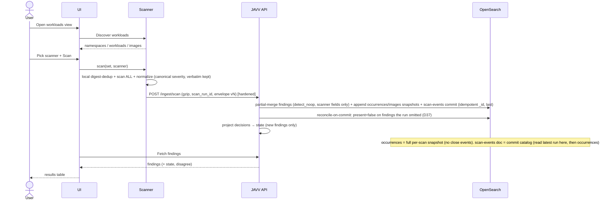

# JAVV - Spec (v4)

> **Living doc** (formerly `SPEC_v4.md` in `docs/engineering/V4/` — suffixes dropped 2026-07-16, #410).
> The v1–v3 evolution trail is frozen in `.deprecated/`; version markers are reserved for frozen generations.

> **Revision 4 (2026-06-21).** Supersedes `.deprecated/docs/engineering/deprecated/V3/SPEC_v3.md` (frozen). Reflects the post-v3 audit
> dialogue. Companions: `PLAN.md` (decisions/data-model/milestones), `ARCHITECTURE.md` (flows),
> `handoff/v4/` (UI reference - *reference point, not a 1:1 contract*). Diagrams: Mermaid.
> Key v4 changes: `system-exceptions`→`system-decisions`; raw-fidelity via keyword normalizer; rebuildable
> triage state; idempotent appends; projection-on-new-only; two-timer staleness; VEX **import → v1.1**
> (export stays); scheduled/throttled export; envelope-versioning policy; Admin Data & OpenSearch panel.

## Intent
A lightweight, k8s-runtime-native tool that ingests **Trivy AND Grype** results, lets teams **audit and
triage** findings with a durable, **VEX-aligned** lifecycle, and gives **Kibana-grade dashboards + trends +
one-click CSV** over what's *actually running* - the seam between view-only scanner-dashboards (no triage)
and rigid triage tools (no flexible reporting).

## Actors
- **Triager** (Operator+) - reviews, filters, triages, exports.
- **Security Lead** - approves decisions (risk-accepts), edits SLA.
- **Admin** - users/roles, tags, per-(cluster,scanner) tokens, **retention/rollover/snapshots**, scanner config.
- **Scanner module** - automated client: discover → scan → push.

(RBAC: Viewer < Auditor < Operator < Security Lead < Admin. A **bootstrap admin** is seeded on first boot
from an env/secret and must change the password on first login - FR-18.)

## Functional requirements

- **FR-1 Discovery.** Scanner enumerates namespaces/workloads/running images via the k8s API; dedupes by
  image **digest**; reads `kube-system` UID as immutable `cluster_id`.
- **FR-2 Scan.** Selected scanner (Trivy|Grype) over unique digests; resolves namespace-scoped
  `imagePullSecrets`; **scans everything every cycle** - a stateless scanner with **local digest-dedup**
  (each unique digest once) and namespace/label **exclusions** only (no skip-unchanged, no backend query -
  D30); bounded concurrency.
- **FR-3 Ingest.** Scanner **normalizes** Trivy/Grype JSON into the shared shape (canonicalizing the severity
  *vocabulary* to `crit/high/med/low` while **preserving the verbatim scanner word**) and pushes per-image,
  gzipped, retried (backoff+jitter, dead-letter), to `POST /api/v1/ingest/scan` over a private network with a
  per-`(cluster,scanner)` token. The endpoint **validates** the **versioned** envelope and **accepts the
  current envelope only, rejecting older with a clear 4xx** (D25/D35/D38 - N/N-1 dual-parse dropped); it is
  **hardened** (NFR-7) and never parses raw scanner JSON. Each push carries `scan_run_id` and the scanner's
  self-reported **`scanner_version` + vuln-DB version/built** provenance (D41) - the ingest model must accept
  these fields (it is `extra="forbid"`).
- **FR-4 Dedup/identity.** Upsert `findings` by `_id = finding_key = hash(cluster_id + image_digest +
  scanner + cve_id + package_name + installed_version)`. **No-op for unchanged findings** (`detect_noop`);
  **full-precision `last_seen_at`** (D37/M13) + `last_scan_run_id` + **`last_scan_order`** (guard key) +
  `last_scan_at` (display); re-ingest writes scanner fields via a **partial-doc merge**, leaving all
  human-owned fields untouched (a rebuildable cache - D17/D31). **Ordering (D39/H3-r2, D40):** the `findings`
  merge runs **after** the scan-events commit doc lands (which itself lands only after per-item `_bulk`
  success), and is **newer-scan-wins** keyed on the backend-allocated (D45) **`scan_order`** - both create and update
  **no-op when `scan_order ≤ doc.last_scan_order` or `< the per-digest `javv-scan-watermarks` watermark`**, so
  an out-of-order older run can't overwrite **or re-create** state (the watermark is what guards a *create* -
  C-r3). Then **reconcile-on-commit** flips `present=false`/`resolved_at` on findings the committed run omits
  (D37/C2), **retrying scoped until zero version-conflicts** (E-r3). Per-scanner rows, **never merged**.
  A CVE on **N images = N findings rows** (`finding_key` includes `image_digest`); the `images` doc holds
  rollup **counts, not the vuln list** (the list is a query of `findings` by `image_digest`). Indexes relate
  by **shared-key joins**, never embedded sub-tables (worked example: `FLOW-EXAMPLE.md` §7–§8).
- **FR-5 Logs / trends.** On every ingest, append an **immutable** doc to `javv-scan-events-*` - one per
  **(image, scanner, scan)**: severity *counts* + dimensions + `@timestamp` + **`scan_order`** (the catalog
  ordering key - D40) + `commit_key` + **`scanner_version` / `scanner_db_version` / `scanner_db_built`**
  provenance (D41, for the read-only scanner-status version view + audit matrix), **idempotent `_id`** (D18).
  The trends source. Partitioned per `cluster_id`; lifecycle per FR-19.
- **FR-5b Per-scan snapshots (point-in-time).** Every **successful** scan appends a **full snapshot** to
  `javv-finding-occurrences-<cluster_id>-*` - one immutable row per current finding (`@timestamp`,
  `scan_run_id`, **`scan_order`** (D40), **`commit_key`** (D39), `finding_key`, `vuln_id`, package,
  `image_digest`, `severity` as-of-then - **no `severity_rank` here**, OE-5/D38; as-of-T sort uses a fixed
  order map),
  idempotent `_id = hash(scan_run_id + finding_key)` (D18). **No close events** - a fixed/absent vuln just
  isn't in later snapshots (validated: Elastic CSPM raw+latest pattern). The `javv-scan-events` doc is the
  **commit catalog/marker** (only committed snapshots are eligible as "latest", carrying the `commit_key`
  4-tuple, F1/D37). **Forward (R-CATALOG two-step):** "digest X at T" = the **max-`scan_order`** committed
  `scan_run_id` from scan-events ≤ T (order by `scan_order`, not `@timestamp` - D40/C-r3), **then** occurrences
  for that run → its rows; **zero rows = clean** (a clean rescan wrote no rows - never take the latest
  occurrence doc per digest, C1); "not yet scanned then" if no committed run ≤ T. **Symmetric:** "which images
  had CVE-Y at T" = a **two-step query via the catalog** (Step 1 pages `scan-events` ≤ T → **max-`scan_order`**
  committed `commit_key` per digest; Step 2 = `commit_key IN {…} AND vuln_id=Y` over occurrences - F2/D39;
  **not** a composite "latest snapshot per digest" over occurrences, **not** a swapped collapse). Per-scanner, never
  merged. **As-scanned, not as-running** (F4).
  **NON-downsampled** - horizon = raw `retention_days`. *(Built in M8, after read.)*
- **FR-6 Staleness lifecycle (two-timer, D20).** **(a)** A finding not re-seen within the **per-finding
  freshness window** (default **3 d**, per-cluster configurable) → `stale` (daily sweep). **(b)** A scanner
  silent beyond the **scanner-down escalation window** (default **7 d**) → all that cluster's findings →
  `stale`. Between (a) and (b) the per-finding timer is **held** (no mass-staling on a brief outage) but every
  inventory view shows a **"data as of T; scanner silent since T'"** banner. Re-push reverts to
  `pre_stale_status`. `resolved` is manual-only. Both windows editable (FR-19/D26). **`stale` is a flag, not a
  delete** (D37/M12) - `findings` docs are purged only after a separate long window; the freshness timer reads
  full-precision `last_seen_at`.
- **FR-7 Triage (VEX two-field model).** `state ∈ {open, acknowledged, not_affected, risk_accepted,
  resolved, stale}` + nullable `vex_justification` (CISA five; required iff `not_affected`). "False positive"
  = `not_affected` + component/code-not-present justification (UI chip). Notes; optimistic concurrency; bulk
  via `_bulk` (202+async for large sets); each triage write is **CAS'd on the finding** and **every action
  (incl. acknowledge/assign/note) appends one `system-audit-log` entry** (one per bulk action, recording the
  **frozen `target_ids`** of the affected set - not a selector or count - plus the finding's resulting
  **`revision`** so replay orders same-field edits causally, not by `event_id` - D38/H8, D40/H-r3) - D17.
- **FR-8 Decisions / scoped risk-acceptance.** Risk-accepts, ignore-rules, and not-affected calls are
  **`system-decisions`** documents (*renamed from `system-exceptions`*) with **scope** (images and/or
  namespaces; empty = cluster-wide), `apply_both_scanners`, justification, approver, expiry. Decision docs are
  **immutable except `revoked_at`** (D39/H5-r2); a scope/justification **or `expiry`** edit is **revoke +
  create-new** under **one `effective_at` and one `operation_id`** (`revoked_at(old) = created_at(new) =
  effective_at`), with **projection deferred until both writes land** (D40/G-r3) - so "active at T" never sees a
  neither/both gap and past-T reconstruction is stable. A finding's
  `state` is a **projection** with **precedence** (explicit-finding > image > namespace > cluster; direct
  action > auto-rule) and **expiry-refresh**. Re-projected at **ingest (newly-created findings only, vs
  cascading namespace/cluster rules - D19)** / decision-apply / daily-sweep. **`apply_both_scanners`
  semantics are pinned (D22):** matches on `(cluster, cve, scope)` ignoring scanner, projects onto each
  scanner's finding independently, each closes on its own, and a scanner-specific decision outranks a
  both-scanners one for that scanner.
- **FR-9 Tagging.** Team/app/org tags on findings/images; image-level where possible; retags as async
  `update_by_query` (`slices=auto`, `conflicts=proceed`), rate-limited; tag fields preserved on re-ingest.
- **FR-10 SLA / overdue.** Per-severity SLA days (CRIT 2 / HIGH 7 / MED 30 / LOW 90, editable) + KEV
  override (24h). `overdue` derived from **read-time vuln-age** (group by `cve_id + image_digest`, earliest
  `first_seen_at` - so a package bump doesn't reset the clock, D21); surfaced on findings + notifications.
- **FR-11 Scanner disagreement.** (a) Per-finding **severity** disagreement flag; (b) per-image **count**
  disagreement (`trivy_count` vs `grype_count` + `count_delta`). Precomputed; shown side-by-side, never summed.
- **FR-12 Search & dashboards.** Filter by namespace/image/tag/severity/timestamp/**scanner**/state/
  assignee/KEV/fix-available/disagree; aggregations **faceted by scanner**; capped terms or **composite**
  aggs; PIT + `search_after`. Trends from scan-events; Contributors from `system-audit-log`; "new in 30d"
  from `first_seen_at`. Severity filters/aggs are case-insensitive (normalizer, D16).
- **FR-13 Reporting (scheduled/throttled, D24).** Streaming, **CSV-injection-sanitized** export from any
  lens (constant memory). Large exports become **`system-reports`** jobs: the export dialog offers **"run
  now"** or **"schedule off-peak"** (throttled - PIT+`search_after`, small pages, brief sleeps); the result
  is stored **in OpenSearch**, chunked into `system-report-chunks` (un-indexed slices; amended 2026-07-07,
  #32/#212 - supersedes the earlier object-storage model, single-store constraint honored), downloaded via a
  backend endpoint gated by the tenant chokepoint + a short-lived token, and **TTL-expired** (`expires_at`,
  default 24 h - 410 after); user is notified via the **bell**. Broker-free (CronJob drain). **Each job is
  claimed by optimistic concurrency** (`pending→running` via `seq_no`/`primary_term` CAS + `heartbeat_at` +
  `lease_expires_at` + `retry_count` - D38/M17) plus a **fencing `attempt_id`** (heartbeat + `done` CAS on it,
  result chunks + the report doc include it - D39/M7-r2) so neither API replicas/retries nor an
  expired-then-reclaimed slow worker can double-run or double-publish (the bell reads only the `done` doc);
  **orphan chunks from failed/stale attempts are TTL-swept** (D40/I-r3). Retires the reporting-vs-ingest
  contention risk.
- **FR-14 Per-image report.** Image drill-down with Trivy/Grype **scanner dropdown**; severity-summary +
  per-scanner finding table (verbatim scanner severity from `_source`). Fully **time-travelable** via the
  global picker (FR-23): at a past T it shows the image's exact CVE list + as-of-then severities from
  `javv-finding-occurrences-*`. **Two distinct guarantees, never conflated (D38/H6):**
  **`runtime_inventory_at_T`** = was this digest in the cluster at T (from the latest **`status=committed`**
  `javv-inventory-runs` manifest ≤ T **by `inventory_order`** and its images - D39/H4-r2, D40/F-r3);
  **`vulns_as_scanned_at_T`** = what a scan found on it (max-`scan_order` **committed** run from `scan-events`
  ≤ T, then its occurrences via R-CATALOG). **"Image X" = `image_digest`** (UI selects by `repo:tag`/workload →
  maps to the digest(s) present at T, marking "image build changed here" not a silent gap - F3);
  **as-scanned, not as-running** (F4); "not yet scanned then" when no committed snapshot ≤ T.
- **FR-15 Contributors / trends (MVP, expanded).** Resolved-over-time, median TTR, SLA-hit %, leaderboard
  (+ expanded metrics) - from `system-audit-log` + `findings`; scoped by the global time-range picker.
  **Leaderboard window is bounded by `system-audit-log` retention** (kept long - §5.5b).
- **FR-16 Notifications (MVP, per-user).** `system-notifications` populated with the user's SLA breaches +
  new assignments + ready exports; bell badge; polling (no broker).
- **FR-17 Saved views (MVP, per-user).** `system-saved-views` named filter sets; deep-link into pre-filtered
  Findings.
- **FR-18 Auth/RBAC (capability-based - D33; lifecycle - SEC-5).** Local users (`system-users`, argon2id) +
  **server-side sessions** (`system-sessions`: httpOnly+Secure+SameSite cookie, TTL, revoke-on-role-change;
  one session per browser, **shared across tabs**) + **bootstrap admin** (mounted secret, seed-once,
  server-enforced `must_change` - SEC-6) + **password policy + login lockout/throttle** + **auth-event
  auditing**. **Capabilities, not role strings**, gate every action (`can_triage`, `can_accept_audit_final`
  for risk-accept, `can_manage_*`; destructive caps Admin-only + journaled). `get_current_principal()`
  resolves the session (OIDC-swappable later); **ingest-token auth separate**, with **token↔payload binding**
  (SEC-3). Per-request entitlement on every fetch **and export** (IDOR); **tenant `cluster_id` filter via one
  chokepoint helper** + negative test (SEC-4), never UI-only. **MVP tenant model (D38/H9):** all clusters are
  visible to any authenticated user - `cluster_id` is a **data filter applied on every read/agg/export** (guards
  accidental cross-cluster bleed), **not** a per-user auth boundary; per-user/role `allowed_cluster_ids` grants
  are **post-MVP**. RBAC gated client + server.
- **FR-19 Data & OpenSearch settings (Admin, D26).** `Settings → Data & OpenSearch`: per-`cluster_id`
  `retention_days`; **rollover** knobs (doc count / age / size; defaults ~40 GB / 30 d / 50 M docs);
  **snapshot** repository + schedule + manual snapshot/restore; **staleness timers** (FR-6) (here or a
  sibling "Scanning" section). JAVV applies/updates the ISM policies. *(Superseded by the M4 mechanism decision: the daily lifecycle sweep reads the `system-config` knobs live and drops whole indices at horizon — no ISM policy re-apply; see the M9e bolt README.)* (Full index-management UI is v1.x.)
- **FR-20 Observability.** `/healthz`, `/readyz`, Prometheus `/metrics` (ingestion rate, 4xx/413/429/503,
  payload sizes, **decompression ratio**, queue depth, latency, memory); structured logs (structlog). M1.
- **FR-21 Risk metadata.** Capture **EPSS/KEV** from Grype (explicit mapped fields; absent for Trivy).
- **FR-22 VEX export (MVP); import (v1.1).** **Export** (M6): serialize `state`/`vex_justification` →
  OpenVEX/CycloneDX (consumable by Trivy/Grype `--vex`). **Import → v1.1:** a VEX `not_affected` statement
  becoming a `system-decisions` record is deferred; **MVP ingests only the scanner JSON envelope.** The
  two-field model (FR-7) keeps import additive when it lands.
- **FR-23 Whole-app time-travel (global rewind - D28).** A global time picker (days/hours/minutes ago;
  default now) makes **every screen a projection at T**. `T=now` reads materialized current-state (fast);
  `T<now` reconstructs from the timestamped append logs **catalog-first** (D39 - no "latest snapshot ≤ T"
  shorthand): scanner facts = **max-`scan_order`** committed run from `scan-events` ≤ T, then `occurrences` for
  that run's `commit_key`; inventory = images of the latest `status=committed` `javv-inventory-runs` ≤ T **by
  `inventory_order`**; trends =
  `javv-scan-events`; **human state = `system-audit-log` replay ≤ T (ordered by `(@timestamp, event_id)`,
  latest-per-field) + `system-decisions` active at T**; `stale` recomputed at T. Same UI, source swapped by T. **Reach is per-cluster - as far back
  as that cluster's retained data allows** (oldest `occurrences`/`images` window + long-kept
  `system-audit-log`). Past-T reconstruction is heavier than the now read (bounded per cluster; all-clusters
  rewind paginated). **Cost guardrails (D38/M16, D39/M11-r2):** **in MVP, historical all-clusters dashboards are
  limited/unavailable** (per-cluster rewind is fully supported); they become cheap once the `javv-metrics`
  rollup (v1.1) lands, read from the rollup not raw occurrences. PIT/search contexts are **explicitly closed**
  (not left to expiry); composite aggs paginate via `after_key`.
- **FR-24 Scan scope (which namespaces/images to scan) - UI-configurable, backend-mediated (D43).** An
  operator sets include/ignore **namespaces**, excluded **image** globs, and ignored workload **kinds** from
  Settings→Scan scope (M9e); the config is a `scan_scope:<cluster_id>` doc in `system-config`. The scanner
  **fetches it from the backend** (`GET /api/v1/scan-scope`) at cycle start and filters discovery **before**
  pull/scan (so "scan only namespace X to test fast" is genuinely cheap). Semantics: empty include = all,
  **ignore wins over include**; a digest spanning namespaces is scanned if it runs in ≥1 in-scope namespace.
  **All lists take fnmatch globs** (namespaces too — operator ruling 2026-07-15: `kube*` covers the kube-
  family; backward compatible, DNS-1123 namespace names cannot contain glob metacharacters).
  **Fail-closed:** backend unreachable → scan nothing that cycle; fetched-empty → scan all. Scope is enforced
  scanner-side (not merely at ingest) so "don't scan" means the image is never pulled/scanned. Write path is
  M9e (interim admin CLI); a valid token reads only its own cluster's scope (SEC-4). Not scanner *tuning*
  (env/GitOps, #91) nor *version* (build-time, D41).
- **FR-25 Effective-config stamp (D44).** Every envelope (schema **v3**) carries `effective_config` =
  the scanner's effective **tuning** flags (per-scanner shape) + the **scope** applied that cycle;
  persisted on **scan-events** only. Read-only - feeds the M9e per-scanner cards and the audit trail;
  no write-back. Envelope stays current-only: v2→v3 is a flag-day (scanner + backend upgrade together).

## Non-functional requirements

- **NFR-1 Storage.** OpenSearch-only; explicit mappings + `dynamic:false`; `keyword` ids/enums with a
  **lowercase `normalizer`** on scanner enum/casing fields (raw preserved in `_source`; case-insensitive
  aggs/filters; **no duplicate normalized fields** - D16) + a derived numeric `severity_rank` for correct
  severity sort/range (D16); vendor-keyed CVSS reshaped to fixed arrays; `total_fields` safety net. Current-state single indices with `cluster_id`; logs partitioned per
  `cluster_id`. `finding_key` is a single-valued `keyword`. **Single-store contention** (heavy reporting vs
  ingest/auth share one cluster) is mitigated by scheduled/throttled export (FR-13) and, at scale, by adding
  OpenSearch nodes / a coordinating node - never a second datastore (D11). Schema changes follow the
  `_reindex` runbook (D25).
- **NFR-2 Lightweight deploy.** docker-compose + k8s/Helm. OpenSearch minimums (compose ≥4 GB / 1–2 GB heap;
  small prod ≥8 GB / ~4 GB heap). **Shard budget:** monthly rollover + 1 primary shard/index keeps shard
  count sane; append indices partition by **`cluster_id` only** (`scanner` is a field, not in the index name -
  D38/M15), so the multiplier is per-cluster × 4 append families (occurrences, scan-events, images,
  inventory-runs - the last is tiny, 1 doc/run) × rollover, **not** also × scanner. A single
  small node supports a documented cluster-count ceiling before needing multi-node or a shared-index mode
  (each shard carries fixed heap/cluster-state overhead regardless of size; hundreds of clusters → revisit).
- **NFR-3 Least-priv scanner RBAC** (read-only workloads; namespace-scoped Secret read).
- **NFR-4 Deterministic tests** via frozen golden scanner JSON; **golden-envelope round-trip** at the M0/M1
  seam (raw preserved + normalized bucketed); one count-tolerant live scan test.
- **NFR-5 Credentials in memory only, never logged.** Passwords argon2id-hashed; ingest tokens are **256-bit
  random**, stored **peppered SHA-256** (D38/M14); "token↔payload binding" is authorization matching (token
  scope must equal payload `cluster_id`/`scanner`), not body signing.
- **NFR-6 Backups/availability + retention horizons.** **Native OpenSearch Snapshot/Restore** to S3/MinIO
  (`repository-s3`) with **tested restore** (gate at M2); ISM-automated schedule (FR-19). **Independent
  retention per purpose:** `javv-finding-occurrences-*` (accurate-history horizon, main cost lever,
  NON-downsampled); `javv-scan-events-*` (trends); `system-audit-log` (**keep long** → bounds Contributors +
  compliance); current-state has no time-retention. HA is **not JAVV-built** (NFR-9/D23).
- **NFR-7 Ingest hardening.** `AsyncOpenSearch` + `_bulk` (inspect per-item errors; backoff on 429/503);
  `refresh_interval: 30s` with `refresh=wait_for` on **triage writes only**; per-token rate-limit (`slowapi`,
  in-proc) → 429; bounded `asyncio.Semaphore` → 503; **max compressed (~5 MB) + streamed decompressed
  (~50 MB) caps** → 413 (gzip-bomb guard); Pydantic v2 `extra="forbid"` + per-field `max_length` + bounded
  arrays; **structured query bodies, never string-concat**; **do not sanitize field values** (UTF-8/emoji
  safe - risk is field-names/`query_string`/`script`); bearer tokens 256-bit random, **peppered
  SHA-256**-hashed, `hmac.compare_digest`, rotatable (D38/M14).
- **NFR-8 Observability first** (FR-20) - M1.
- **NFR-9 No extra infrastructure.** **No Redis/Kafka/RabbitMQ/broker** (hard constraint). Jobs are k8s
  CronJobs (`Forbid`); coordination via OpenSearch. **HA & multi-pod (D23):** at `replicas > 1` the in-proc
  rate-limit is per-pod (global limit ≈ configured × replicas; exact at `replicas:1`). The point-in-time
  snapshot **history** is **pure-append with deterministic `_id`, so it has no close-event race** at any
  replica count (designed out). The **current cache** (`findings`) does a **guarded read-modify-write** -
  newer-scan-wins on `scan_order` + the per-digest `javv-scan-watermarks` watermark (CAS) + reconcile
  retry-to-zero-conflicts (D40) - which is safe at any replica count without a broker. A hard global rate cap
  would need shared state (out of scope by D11).
- **NFR-10 Idempotent/resumable jobs** - condition-based sweep + deterministic-`_id` appends/rollup over
  immutable sources (D18).
- **NFR-11 Vuln-DB** mirror/cache, scheduled refresh, PVC cache volume.

## First working flow (acceptance target)

**Acceptance:** pick scanner → Scan → digest-deduped images scanned → findings ingested with no duplicates
and **zero writes for unchanged findings** → scan-events appended (idempotent) → table renders. Re-running
preserves triage (and a retry double-push double-counts nothing); staleness/decision projection behave per
FR-6/FR-8.

## Scope notes
- **MVP:** per-finding occurrences + point-in-time (FR-5b/FR-14, built M8 after read); VEX **export**
  (FR-22); Contributors **expanded** (FR-15); SLA bell (FR-16); scheduled export (FR-13); snapshot/restore
  (NFR-6); Data & OpenSearch admin panel (FR-19); local auth + bootstrap admin (FR-18).
- **v1.1 fast-follow:** **VEX import**; Jira ticket push; dashboard **builder** (saved views stay default);
  `javv-metrics-*` downsample tier.
- **Deferred:** CEL/expression policies; LDAP/OIDC.
- **HA:** OpenSearch-native (multi-node + replicas) + stateless app replicas - not JAVV-built; multi-pod
  concurrency caveats per NFR-9/D23.
- **Explicit non-goals:** supply-chain hash-integrity checking; **cross-scanner merge** (disagreement flags
  only).
