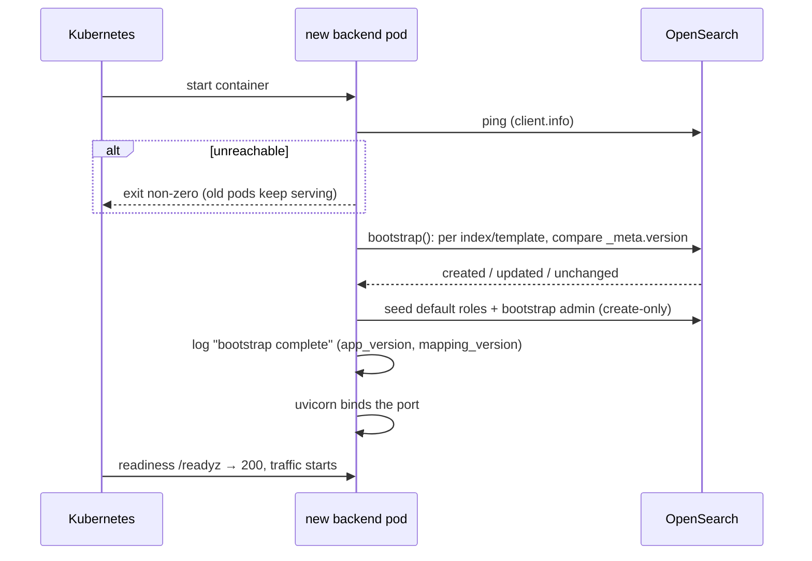

# JAVV - How an upgrade runs

> **Design note** (issue 261, 2026-09-29). This note covers how the index bootstrap behaves when a new JAVV
> release rolls out: which pod runs it, why old and new pods can serve side by side, and what a rollback
> does. It also sets the requirements the Helm chart (#452) must meet. The operator runbook built on
> it is [`docs/UPGRADING.md`](../UPGRADING.md). Index definitions stay in [`INDEX-MAP.md`](INDEX-MAP.md).

## Where bootstrap runs

Every backend pod runs the bootstrap itself during startup. There is no separate migration Job.

- **Bootstrap finishes before the pod opens its port.** `core/lifespan.py` runs the ping and
  `bootstrap()` in the FastAPI lifespan. uvicorn's `Server.startup` completes the lifespan startup
  before it calls `create_server`, so a new pod answers no probe and takes no traffic until its own
  bootstrap is done. Checked against uvicorn 0.54.
- **A failed bootstrap stops the pod, not the service.** An exception in the lifespan makes uvicorn
  log `Application startup failed. Exiting.` and exit non-zero; exit code 3 was observed with OpenSearch
  unreachable. With the rollout settings below, the old pods keep serving while the new one crash-loops.
- **It runs on every start of every pod, and that is safe.** Bootstrap leaves an index or template
  `unchanged` when its `_meta.version` is at or above the code's `MAPPING_VERSION`. When two pods
  race to create the same index, the loser sees `resource_already_exists_exception` and records
  `unchanged`. Mapping and template updates send identical bodies, so concurrent updates agree. On a
  store that is already current, it checks 20 indices and templates with two reads each. That took
  0.8 s end to end on the dev store, including interpreter start.
- **`JAVV_BOOTSTRAP_ON_STARTUP=false` skips all of it,** including seeding the roles and the admin. It
  exists for unit tests. A deployment must leave it at `true` ([CONFIGURATION.md §1](../CONFIGURATION.md)).

### Why not a Helm pre-upgrade hook Job

A hook Job would run `python -m backend.core.bootstrap` before the new pods start. It was rejected
for four reasons:

1. **It adds nothing to the ordering.** The in-pod bootstrap already guarantees that no new code
   serves before its mappings exist.
2. **It would be a second path to keep correct.** A hook needs its own pod spec, credentials,
   timeout and failure handling. The pod still has to bootstrap anyway, for a fresh install and for
   `helm rollback`.
3. **GitOps tools treat hooks differently.** Argo CD maps Helm hooks onto its own sync phases, and
   `helm template | kubectl apply` applies a hook Job as an ordinary resource, with no ordering at
   all. D41 expects operators to deploy GitOps-style.
4. **It would need a second place for credentials.** The pod already has the OpenSearch
   connection; a hook would need the same secret wired a second time.

Revisit this choice when a release needs a **breaking** migration (a reindex). That is a long-running,
resumable Job by nature, and it belongs to the hardening phase (see *Deferred* below).

## Old and new pods side by side

A rolling upgrade briefly runs both releases against one store. That is safe only because every
mapping change is **additive**. `core/bootstrap.py` says so in its instructions for evolving a mapping,
and the history v2 → v18 contains only added fields and indices.

| Who | Sees | Why it's safe |
|---|---|---|
| old pod, reading | fields the new release added | mappings are `dynamic:false` and readers pick the fields they know, so extra `_source` keys are ignored |
| old pod, writing | a mapping with more fields than it writes | the document simply lacks the new field; readers treat it as absent (the same as documents written before the bump) |
| new pod, reading | documents written by the old pod | the same "field absent" case every bump already handles |
| scanner (old image) | a newer backend | `scanner/src/scanner/scope.py` parses the scan scope leniently (unknown fields are ignored) |
| scanner (new image) | the backend's accepted envelope window | the backend accepts every envelope version in `GET /api/v1/meta` → `envelope_versions` (currently 3 and 4); the backend must be upgraded **first** |

**The order is backend, then frontend, then the scanner images.** A newer frontend against an older
backend would call routes that don't exist yet. A newer scanner can send an envelope version the older
backend rejects. A single `helm upgrade` rolls the backend and the frontend at the same time, so the
window where the frontend is newer than the backend lasts as long as the rollout. During it, a new
screen can call a route the old backend doesn't have yet, and the old frontend can call a route the
new backend has removed. Keeping a removed route alive for one release is a hardening-phase rule (see
*Deferred*).

## Rollback

- **Mappings are rollback-safe.** Bootstrap only moves forward: an older pod finds `_meta.version`
  above its own `MAPPING_VERSION` and leaves the index `unchanged`. The newer fields stay mapped and
  unused. `helm rollback` needs no data step for an additive release.
- **Stored settings are rollback-safe (#640).** The seven settings models stay `extra="forbid"`,
  because they also validate request bodies. Every read of a stored `system-config` value goes
  through `core/stored_settings.py` `parse_stored_setting`, which drops the top-level fields the
  running release doesn't declare and validates the rest with the strict model. It covers
  `ScanScope`, `SnapshotRepoRef`, `ReportTtl`, `LifecycleSettings`, `SlaPolicy`,
  `FindingsCleanupSetting` and `StalenessTimers`.
  - A drop logs `stored setting has unknown keys` (field names only) once per setting doc per
    process, and bumps `javv_stored_setting_unknown_fields_total{setting}` on every such read.
  - A bad value on a field the release *does* know still fails; that's corrupt data, not a version
    gap.
  - Writes stay strict. An older release that saves the setting stores only its own fields, so the
    newer field returns to its default after the next upgrade (operator decision on #640).
  - A guard test (`tests/test_stored_settings_readers.py`) fails the build if code outside the
    helper validates a stored `_source` value directly.

  Before this, the older release raised `ValidationError` on every read of such a setting, and
  `core/errors.py` turned it into a 500. For the scan scope, that meant every scanner skipped its
  cycle. Rollbacks to a release without the fix still behave that way.
- **Decisions are safe.** Editing a decision copies only the fields `DecisionPayload` declares from the
  stored document (`decisions/lifecycle.py`), so unknown stored keys are dropped, not rejected.

## What the Helm chart must do (#452)

| Setting | Value | Why |
|---|---|---|
| backend `strategy` | `RollingUpdate`, `maxUnavailable: 0`, `maxSurge: 1` | a new pod that fails bootstrap never takes the last serving pod down with it |
| `readinessProbe` | `GET /readyz` | 200 only when OpenSearch is reachable; the pod isn't listening at all until bootstrap is done |
| `livenessProbe` | `GET /healthz` | no OpenSearch dependency, so a store outage degrades the app instead of restarting it |
| `startupProbe` | `GET /healthz`, with a budget of several `JAVV_REQUEST_TIMEOUT` periods (default 30 s each) | holds off liveness while bootstrap runs against a slow store; the chart documents the number it picks in `CONFIGURATION.md` |
| `JAVV_BOOTSTRAP_ON_STARTUP` | not set (default `true`) | false skips index creation and the admin seed |
| scanner CronJobs | a separate image tag per scanner (D41) | upgraded after the backend, as a tag swap |

The scanner CronJobs' security context is set out in the M10 bolt README (`## Updates`, 2026-09-29).

## Deferred to the hardening phase (issue 261, items 1-3)

- **Breaking migrations:** retyping or removing a field, changing an `_id` scheme, or splitting an
  index. These need a versioned, checkpointed, resumable reindex Job and a rule for which release runs
  it.
- **Pinning "additive only":** a CI check that a release's mappings are a superset of the previous
  tag's.
- **A tested rollback:** a CI run that upgrades, writes, rolls back and reads. It would exercise the
  lenient settings reads above end to end, plus keeping a route for one release before removing it.
