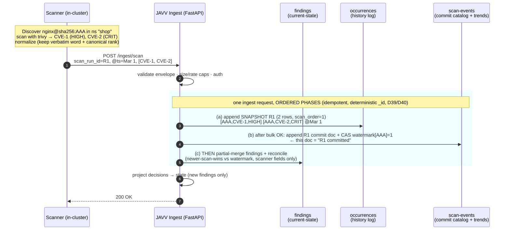
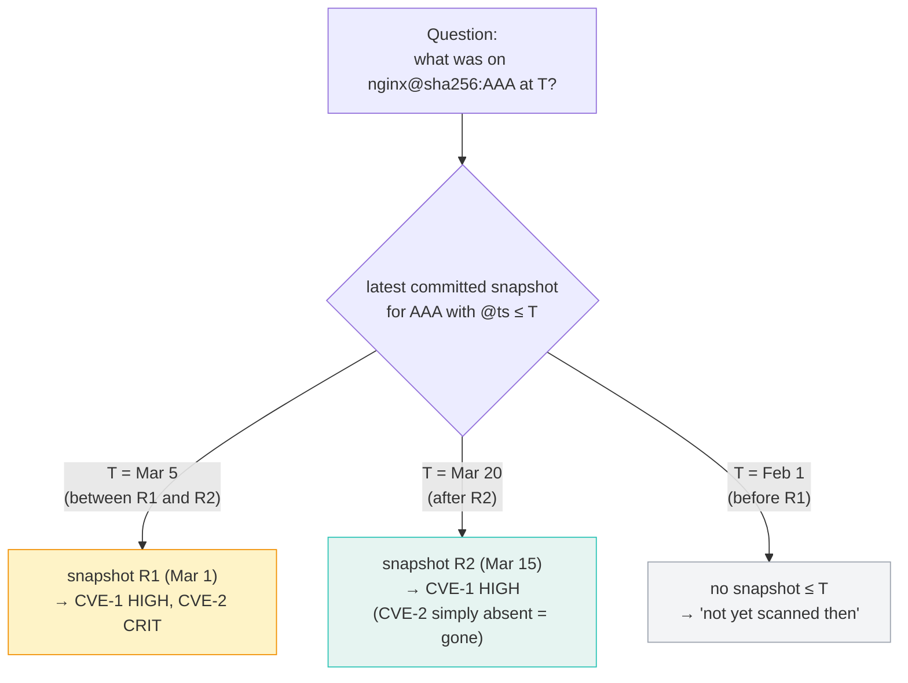
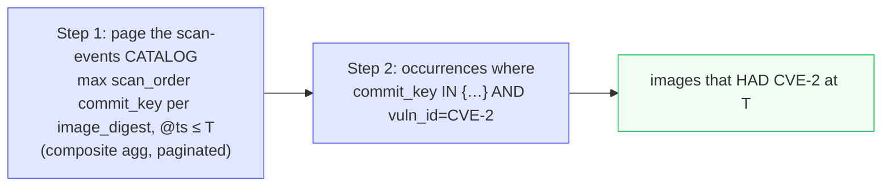

# JAVV - End-to-end worked example (v4 snapshot model)

> A concrete scan→push→store→query walkthrough of the v4 point-in-time model, with real-ish data, to make
> the **full-snapshot-per-scan** logic easy to follow. Companion to `PLAN_v4.md` §5.4/§5.5, `SPEC_v4.md`
> FR-5/FR-5b/FR-14, `ARCHITECTURE_v4.md` §3. Diagrams: Mermaid.

## The scenario

One image, one scanner, two scans - chosen so a CVE *disappears* without the image being rebuilt (the case
people worry about):

- Image: `nginx`, digest `sha256:AAA`, namespace `shop`, scanner `trivy`.
- **Scan R1 - Mar 1:** finds `CVE-1` (HIGH) and `CVE-2` (CRITICAL).
- **Scan R2 - Mar 15:** the vuln-DB updated and `CVE-2` was withdrawn → same digest `AAA`, now only `CVE-1`
  (HIGH). *(If instead the image were patched/rebuilt, it would be a new digest `sha256:BBB` with its own
  snapshots - same mechanics, separate timeline.)*

## 1. One scan, start to finish (where each piece lands)



**The order matters (D39/D40):** occurrences+images go first (phase a); the scan-events commit doc + the
watermark CAS land only after that bulk succeeds (phase b - the **commit catalog**, so a half-finished push is
never read as "latest"); the `findings` "now" cache is written **last** (phase c), guarded by the watermark so
an out-of-order older run can't corrupt it. A crash between (b) and (c) self-heals via the scanner-cache
rebuild.

## 2. What the history log holds after both scans

`occurrences` is append-only - R2 does **not** touch R1's rows; it just adds R2's complete snapshot:

| @timestamp | scan_run_id | image_digest | vuln_id | severity | (committed? = has scan-events doc) |
|---|---|---|---|---|---|
| Mar 1 | R1 | sha256:AAA | CVE-1 | high | ✅ |
| Mar 1 | R1 | sha256:AAA | CVE-2 | critical | ✅ |
| Mar 15 | R2 | sha256:AAA | CVE-1 | high | ✅ |

Notice: **there is no "CVE-2 closed" row.** CVE-2 is gone simply because **R2's snapshot doesn't list it.**
Nothing was edited or deleted.

Meanwhile `findings` (current-state) shows only `CVE-1` now; `CVE-2` was omitted by R2, so **reconcile-on-commit**
flips it `present=false` (`resolved_at` = R2's time) at commit and it drops off the live grid **immediately** -
no wait for the staleness timer (D37/C2). (Current-state = "now"; occurrences = "the timeline".)

## 3. Point-in-time: "what was on nginx@AAA at T?" (R-CATALOG two-step - D37)

**Two steps, always - never `sort @timestamp desc, size 1` on occurrences.** (1) From `javv-scan-events ≤ T`,
get the **max-`scan_order` committed `scan_run_id`** for `AAA` (the commit catalog; order by `scan_order`, not
`@timestamp` - D40). (2) Read `occurrences` for **that exact run**. Its rows = the state then; **zero rows = clean**. This is what stops a *clean rescan* (which
writes no occurrence rows) from resurrecting the previous scan's fixed CVEs (C1).



- **Rewind to Mar 5** → you see both CVEs (R1 was the truth then). ✅
- **Rewind to Mar 20** → you see only CVE-1; CVE-2 is gone **with no tombstone** - it's just not in R2. ✅
- **Rewind to Feb 1** → nothing ≤ T → "not yet scanned then." ✅

This is the Kibana-style behavior you described: the timestamp dictates everything, and looking at the past
shows the past exactly as it was scanned.

### 3b. The clean-rescan trap (why step 1 is mandatory - C1)

Suppose a third scan **R3 (Mar 30)** finds the image fully patched - **0 CVEs**. R3 writes **no occurrence
rows**, but it **does** write a `scan-events` commit doc (`total:0`).

- **Wrong (latest-doc-per-digest):** "give me the newest occurrence row for `AAA`" → still returns R2's
  `CVE-1` row (R3 added none). The grid shows `CVE-1` as live - **resurrected**, 5 days after it was fixed. ✗
- **Right (R-CATALOG):** step 1 asks the catalog for the latest committed run ≤ Mar 30 → **R3**; step 2 reads
  occurrences for R3 → **0 rows** → image is **clean**. ✓

The `findings` "now" grid stays correct the same way without waiting for the staleness timer:
**reconcile-on-commit** runs an `update_by_query` on R3's commit that sets `present=false` on the `CVE-1`
finding (its `last_scan_run_id` is R2, ≠ R3). Cache only - the occurrences history is never edited (C2).

## 4. The reverse question: "which images had CVE-2 at T?" (two-step, F2)

You **cannot** just filter `vuln_id=CVE-2` and take the latest row - a digest that dropped CVE-2 would
falsely resurface from its old row. So it's two steps:



For `T = Mar 20`: Step 1 picks R2 for `AAA`; Step 2 checks R2 for CVE-2 → not there → `AAA` correctly does
**not** appear. For `T = Mar 5`: Step 1 picks R1; CVE-2 is in R1 → `AAA` appears. ✅ (Run per scanner,
side-by-side, never merged.)

## 5. Why this is safe and simple (recap)

- **No close events / tombstones / diff job / cronjob** - absence in a later snapshot *is* the "it's gone."
- **No multi-pod race** - every write is a pure append with a deterministic `_id = hash(scan_run_id +
  finding_key)`; a retried push overwrites the same id, never duplicates. Nothing reads-then-writes.
- **Commit marker (F1)** - a snapshot counts as "latest" only once its scan-events doc exists, so a
  partial/failed scan can never make a vuln look fixed.
- **Identity = digest (F3)** - a rebuilt image is a new digest with its own clean timeline; the UI lets you
  pick `repo:tag`/workload and maps it to the digest(s) running at T.
- **As-scanned, not as-running (F4)** - occurrences answers "what a scan found on digest D as of T," not
  "what was deployed." These are **two separate questions with two sources** (H6/D38): `vulns_as_scanned_at_T`
  comes from the committed occurrences snapshot (above); `runtime_inventory_at_T` ("was `AAA` actually running
  at T") comes from the latest complete `javv-images` inventory run ≤ T. Never conflate them.
- Cost is storage (a full set per scan that runs), which is bounded by per-cluster retention - the accepted
  trade. Validated end-to-end in `docs/research/SNAPSHOT-MODEL-VALIDATION.md`.

## 6. How each index looks (sample documents)

Same scenario, plus one triage action so the human-decision indexes have content:
**Mar 16 - Alice (Triager) risk-accepts `CVE-1` on `sha256:AAA`, approved by Bob (Security Lead), until Jun 1.**
`cluster_id` here is the `kube-system` UID `9b1e…uid`. Values shown are illustrative; mappings are pinned in
`PLAN_v4.md` §5.2–§5.7. (`severity` is stored verbatim in `_source`; the lowercase `normalizer` is what the
aggregations/filters use - both shown for clarity.)

### `findings` - current-state ("now"), partial-merge · `_id = finding_key`
After R2: CVE-1 is current (and risk-accepted); CVE-2 was not re-reported, so the sweep marked it `stale`.
```jsonc
// CVE-1 - _id = hash(cluster_id+image_digest+scanner+cve_id+package+version)
{
  "finding_key": "f3a9c1",
  "cluster_id": "9b1e-uid", "scanner": "trivy",
  "image_digest": "sha256:AAA", "image_repo": "docker.io/library/nginx",
  "tag": "1.25", "namespace": "shop", "app": "storefront",
  "cve_id": "CVE-1", "package_name": "openssl", "installed_version": "3.0.1",
  "severity": "HIGH",            // _source verbatim; indexed as "high" via normalizer
  "severity_rank": 4,            // numeric sort key (critical=5 … unknown=0)
  "cvss": 7.5, "fixable": true, "fixed_version": "3.0.2",
  "epss": null, "kev": null,     // grype-only enrichment; null for trivy
  "disagree": false,             // precomputed severity-disagreement flag (D5a)
  "first_seen_at": "2026-03-01T02:00:00Z", "last_seen_at": "2026-03-15T02:00:00Z",  // full precision (D37)
  "last_scan_run_id": "R2", "last_scan_order": 2, "last_scan_at": "2026-03-15T02:00:00Z",  // newer-scan-wins guard key (D40)
  "present": true, "resolved_at": null,  // reconcile-on-commit (D37)
  // ---- human-owned CACHE (rebuildable from system-decisions + system-audit-log) ----
  "state": "risk_accepted",      // projected from the decision below
  "vex_justification": null, "assignee": "alice",
  "notes": "accepted per change-ticket SHOP-42",
  "schema_version": 1
}

// CVE-2 - re-reported by R2? No. Reconcile-on-commit flipped present=false at R2's commit (D37/C2),
// so it leaves the "now" grid immediately - no wait for the staleness timer.
{
  "finding_key": "b7d2e8", "cluster_id": "9b1e-uid", "scanner": "trivy",
  "image_digest": "sha256:AAA", "cve_id": "CVE-2", "package_name": "zlib",
  "installed_version": "1.2.11", "severity": "CRITICAL", "severity_rank": 5,
  "cvss": 9.1, "fixable": true, "fixed_version": "1.2.12",
  "first_seen_at": "2026-03-01T02:00:00Z", "last_seen_at": "2026-03-01T02:00:00Z",
  "last_scan_run_id": "R1", "last_scan_order": 1, "last_scan_at": "2026-03-01T02:00:00Z", "present": false, "resolved_at": "2026-03-15T02:00:00Z",
  "state": "open", "pre_stale_status": null, "schema_version": 1
}
```

### `javv-images-<cluster_id>-NNNNNN` - append, inventory snapshots · `_id = hash(scan_run_id+image_digest)`
One snapshot per (image, scan), each cycle sharing an `inventory_run_id` certified by a manifest in
`javv-inventory-runs` (below). **"Running images now / at T" = the images of the latest `status=committed`
`inventory_run_id`** (R-CATALOG, D37/D39), not latest-doc-per-digest and never a partial run; undeployed images
vanish at the next committed run and age out via retention (D29). Two docs here (R1, R2):
```jsonc
{ "@timestamp":"2026-03-01T02:00:00Z", "scan_run_id":"R1", "inventory_run_id":"R1", "cluster_id":"9b1e-uid", "image_digest":"sha256:AAA",
  "image_repo":"docker.io/library/nginx", "tag":"1.25", "namespace":"shop", "app":"storefront", "scanners":["trivy"],
  "crit":0,"high":1,"med":0,"low":0,"negligible":0,"unknown":0,"total":1,"fixable":1,
  "trivy_count":1, "grype_count":null, "count_delta":null,  // count-disagreement pair (D5b)
  "replicas":3, "schema_version":1 }

{ "@timestamp":"2026-03-15T02:00:00Z", "scan_run_id":"R2", "inventory_run_id":"R2", "cluster_id":"9b1e-uid", "image_digest":"sha256:AAA",
  "image_repo":"docker.io/library/nginx", "tag":"1.25", "namespace":"shop", "app":"storefront", "scanners":["trivy"],
  "crit":1,"high":0,"med":0,"low":0,"negligible":0,"unknown":0,"total":1,"fixable":1,
  "trivy_count":1, "grype_count":null, "count_delta":null, "replicas":3, "schema_version":1 }
```

### `javv-inventory-runs-<cluster_id>-NNNNNN` - append, inventory commit manifest · `_id = inventory_run_id`
One doc per run, written **last** (after the images bulk succeeds). "Running images" reads only
`status=committed` runs, so a half-written or zero-image run is never shown as the live inventory (D39/H4-r2).
```jsonc
{ "@timestamp":"2026-03-15T02:00:00Z", "inventory_run_id":"R2", "inventory_order":2, "cluster_id":"9b1e-uid",
  "started_at":"2026-03-15T02:00:00Z", "completed_at":"2026-03-15T02:01:10Z",
  "expected_count":1, "written_count":1, "status":"committed", "schema_version":1 }
```

### `javv-scan-watermarks` - per-digest committed-scan pointer · `_id = hash(cluster+scanner+digest)`
CAS-bumped at each commit; the newer-scan-wins guard for create AND update (D40). After R2:
```jsonc
{ "cluster_id":"9b1e-uid", "scanner":"trivy", "image_digest":"sha256:AAA",
  "max_committed_scan_order":2, "max_committed_scan_at":"2026-03-15T02:00:00Z", "schema_version":1 }
```
> A late retry of R1 (scan_order=1) arriving now sees `1 < 2` → **skips all cache writes** (its history rows
> are harmless: the catalog orders by `scan_order`, so R2 is still "latest"). This is what stops the
> "finding only in an older out-of-order scan" resurrection that per-doc state couldn't guard.

### `javv-scan-events-<cluster_id>-NNNNNN` - append, trends + **commit catalog** · `_id = hash(scan_run_id+image_digest+scanner)`
`scanner` is a field, not in the index name (D38/M15). Two docs (one per scan); each carries the `commit_key`
4-tuple and *certifies its scan_run committed* (F1/R-CATALOG - the read path resolves the latest run here
first, then reads occurrences for it).
```jsonc
{ "@timestamp": "2026-03-01T02:00:00Z", "scan_run_id": "R1", "scan_order": 1, "commit_key": "hash(9b1e-uid|trivy|sha256:AAA|R1)",
  "cluster_id": "9b1e-uid", "scanner": "trivy", "namespace": "shop", "image_repo": "docker.io/library/nginx",
  "image_digest": "sha256:AAA", "tag": "1.25", "app": "storefront",
  "crit": 1, "high": 1, "med": 0, "low": 0, "negligible": 0, "unknown": 0, "total": 2, "fixable": 2,
  "schema_version": 1 }

{ "@timestamp": "2026-03-15T02:00:00Z", "scan_run_id": "R2", "scan_order": 2, "commit_key": "hash(9b1e-uid|trivy|sha256:AAA|R2)",
  "cluster_id": "9b1e-uid", "scanner": "trivy", "image_digest": "sha256:AAA", "namespace": "shop", "tag": "1.25",
  "crit": 0, "high": 1, "med": 0, "low": 0, "negligible": 0, "unknown": 0, "total": 1, "fixable": 1,
  "schema_version": 1 }
```

### `javv-finding-occurrences-<cluster_id>-NNNNNN` - append, the history log · `_id = hash(scan_run_id+finding_key)`
**Three rows total** - R1's full snapshot (2 rows) + R2's full snapshot (1 row). No CVE-2 row in R2 = gone.
```jsonc
// R1 snapshot @ Mar 1  (complete list as of R1)
{ "@timestamp": "2026-03-01T02:00:00Z", "scan_run_id": "R1", "scan_order": 1, "commit_key": "hash(9b1e-uid|trivy|sha256:AAA|R1)", "cluster_id": "9b1e-uid", "scanner": "trivy",
  "image_digest": "sha256:AAA", "namespace": "shop", "vuln_id": "CVE-1",
  "package_name": "openssl", "package_version": "3.0.1", "finding_key": "f3a9c1",
  "severity": "HIGH", "cvss": 7.5, "fixable": true, "fixed_version": "3.0.2",   // no severity_rank on occurrences (OE-5/D38)
  "schema_version": 1 }

{ "@timestamp": "2026-03-01T02:00:00Z", "scan_run_id": "R1", "scan_order": 1, "commit_key": "hash(9b1e-uid|trivy|sha256:AAA|R1)", "cluster_id": "9b1e-uid", "scanner": "trivy",
  "image_digest": "sha256:AAA", "namespace": "shop", "vuln_id": "CVE-2",
  "package_name": "zlib", "package_version": "1.2.11", "finding_key": "b7d2e8",
  "severity": "CRITICAL", "cvss": 9.1, "fixable": true, "fixed_version": "1.2.12",   // no severity_rank on occurrences (OE-5/D38)
  "schema_version": 1 }

// R2 snapshot @ Mar 15  (complete list as of R2 - CVE-2 simply not here)
{ "@timestamp": "2026-03-15T02:00:00Z", "scan_run_id": "R2", "scan_order": 2, "commit_key": "hash(9b1e-uid|trivy|sha256:AAA|R2)", "cluster_id": "9b1e-uid", "scanner": "trivy",
  "image_digest": "sha256:AAA", "namespace": "shop", "vuln_id": "CVE-1",
  "package_name": "openssl", "package_version": "3.0.1", "finding_key": "f3a9c1",
  "severity": "HIGH", "cvss": 7.5, "fixable": true, "fixed_version": "3.0.2",   // no severity_rank on occurrences (OE-5/D38)
  "schema_version": 1 }
```

### `system-decisions` - the "anchor": what humans decided (source of truth for `risk_accepted`)
```jsonc
{
  "decision_id": "d-77", "type": "risk_accepted", "cve_id": "CVE-1",
  "scope": { "namespaces": [], "images": ["sha256:AAA"] },  // image-scoped
  "apply_both_scanners": true,                              // semantics pinned in D22
  "vex_justification": null,
  "justification": "accepted per change-ticket SHOP-42",
  "approver": "bob", "expiry": "2026-06-01",      // expiry IMMUTABLE - change = revoke+create-new (D40/G)
  "created_by": "alice", "created_at": "2026-03-16T09:00:00Z",
  "effective_at": "2026-03-16T09:00:00Z", "operation_id": "op-310", "revoked_at": null
}
```
→ Projection reads this and stamps `findings.CVE-1.state = "risk_accepted"` (the cache above). If that cache
were ever corrupted, the **rebuild-state job** re-derives it from this index + the audit log.

### `system-audit-log` - append, immutable trail (every action; powers Contributors)
```jsonc
{ "@timestamp": "2026-03-16T09:00:00Z", "event_id": "evt-5001", "actor": "alice",
  "action": "risk_accept", "entity_type": "finding", "entity_id": "f3a9c1", "finding_key": "f3a9c1",
  "cluster_id": "9b1e-uid", "field": "state", "field_type": "scalar",
  "old_value": "open", "new_value": "risk_accepted",
  "revision": 7,                                       // finding's resulting version (CAS) - replay orders same-field by this (D40/H)
  "target_ids": ["f3a9c1"], "result_count": 1,        // frozen affected set (H8) - a bulk accept would list every id
  "decision_id": "d-77" }
```

### `system-*` supporting indexes (abbreviated)
```jsonc
// system-users
{ "username": "alice", "password_hash": "$argon2id$v=19$...", "role": "triager",
  "created_at": "2026-02-10T08:00:00Z", "disabled": false }

// system-tokens  (per cluster+scanner; 256-bit random, peppered SHA-256 - D38/M14; scanner-down guard uses last_ingest_at)
{ "token_hash": "peppered-sha256:9f2c…", "cluster_id": "9b1e-uid", "scanner": "trivy",
  "scope": "push:findings", "last_ingest_at": "2026-03-15T02:00:00Z" }

// system-notifications  (per-user bell; SLA breach / assignment / ready export)
{ "user": "alice", "type": "sla_breach", "cve_id": "CVE-2", "image_digest": "sha256:AAA",
  "created_at": "2026-03-04T00:00:00Z", "read": false }

// system-reports  (scheduled/throttled export jobs - D24; claimed by optimistic concurrency - D38/M17)
{ "report_id": "rep-12", "status": "done", "requested_by": "alice", "run_mode": "offpeak",
  "scheduled_for": "2026-03-17T01:00:00Z", "result_location": "s3://javv-exports/rep-12.csv",
  "heartbeat_at": "2026-03-17T01:04:00Z", "lease_expires_at": "2026-03-17T01:10:00Z", "retry_count": 0 }
```

**How they relate:** `findings`/`images` = "now" (fast grid). `scan-events` = cheap trends **and** the commit
marker. `occurrences` = the timeline (full snapshots). `system-decisions` + `system-audit-log` = the human
layer that *drives* `findings.state` and is the source of truth behind the rebuildable cache. The cross-index
write/read paths are in `ARCHITECTURE_v4.md` §1b.

## 7. How the indexes relate (shared-key joins)

OpenSearch isn't relational - there are **no foreign keys and no embedded sub-tables.** Indexes are linked by
**shared key values, joined at query time** (you filter by the key). Nothing embeds another index's rows.

| From | To | Joined by | Used for |
|---|---|---|---|
| `findings` | `images` | `cluster_id` + `image_digest` | list an image's vulns; the image card's counts |
| `findings` | `occurrences` | `finding_key` (and `image_digest`) | per-finding / per-image timeline |
| `findings` | `system-decisions` | `cve_id` + scope match | the projected `state` |
| `findings` | `scan-events` | `commit_key` = `cluster_id`+`scanner`+`image_digest`+`scan_run_id` | trends; the commit catalog (F1/R-CATALOG) |
| `system-audit-log` | `system-decisions` | `decision_id` | who made which decision |

**The `images` doc holds counts, not the vuln list.** It's a lightweight summary row (severity buckets,
count-disagreement pair, `replicas`) so the inventory grid renders from one cheap doc per image. To get the
actual CVEs on an image you **query `findings` by `image_digest`** - and `findings` **denormalize**
`image_repo`/`tag`/`namespace`/`app` precisely so you can filter and group by image **without touching the
`images` index at all**. Embedding the list in the image doc was rejected: it would rewrite the whole doc on
every CVE change (write amplification, breaks `detect_noop`) and balloon into a large nested array.

## 8. One CVE across many images (per-image findings + one scoped decision)

`finding_key` includes `image_digest`, so the **same CVE on two images is two findings documents** - same
`cve_id`, different `finding_key` - never merged:

```jsonc
{ "finding_key": "f3a9c1", "cve_id": "CVE-1", "scanner": "trivy",
  "image_digest": "sha256:AAA", "image_repo": ".../nginx", "namespace": "shop", "state": "open" }

{ "finding_key": "9d4b20", "cve_id": "CVE-1", "scanner": "trivy",
  "image_digest": "sha256:BBB", "image_repo": ".../api",   "namespace": "shop", "state": "open" }
```

**"Which images have CVE-1 now?"** = a **"now" query must scope tenant + scanner + presence** (D39/M10-r2),
then group by `image_digest`:
```jsonc
GET findings/_search
{ "query": { "bool": { "filter": [
    { "term": { "cluster_id": "9b1e-uid" } },   // tenant - always
    { "term": { "scanner": "trivy" } },          // per-scanner - never union
    { "term": { "cve_id": "CVE-1" } },
    { "term": { "present": true } }              // exclude resolved-by-scan / gone (else stale rows leak in)
  ] } },
  "aggs": { "images": { "terms": { "field": "image_digest" } } } }   // → sha256:AAA, sha256:BBB
```
(Omitting `present:true` would resurface findings a clean scan already dropped. Point-in-time "had CVE-1 at T"
= the two-step catalog query, §4.)

**You don't triage each row by hand.** The audit anchors on the CVE: **one `system-decisions` record with a
scope** decides the blast radius, and projection fans the resulting `state` onto exactly the in-scope rows:
```jsonc
// ONE decision for CVE-1, accepted only on nginx (not api)
{ "decision_id": "d-91", "type": "risk_accepted", "cve_id": "CVE-1",
  "scope": { "images": ["sha256:AAA"] }, "apply_both_scanners": true,
  "approver": "bob", "expiry": "2026-06-01" }
```
→ `CVE-1` on `sha256:AAA` (nginx) becomes `risk_accepted`; `CVE-1` on `sha256:BBB` (api) **stays `open`.**

Scope it to a **namespace** instead (`"scope": { "namespaces": ["shop"] }`) and it covers every CVE-1 in
`shop` **and cascades to new images** that appear with CVE-1 later (D19) - no re-accepting. This is the
"accept for selected images/namespaces" workflow (D4): the decision follows the **vulnerability**, the scope
decides which per-image rows inherit it.

## 9. Whole-app time-travel (the Findings page at two T's · D28/FR-23)

The global time picker rewinds **every** screen. `T=now` reads the materialized `findings`; `T<now`
reconstructs from the timestamped append logs. **Same nginx timeline as §1–§6:** **R1** Mar 1 (CVE-1 HIGH,
CVE-2 CRITICAL) · **R2** Mar 15 (CVE-1 HIGH, CVE-2 gone) · Alice risk-accepts CVE-1 on `sha256:AAA` **Mar 16**
(decision `d-77`, expiry Jun 1).

**Findings page as of Mar 5** (between R1 and R2; before the accept):
- Scanner facts (R-CATALOG) = latest **committed** run ≤ Mar 5 = **R1** → its occurrences → CVE-1 (HIGH),
  CVE-2 (CRITICAL).
- Human state ≤ Mar 5 = decision `d-77` `created_at` = Mar 16 → **not active** → `state: open`; no audit
  entries ≤ Mar 5 → no assignee.
- **Render:** CVE-1 (HIGH, open), CVE-2 (CRITICAL, open).

**Findings page as of Mar 25** (after R2 and after the accept):
- Scanner facts ≤ Mar 25 = latest committed run = **R2** → its occurrences → CVE-1 (HIGH); CVE-2 **absent**
  (not in R2's snapshot).
- Human state ≤ Mar 25 = `d-77` active (created Mar 16, not expired/revoked) → CVE-1 `state: risk_accepted`
  (replay `system-audit-log` ≤ Mar 25 → assignee alice, notes).
- **Render:** CVE-1 (HIGH, risk_accepted). CVE-2 gone.

Same page, two data sources: `T=now` → `findings` index (one fast query); past-T → reconstruct **catalog-first**
(latest committed run from `scan-events` ≤ T → its occurrences ⋈ decisions-active-at-T + `system-audit-log`
replay ≤ T; `stale` recomputed) - never "latest occurrences snapshot ≤ T". Granularity: scanner facts resolve
to the last committed scan ≤ T; human state is exact to the second. **Reach = this cluster's oldest retained
`occurrences`/`images` window** (`system-audit-log` kept long).
